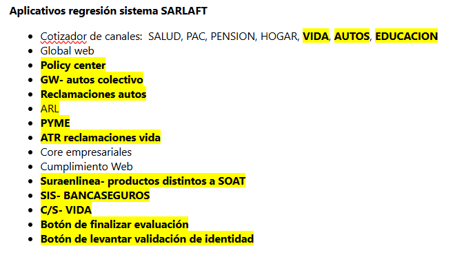

# Pruebas de Regresión SARLAFT – SOAT Orden Administrativa

> **Fuente Confluence:** [Pruebas de regresión frente SARLAFT - SOAT Orden Administrativa](https://segurosti.atlassian.net/wiki/spaces/EPA/pages/3826089992/Pruebas+de+regresi%C3%B3n+frente+SARLAFT+-+SOAT+Orden+Administrativa)  
> **Última modificación:** 2024-06-20 — Natalia Sanchez Tangarife · versión 2  
> **Sección:** [Atributos de Calidad Desarrollo](./index.md)

En este apartado pueden encontrarse todos los escenarios de pruebas que se revisaron, trabajaron, probaron y documentaron en las pruebas de regresión para el frente de Sarlaft en la iniciativa de SOAT Orden Administrativa. Estas pruebas las trabajaron en conjunto Laura Camila Ortiz Gutierrez y Fernando Alberto Blandón Jimenez.

Tarea de referencia en Azure DevOps: [Tarea 538482: Pruebas sistema SARLAFT sin SOAT](https://dev.azure.com/SuraColombia/Portafolios/_workitems/edit/538482)

## Aplicativos Regresión Sistema SARLAFT

- Cotizador de canales: SALUD, PAC, PENSION, HOGAR, VIDA, AUTOS, EDUCACION
- Global web
- Policy center
- GW – autos colectivo
- Reclamaciones autos
- ARL
- PYME
- ATR reclamaciones vida
- Core empresariales
- Cumplimiento Web
- Suraenlinea – productos distintos a SOAT
- SIS – BANCASEGUROS
- C/S – VIDA
- Botón de finalizar evaluación
- Botón de levantar validación de identidad

## Archivos Adjuntos

| Archivo | Descripción |
| --------- | ------------- |
| [`EvidenciaGlobalWebRegresion.pdf`](./attachments/EvidenciaGlobalWebRegresion.pdf) | Evidencias Global Web regresión |
| [`EvidenciasEscenarios_SOAT.docx`](./attachments/EvidenciasEscenarios_SOAT.docx) | Evidencias de escenarios de prueba |
| [`Regresion_CotizadorAutos_062024.docx`](./attachments/Regresion_CotizadorAutos_062024.docx) | Regresión Cotizador Autos – Junio 2024 |
| [`Regresion_SEL_distintoSOAT_062024.docx`](./attachments/Regresion_SEL_distintoSOAT_062024.docx) | Regresión SEL distinto a SOAT – Junio 2024 |
| [`Regresion_SIS_Suramasivos_062024.docx`](./attachments/Regresion_SIS_Suramasivos_062024.docx) | Regresión SIS y Suramasivos – Junio 2024 |

## Escenarios de Prueba (Markdown)

| Archivo | Descripción |
| --------- | ------------- |
| [Regresion_CotizadorAutos.md](./Regresion_CotizadorAutos.md) | Escenarios Cotizador Autos (Registraduría, PEP, INTENSIFICADO) |
| [Regresion_EvidenciasEscenarios.md](./Regresion_EvidenciasEscenarios.md) | Evidencias escenarios generales (Policy Center, ARL, PYME, C/S Vida, etc.) |
| [Regresion_SEL_SOAT.md](./Regresion_SEL_SOAT.md) | Escenarios SuraEnLínea distinto a SOAT (Migración, Experian, PEPS) |
| [Regresion_SIS_Suramasivos.md](./Regresion_SIS_Suramasivos.md) | Escenarios SIS y Suramasivos (GAFI, PEP, Registraduría) |

Para validar data o escenarios de pruebas de regresión se pueden comunicar con Laura Camila Ortiz Gutierrez [lcortiz@sura.com.co](mailto:lcortiz@sura.com.co) y con Fernando Alberto Blandón Jimenez [fblandon@sura.com.co](mailto:fblandon@sura.com.co).

Todas las evidencias también se encuentran adjuntas en: <https://dev.azure.com/SuraColombia/Portafolios/_workitems/edit/546392>
