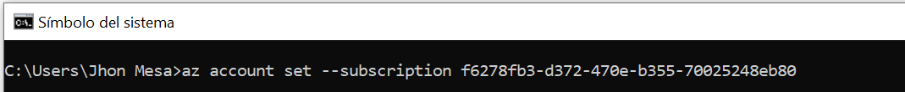
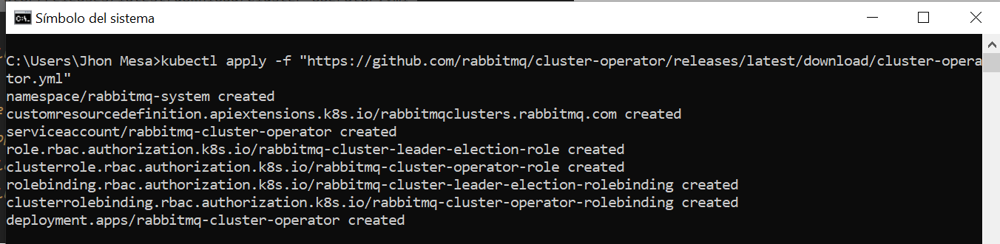
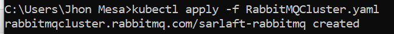

# Instalación RabbitMQ en AKS Sarlaft

> **Fuente Confluence:** [Instalación RabbitMQ en AKS Sarlaft](https://segurosti.atlassian.net/wiki/spaces/EPA/pages/1880817708/Instalaci+n+RabbitMQ+en+AKS+Sarlaft)  
> **Última modificación:** 2021-04-12 — Jhon Edison Mesa Bedoya · versión 1  
> **Sección:** [Configuración Plataforma Base Sarlaft](./index.md)

A continuación se describe el proceso de instalación de RabbitMQ en el AKS de Sarlaft por medio de RabbitMQ Cluster Operator for Kubernetes [https://www.rabbitmq.com/kubernetes/operator/operator-overview.html](https://www.rabbitmq.com/kubernetes/operator/operator-overview.html)

Requisitos:

1. Acceso al Cluster de Kubernetes en versión 1.17 o superior.
2. Kubectl configurado en el local para acceso al cluster.

**SECCIÓN 1: Instalar RabbitMQ Cluster Operator**

**a. Conectarse al AKS por medio**

az account set --subscription f6278fb3-d372-470e-b355-70025248eb80

Donde f6278fb3-d372-470e-b355-70025248eb80 es el ID de la suscripción donde esta instalado el AKS.

**b. Importar en el local, las credenciales de acceso al AKS para poder usar el comando kubectl**
az aks get-credentials --resource-group rg-sarlaft-lab-001 --name aks-sarlaft

c. Instalar RabbitMQ cluster operator por medio de la instrucción:
`kubectl apply -f "https://github.com/rabbitmq/cluster-operator/releases/latest/download/cluster-operator.yml"`

Con estos pasos, se finaliza la instalación de RabbitMQ cluster operator.

**SECCION 2: Iniciar un cluster RabbitMQ en el AKS**

A continuación se describe como inicializar un cluster de Rabbitmq por medio de un archivo de definción yaml: [https://www.rabbitmq.com/kubernetes/operator/using-operator.html](https://www.rabbitmq.com/kubernetes/operator/using-operator.html)

[RabbitMQCluster.yaml](./attachments/RabbitMQCluster.yaml)

a. Ejecutar el comando `kubectl apply -f RabbitMQCluster.yaml` con la definición de la configuración del Cluster

b. Obtener el nombre de usuario y clave del administrador generada para el sitio:

`kubectl -n default get secret sarlaft-rabbitmq-default-user -o jsonpath="{.data.username}" | base64 --decode`
`kubectl -n default get secret sarlaft-rabbitmq-default-user -o jsonpath="{.data.password}" | base64 --decode`
