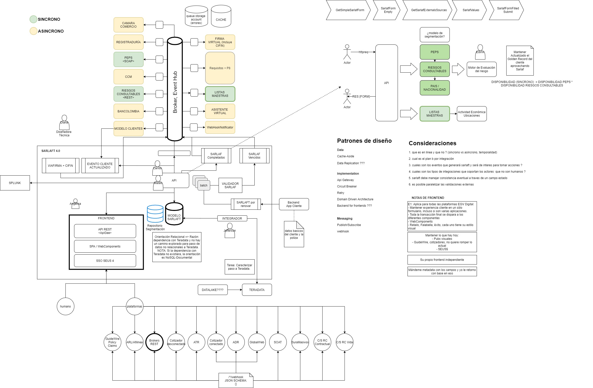

# Diagramas de Arquitectura

> **Fuente Confluence:** [Diagramas de Arquitectura](https://segurosti.atlassian.net/wiki/spaces/EPA/pages/1804861588/Diagramas+de+Arquitectura)  
> **Última modificación:** 2021-04-05 — Jhon Edison Mesa Bedoya · versión 3  
> **Sección:** [Diagramas de Arquitectura](../index.md)

## Archivos adjuntos

| Archivo | Enlace |
| --------- | -------- |
| `image-20210405-145511.png` | [image-20210405-145511.png](./attachments/image-20210405-145511.png) |
| `image-20210405-145502.png` | [image-20210405-145502.png](./attachments/image-20210405-145502.png) |
| `arquitectura-sarlaft-Diagram Container - EDA.jpg` | [arquitectura-sarlaft-Diagram Container - EDA.jpg](./attachments/arquitectura-sarlaft-Diagram Container - EDA.jpg) |

Arquitectura de la aplicación, en la sección de Documento Técnico se puede encontrar una explicación del presente diagrama, así como en la sección de Contextualización la explicación de la misma a través de un video.

