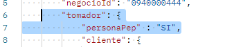
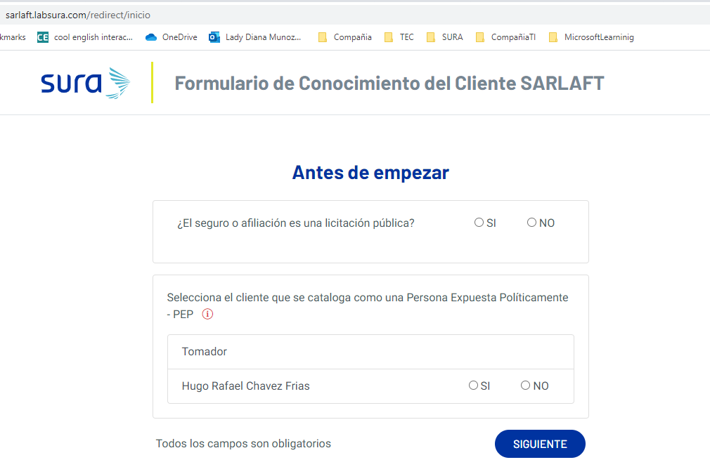
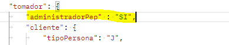
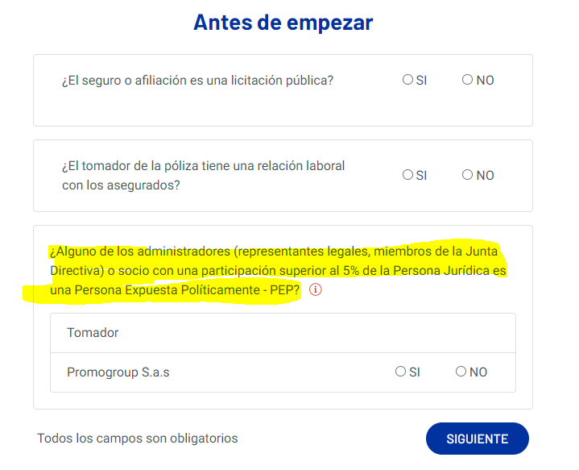

# 10. Validación y Habilitación Cliente PEPs

> **Fuente Confluence:** [10. Validación y Habilitación Cliente PEPs](https://segurosti.atlassian.net/wiki/spaces/EPA/pages/3226599489/10.+Validaci+n+y+Habilitaci+n+Cliente+PEPs)  
> **Última modificación:** 2023-06-16 — Diana Muñoz · versión 11  
> **Sección:** [Diseño Funcionalidades](./index.md)

## Archivos adjuntos

| Archivo | Enlace |
| --------- | -------- |
| `Sarlaft_Laura-FlujoPEPS_Marcacion (1)-20230616-164358.jpg` | [Sarlaft_Laura-FlujoPEPS_Marcacion (1)-20230616-164358.jpg](./attachments/Sarlaft_Laura-FlujoPEPS_Marcacion (1)-20230616-164358.jpg) |
| `Sarlaft_Laura-FlujoPEPS_Marcacion-20230616-133457.jpg` | [Sarlaft_Laura-FlujoPEPS_Marcacion-20230616-133457.jpg](./attachments/Sarlaft_Laura-FlujoPEPS_Marcacion-20230616-133457.jpg) |
| `image-20230616-131617.png` | [image-20230616-131617.png](./attachments/image-20230616-131617.png) |
| `image-20230616-131522.png` | [image-20230616-131522.png](./attachments/image-20230616-131522.png) |
| `image-20230616-130804.png` | [image-20230616-130804.png](./attachments/image-20230616-130804.png) |
| `image-20230616-125400.png` | [image-20230616-125400.png](./attachments/image-20230616-125400.png) |
| `Sarlaft_Laura-FlujoPEPS (2)-20230615-212353.jpg` | [Sarlaft_Laura-FlujoPEPS (2)-20230615-212353.jpg](./attachments/Sarlaft_Laura-FlujoPEPS (2)-20230615-212353.jpg) |
| `Sarlaft_Laura-FlujoPEPS (1)-20230615-211413.jpg` | [Sarlaft_Laura-FlujoPEPS (1)-20230615-211413.jpg](./attachments/Sarlaft_Laura-FlujoPEPS (1)-20230615-211413.jpg) |
| `Sarlaft_Laura-FlujoPEPS-20230615-194802.jpg` | [Sarlaft_Laura-FlujoPEPS-20230615-194802.jpg](./attachments/Sarlaft_Laura-FlujoPEPS-20230615-194802.jpg) |

Dentro del proceso de evaluación para el tomador y las figuras que determine el motor se debe realizar la validación de PEPs (Persona expuesta políticamente). Dentro del proceso una persona PEPS es aquella que se autodenomina Peps a través de una respuesta en el formulario de sarlaft o aquella que se encuentran marcada en la base de datos de peps de Sura.

Es de aclara que la validación Peps aplica solo para personas naturales, por eso cuando el tomador o figura es una persona jurídica, la validación de Peps reace en los administradores de esta, tales como representante legal, accionista o socio, el motor es quien determina sobre cual figura debe realizarse la validación.

> Solicitud Peps: es una solicitud para habilitar que se puedan expedir negocios para personas marcadas como Peps en el modelo de Sura. Esta solicitud es realizada por el director/gerente de la oficina donde se radica el negocio y tiene una vigencia de 15 días calendario. Esta habitación es realizada por medio del aplicativo de Riesgos Consultables (externo a Sarlaft 4.0). Esta solicitud es un medio por la cual Sura puede evidenciar ante la Superintendencia Financiera que se ha hecho un análisis y conocimiento de las persona que tienen esta marca y representan un mayor riesgo según la norma de sarlaft.

#### Escenario persona PEPs marcada en BD de Sura:

Dentro de la evaluación se utiliza la cache de Peps, para identificar aquellos dnis (concatenación del tipo y nro de identificación de la persona), si la persona no se encuentra en la cache, el sistema conoce que no tiene esta marca y continua el proceso dejando la evidencia en estado EXITOSO.  Si por el contrario el dni de la persona si se encuentra en cache, el sistema verifica que efectivamente aun tenga la marca de Peps en el modelo de sura correspondiente y que no tenga una solicitud de habilitación Peps activa.

En este punto se puede encontrar que una persona tiene marca Peps y no tiene una solicitud de habilitación vigente ni para el mismo código de oficina asociado a la evaluación, si esta condición no se cumple se genera una evidencia en estado FALLIDO. Si por el contrario se encuentra que una persona tiene marca Peps y  tiene una solicitud de habilitación vigente y para el mismo código de oficina asociado a la evaluación, se crea una evidencia en estado EXITOSO.

##### Habilitación PEPS:

Una vez una evidencia Peps  se encuentra en estado FALLIDO,  el sarlaft del cliente queda en estado PENDIENTE y por consiguiente la evaluación. Para hacer el levantamiento de control Peps se requiere un paso manual, en el cual el director o gerente de la oficina de radicación de negocio entra al aplicativo de Riesgos Consultables y crea una solicitud de habilitación Peps. Una vez la solicitud ha sido creada, el aplicativo de RRCC emite un mensaje a RabbitMQ a la cola:  _**seguros.rrcc.habilitacion**_. El aplicativo de sarlaft 4.0 escucha el mensaje y valida que la solicitud haya sido creada con el mismo código de oficina de radicación indicado en la evaluación pertinente, si es así actualiza la evidencia a estado EXITOSO y deja en el campo _**nmcontrol_consecutivo**_ el numero de solicitud peps por la cual se habilita la evidencia.

El siguiente diagrama muestra los dos pasos de validación y habilitación:
-20230615-212353.jpg?version=1&modificationDate=1686864270606&cacheVersion=1&api=v2)

#### Escenario persona PEPs automarcada al responder pregunta del formulario:

En este escenario el cliente que tiene figura tomador, ya sea persona natural o persona jurídica, debe contestar unas preguntas Peps, en la cual una respuesta afirmativa indica una autormarcacion en el modelo Peps.

##### Persona Natural:

Existen dos opciones de contestar estas respuestas: 1. al momento de crear la evaluación y 2. al momento de diligenciar el formulario de sarlaft.

Al momento de crear el formulario el aplicativo expedidor decidió mostrar la pregunta peps al cliente y envía la respuesta en el json de creación de evaluación (assessment)

Si el campo no llega en la evaluación la pregunta se realiza al momento de diligenciar el formulario, si la respuesta es SI, el sistema recategoriza la evaluación a intensificado y marca la persona como Peps en el modelo Peps de Sura.

Escenario de marcación cliente peps
-20230616-164358.jpg?version=1&modificationDate=1686933878214&cacheVersion=1&api=v2)

##### Persona Jurídica:

Existen dos opciones de contestar estas respuestas: 1. al momento de crear la evaluación y 2. al momento de diligenciar el formulario de sarlaft.

Al momento de crear el formulario el aplicativo expedidor decidió mostrar la pregunta peps al cliente y envía la respuesta en el json de creación de evaluación (assessment)

Si el campo no llega en la evaluación la pregunta se realiza al momento de diligenciar el formulario, si la respuesta es SI, el sistema recategoriza la evaluación a intensificado y marca la persona como Peps en el modelo Peps de Sura.

El proceso de levantar el control PEPS se maneja igual que el escenario anterior, a través de una solicitud de habilitación que se realiza en el aplicativo de Riesgos Consultables.
