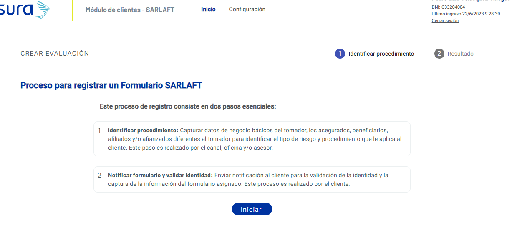
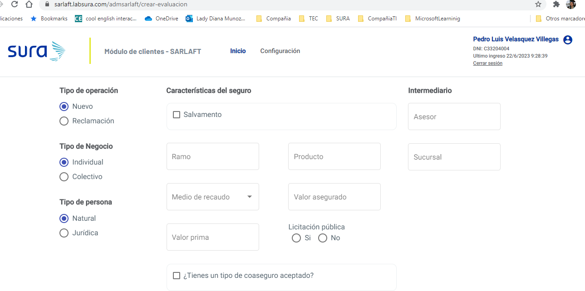
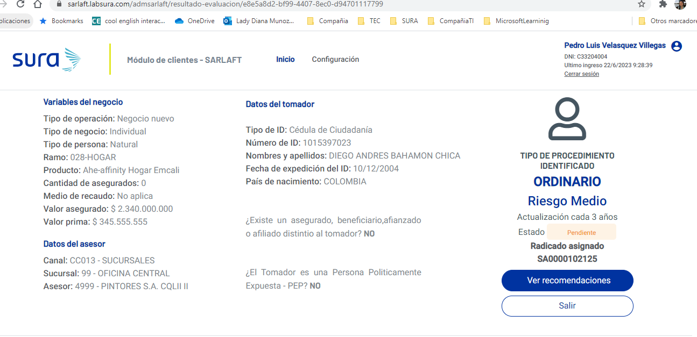

# 12. Crear Evaluación por Formulario

> **Fuente Confluence:** [12. Crear Evaluación por Formulario](https://segurosti.atlassian.net/wiki/spaces/EPA/pages/3235053604/12.+Crear+Evaluaci+n+por+Formulario)  
> **Última modificación:** 2023-06-22 — Diana Muñoz · versión 2  
> **Sección:** [Diseño Funcionalidades](./index.md)

## Archivos adjuntos

| Archivo | Enlace |
|---------|--------|
| `image-20230622-163240.png` | [image-20230622-163240.png](./attachments/image-20230622-163240.png) |
| `image-20230622-163037.png` | [image-20230622-163037.png](./attachments/image-20230622-163037.png) |
| `image-20230622-163014.png` | [image-20230622-163014.png](./attachments/image-20230622-163014.png) |
| `image-20230622-162048.png` | [image-20230622-162048.png](./attachments/image-20230622-162048.png) |
| `image-20230622-162005.png` | [image-20230622-162005.png](./attachments/image-20230622-162005.png) |

Dentro de las opciones para crear una evaluación en Sarlaft 4.0, existe la opción de crearlo desde cero por medio de un formulario en el aplicativo de Sarlaft directamente. (referencia entradas del proceso de evaluacion:  [2. Entradas a Evaluación (Assessment)](/wiki/spaces/EPA/pages/3213164787/2.+Entradas+a+Evaluaci+n+Assessment)).

Para esto se tiene la opción en el visor de aplicaciones_** Sarlaft 4.0 Modulo Clientes**_. url: [https://visorappslab.labsura.com/Index.aspx](https://visorappslab.labsura.com/Index.aspx)

Al seleccionar la opción se presentan dos opciones: _Consultar cliente_ y _Crear evaluacion_. Para ingresar directamente a esta pantalla en laboratorio se puede ingresar por medio de esta url: [https://sarlaft.labsura.com/admsarlaft/inicio](https://sarlaft.labsura.com/admsarlaft/inicio)  con el usuario _**pedrvevi**_.

Con la opción de Crear evaluación se solicitan los datos básicos de la evaluación: 

Al crear la evaluación se muestra la información resumen:

Al correo electrónico del cliente con figura de tomador llega un correo con la url para acceder al formulario de saralft y poder ser diligenciado.