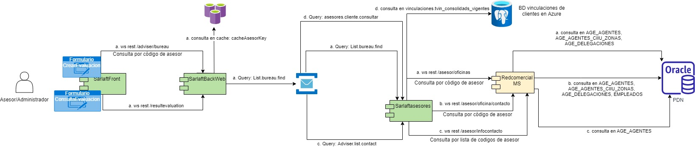
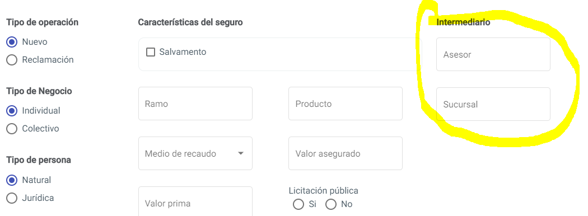
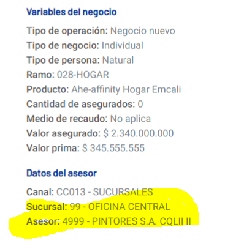

# 13. Consultas Modelo RedComercial

> **Fuente Confluence:** [13. Consultas Modelo RedComercial](https://segurosti.atlassian.net/wiki/spaces/EPA/pages/3234791499/13.+Consultas+Modelo+RedComercial)  
> **Última modificación:** 2023-06-22 — Diana Muñoz · versión 3  
> **Sección:** [Diseño Funcionalidades](./index.md)

## Archivos adjuntos

| Archivo | Enlace |
|---------|--------|
| `image-20230622-182832.png` | [image-20230622-182832.png](./attachments/image-20230622-182832.png) |
| `image-20230622-182004.png` | [image-20230622-182004.png](./attachments/image-20230622-182004.png) |
| `image-20230622-181751.png` | [image-20230622-181751.png](./attachments/image-20230622-181751.png) |
| `Sarlaft_Laura-RedComercial2-20230622-180753.jpg` | [Sarlaft_Laura-RedComercial2-20230622-180753.jpg](./attachments/Sarlaft_Laura-RedComercial2-20230622-180753.jpg) |

Dentro de varios procesos de sarlaft se utilizan consultas a la red comercial, estas consultas se hacen para la creación de la evaluación desde cero en el aplicativo de sarlaft, también se utilizan desde el proceso de actualización.

En el microservicio de redcomercial (Redcomercial MS) se exponen 3 servicios web con consultas al modelo de redcomercial de la base de datos de Oracle PDN (OnPremise). Este microservcio se encuentra desplegado en la infraestructura de sarlaft 4.0 pero no hace parte del dominio de este.

Los servicios mostrados en la grafica de arriba son:

- 
a. ws rest **/asesor/oficinas**: permite consultar el listado de oficinas donde se encuentra inscrito el asesor, así como conocer cual oficina es la principal. [Servicio Web Consultar Oficinas Asesor.](/wiki/spaces/EPA/pages/2565079101/Servicio+Web+Consultar+Oficinas+Asesor.)  Dentro del dominio de sarlaft 4.0 tenemos el microservicio sarlaftasesores que funciona como un integrador hacia el modelo de redcomercial, para consumir este servicio web se utiliza el query: _**List.bureau.find**_; este query es utilizado desde dos puntos del microservicio del backweb al momento de consultar la información de asesor y oficinas en el formulario de crear evaluación desde cero:

Y es utilizado en el servicio web de _**/sarlaftbackweb/resultevaluation**_ para consultar el nombre de la oficina y del asesor de la evaluacion.

- 
b. ws rest **/asesor/oficina/contacto**: permite consultar información de contacto de las oficinas donde esta inscrito/radicado un asesor.(nombre del director de oficina y su correo electronico) [Servicio Web Consulta Información Oficinas Asesor](/wiki/spaces/EPA/pages/2612002880/Servicio+Web+Consulta+Informaci+n+Oficinas+Asesor) 

- 
c. ws rest **/asesor/infocontacto**: permite consultar información de contacto de un asesor [Consultar Información de Contacto del Asesor](/wiki/spaces/EPA/pages/2584870913/Consultar+Informaci+n+de+Contacto+del+Asesor) como correo electrónico y celular