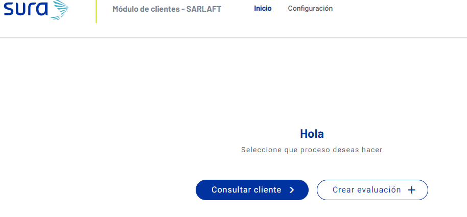
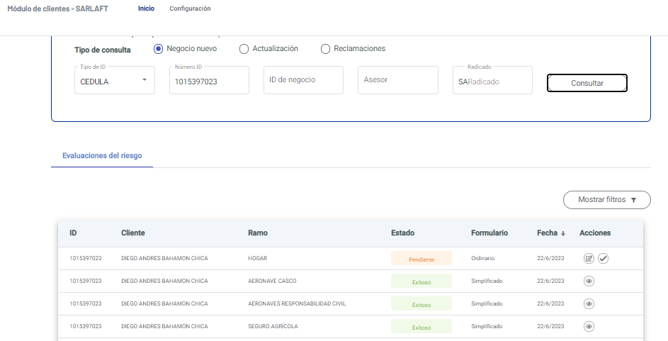
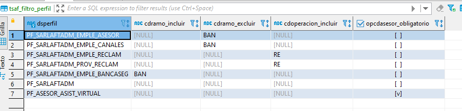
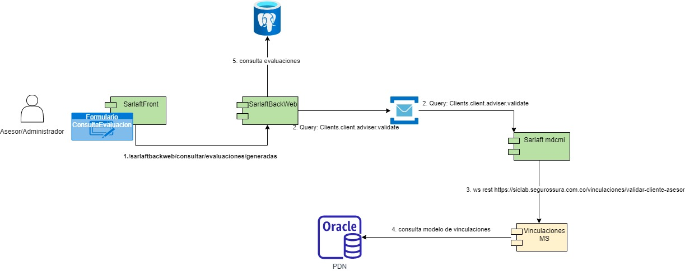

# 14. Consultas Modulo de Clientes

> **Fuente Confluence:** [14. Consultas Modulo de Clientes](https://segurosti.atlassian.net/wiki/spaces/EPA/pages/3235282962/14.+Consultas+Modulo+de+Clientes)  
> **Última modificación:** 2023-06-22 — Diana Muñoz · versión 4  
> **Sección:** [Diseño Funcionalidades](./index.md)

## Archivos adjuntos

| Archivo | Enlace |
|---------|--------|
| `Sarlaft_Laura-ConsultaEvaluacionesGeneradas-20230622-213719.jpg` | [Sarlaft_Laura-ConsultaEvaluacionesGeneradas-20230622-213719.jpg](./attachments/Sarlaft_Laura-ConsultaEvaluacionesGeneradas-20230622-213719.jpg) |
| `image-20230622-210625.png` | [image-20230622-210625.png](./attachments/image-20230622-210625.png) |
| `image-20230622-183610.png` | [image-20230622-183610.png](./attachments/image-20230622-183610.png) |
| `image-20230622-183454.png` | [image-20230622-183454.png](./attachments/image-20230622-183454.png) |

Dentro del aplicativo de sarlaft existe un modulo de clientes para ayudar a consultar información a las oficinas y asesores, también funciona como modulo administrativo para usuarios con mayores privilegios. El acceso a este modulo se realiza de igual forma por el visor de aplicaciones, la url en laboratorio es: [https://sarlaft.labsura.com/admsarlaft/inicio](https://sarlaft.labsura.com/admsarlaft/inicio) , con el usuario pedrvevi.

Dentro de esta pantalla hay 3 servicios muy importantes del microservicio sarlaft backweb:

- 
**/sarlaftbackweb/consultar/evaluaciones/generadas: **permite consultar el listado de evaluaciones en el modelo de Sarlaft 4.0 de acuerdo a los filtros ingresados. [Servicio Consultar evaluaciones de un tomador.](/wiki/spaces/EPA/pages/2427879670/Servicio+Consultar+evaluaciones+de+un+tomador.) 

Dentro de este servicio se realiza un filtro de información que puede ver el usuario logueado, de acuerdo al perfil que posea en la aplicación. Estos permisos se encuentran parametrizados en la tabla _**tsaf_filtro_perfil**_

La columna _opcdasesor_obligatorio _indica que el request del servicio debe existir un header (x-codAsesor) con el codigo del asesor que realiza la consulta.

La columna _cdoperacion_incluir_ indica que el filtro de operación es requerido y que solo es permitido consultar el tipo de operación parametrizado, en la imagen de arriba se visualiza que un usuario con perfil _PF_SARLAFTADM_EMPLE_RECLAM_ y _PF_SARLAFTADM_PROV_RECLAM_, solo puede consultar evaluaciones de reclamaciones.

La colunma _cdramo_incluir _indica que las evaluaciones a consultar pertenezcan a un código de ramo en particular.

La columna _cdramo_excluir _indica las evaluaciones a consultar no pertenezcan a un código de ramo en particular.

También realiza un filtro para el cual solo se permita ver las evaluaciones de un cliente que pertenezca a un asesor por el cual se realiza la consulta, para esto se utiliza el query: _**Clients.client.adviser.validate**_ del microservicio integrador sarlaft mdcmi, el cual consulta por medio del servicio web rest de vinculaciones (externo al dominio de sarlaft) url laboratorio: [https://siclab.segurossura.com.co/vinculaciones/validar-cliente-asesor](https://siclab.segurossura.com.co/vinculaciones/validar-cliente-asesor)

- 
**/sarlaftbackweb/resultevaluation: **permite consulta la información de una evaluación a través de su identificador de numero de evaluación. [Servicio Resultado Evaluación](/wiki/spaces/EPA/pages/2398191643/Servicio+Resultado+Evaluaci+n)  Este servicio realiza los mismo filtros del servicio de generadas explicadas en el punto anterior, donde filtra de acuerdo a la tabla de _**tsaf_filtro_perfil**_ y si el asesor puede ver la información de la evaluación del cliente.

- 
**/sarlaftbackweb/evaluacion/finalizar:** permite a un usuario con perfil administrador finalizar una evaluación sin cumplir todos los requisitos. [Servicio Finalizar Evaluación](/wiki/spaces/EPA/pages/2903408641/Servicio+Finalizar+Evaluaci+n)