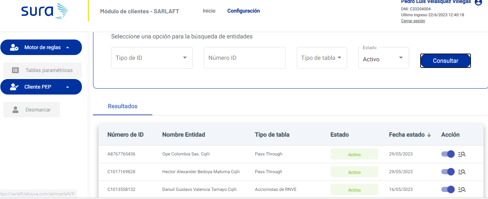

# 15. Parametrización Entidades

> **Fuente Confluence:** [15. Parametrización Entidades](https://segurosti.atlassian.net/wiki/spaces/EPA/pages/3234791531/15.+Parametrizaci+n+Entidades)  
> **Última modificación:** 2023-06-22 — Diana Muñoz · versión 2  
> **Sección:** [Diseño Funcionalidades](./index.md)

## Archivos adjuntos

| Archivo | Enlace |
|---------|--------|
| `image-20230622-191233.png` | [image-20230622-191233.png](./attachments/image-20230622-191233.png) |

Existe un conjunto de entidades que se encuentran parametrizadas en la tabla _**tsaf_entidad**_ del modelo de base de datos de Sarlaft 4.0, estas entidades son utilizadas al momento de realizar la categorización del tipo de riesgo de un sarlaft por parte del motor (sarlaft brms) para aplicar las reglas de negocio pertinentes. Si el dni del cliente se encuentra en esta tabla indicara que tendra un tratamiento especial para el tipo de riesgo del sarlaft. 

Existen diferentes tipos de entidades: FINASEPEN (entidades financieras, aseguradoras y de pensiones) las cuales ya por si solas tienen una obligación de cumplir con el sarlaft ante la superintendencia financiera directamente. REGIMEN (entidades como alcaldías, gobernaciones o demás entes gubernamentales) las cuales tienen un régimen especial en la norma. BOLSA (entidades que cotizan en bolsa de valores). PASSTHROUGH (entidades que para suramericana tienen un trato especial con la norma de sarlaft 4.0)

Para esta pantalla existen 3 servicios web principales:

- 
**/sarlaftbackweb/entidades/consultar:** consulta el listado de entidades parametrizados en la tabla _**tsaf_entidad**_  de acuerdo a los filtros de busqueda. [Servicio Consultar Entidades](/wiki/spaces/EPA/pages/2893152310/Servicio+Consultar+Entidades) 

- 
**/sarlaftbackweb/entidades/cambiarEstado: **permite activar o inactivar una entidad parametrizada. [Servicio Cambiar estado entidad](/wiki/spaces/EPA/pages/2935160848/Servicio+Cambiar+estado+entidad) 

- 
**/sarlaftbackweb/entidades/matricular: **permite parametrizar una nueva entidad. [Servicio Matricular Entidad](/wiki/spaces/EPA/pages/2928377889/Servicio+Matricular+Entidad)