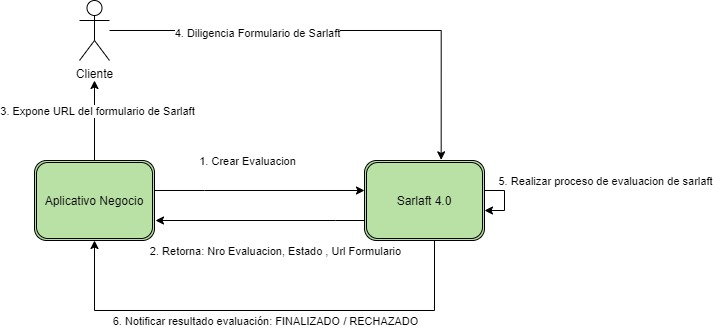
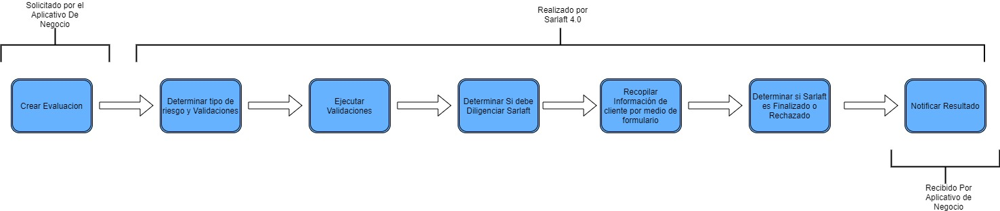
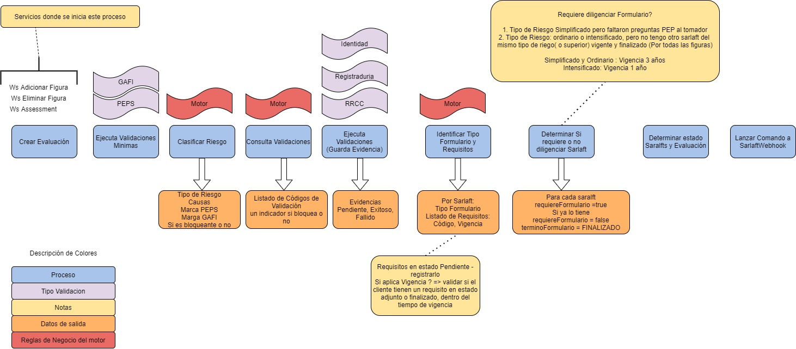

# 1. Proceso de la Evaluación (Assessment)

> **Fuente Confluence:** [1. Proceso de la Evaluación (Assessment)](https://segurosti.atlassian.net/wiki/spaces/EPA/pages/3214049307/1.+Proceso+de+la+Evaluaci+n+Assessment)  
> **Última modificación:** 2023-06-06 — Diana Muñoz · versión 7  
> **Sección:** [Diseño Funcionalidades](./index.md)

## Archivos adjuntos

| Archivo | Enlace |
|---------|--------|
| `Sarlaft_Laura-ProcesoAssessment.jpg` | [Sarlaft_Laura-ProcesoAssessment.jpg](./attachments/Sarlaft_Laura-ProcesoAssessment.jpg) |
| `Sarlaft_Laura-PasosBasicos1-20230606-192743.jpg` | [Sarlaft_Laura-PasosBasicos1-20230606-192743.jpg](./attachments/Sarlaft_Laura-PasosBasicos1-20230606-192743.jpg) |
| `Sarlaft_Laura-PasosBasicos.jpg` | [Sarlaft_Laura-PasosBasicos.jpg](./attachments/Sarlaft_Laura-PasosBasicos.jpg) |

El principal concepto dentro del aplicativo Sarlaft 4.0 es el de “Evaluacion” (assessment). La evaluación es el medio por el cual un aplicativo de negocio puede validar si los clientes (tomador, asegurado, beneficiario, afiliado) que son parte de un negocio de una póliza superan las validaciones de reglamentación de la superintentencia financiera para Sarlaft 4.0 para poder adquirir una póliza con Sura, además de completar la información mínima requerida por la norma.

### Pasos generales de una evaluación: 

Estas imágenes no representan mecanismos tecnológicos ni representa sincronismos entre los pasos, solo explica desde una visión de alto nivel.

Pasos desde la comunicación con el aplicativo expedidor cliente:

- 
El aplicativo cliente reúne la información básica de cada una de las personas (figuras) que tienen un rol dentro del negocio o póliza, ya sea tomador, asegurado, beneficiario, afiliado entre otros; y la envía junto con la información del negocio entre ellos por ejemplo: código de ramo, código de subramo, valor asegurado, valor de prima entre otras características.

- 
Sarlaft 4.0 recibe los datos y crea una evaluación, para la cual determina el nivel de riesgo de las figuras, si es necesario diligenciar formulario o si ya tiene un sarlaft vigente para el mismo nivel de riesgo o superior. Con esas variables determina el estado de cada uno de los sarlaft y evaluación a FINALIZADO, RECHAZADO o PENDIENTE.

- 
Si la evaluación queda en estado FINALIZADO, el aplicativo de negocio podrá realizar la expedición inmediatamente. Si el estado es RECHAZADO no permitirá la expedición. Si el estado es PENDIENTE y que requiere diligenciar formulario mostrara una url que redireccionara al formulario de Sarlaft 4.0. 

- 
En este formulario el cliente podrá ingresar la información necesaria solicitada por Sarlaft 4.0 de acuerdo al tipo de riesgo y así completar este paso. 

- 
Saralft 4.0 verifica que todos los requisitos de sarlaft se completaron y determina el nuevo estado del sarlaft del cliente.

- 
Sarlaft envía una notificación al aplicativo cliente indicando el nuevo estado de la evaluación, es decir si esta fue RECHAZADO  o FINALIZADO.

Ampliando los pasos de la evaluación en Sarlaft 4.0:

En esta imagen se muestran los pasos que realiza Sarlaft 4.0 para cada una de las evaluaciones en forma general.

Ampliando los pasos de la evaluación en Sarlaft 4.0:
