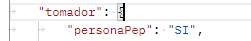
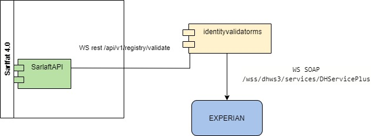

# 3. Validaciones (Assessment)

> **Fuente Confluence:** [3. Validaciones (Assessment)](https://segurosti.atlassian.net/wiki/spaces/EPA/pages/3214082137/3.+Validaciones+Assessment)  
> **Última modificación:** 2023-06-13 — Diana Muñoz · versión 9  
> **Sección:** [Diseño Funcionalidades](./index.md)

## Archivos adjuntos

| Archivo | Enlace |
| --------- | -------- |
| `Sarlaft_Laura-ValidacionIdentidadarlaft2 (1)-20230613-210653.jpg` | [Sarlaft_Laura-ValidacionIdentidadarlaft2 (1)-20230613-210653.jpg](./attachments/Sarlaft_Laura-ValidacionIdentidadarlaft2 (1)-20230613-210653.jpg) |
| `Sarlaft_Laura-ValidacionIdentidadarlaft (1)-20230613-210351.jpg` | [Sarlaft_Laura-ValidacionIdentidadarlaft (1)-20230613-210351.jpg](./attachments/Sarlaft_Laura-ValidacionIdentidadarlaft (1)-20230613-210351.jpg) |
| `Sarlaft_Laura-ValidacionIdentidadarlaft2-20230613-150241.jpg` | [Sarlaft_Laura-ValidacionIdentidadarlaft2-20230613-150241.jpg](./attachments/Sarlaft_Laura-ValidacionIdentidadarlaft2-20230613-150241.jpg) |
| `Sarlaft_Laura-ValidacionIdentidadarlaft-20230609-213516.jpg` | [Sarlaft_Laura-ValidacionIdentidadarlaft-20230609-213516.jpg](./attachments/Sarlaft_Laura-ValidacionIdentidadarlaft-20230609-213516.jpg) |
| `Sarlaft_Laura-ValidacionIdentidadSarlaft (1)-20230609-201613.jpg` | [Sarlaft_Laura-ValidacionIdentidadSarlaft (1)-20230609-201613.jpg](./attachments/Sarlaft_Laura-ValidacionIdentidadSarlaft (1)-20230609-201613.jpg) |
| `Sarlaft_Laura-ValidacionIdentidadSarlaft2-20230608-143824.jpg` | [Sarlaft_Laura-ValidacionIdentidadSarlaft2-20230608-143824.jpg](./attachments/Sarlaft_Laura-ValidacionIdentidadSarlaft2-20230608-143824.jpg) |
| `Sarlaft_Laura-ValidacionIdentidadSarlaft-20230608-143344.jpg` | [Sarlaft_Laura-ValidacionIdentidadSarlaft-20230608-143344.jpg](./attachments/Sarlaft_Laura-ValidacionIdentidadSarlaft-20230608-143344.jpg) |
| `image-20230607-190150.png` | [image-20230607-190150.png](./attachments/image-20230607-190150.png) |

[data-colorid=xe2myvu1ua]{color:#0747a6} html[data-color-mode=dark] [data-colorid=xe2myvu1ua]{color:#5999f8}[data-colorid=oifl00oy26]{color:#0747a6} html[data-color-mode=dark] [data-colorid=oifl00oy26]{color:#5999f8}[data-colorid=pmzm2qlbsd]{color:#0747a6} html[data-color-mode=dark] [data-colorid=pmzm2qlbsd]{color:#5999f8}[data-colorid=b5hzvagq59]{color:#0747a6} html[data-color-mode=dark] [data-colorid=b5hzvagq59]{color:#5999f8}[data-colorid=ieq59kql34]{color:#0747a6} html[data-color-mode=dark] [data-colorid=ieq59kql34]{color:#5999f8}[data-colorid=tnrekhoy0m]{color:#0747a6} html[data-color-mode=dark] [data-colorid=tnrekhoy0m]{color:#5999f8}[data-colorid=krnhufm0iz]{color:#0747a6} html[data-color-mode=dark] [data-colorid=krnhufm0iz]{color:#5999f8}[data-colorid=ip7oqb2zsv]{color:#0747a6} html[data-color-mode=dark] [data-colorid=ip7oqb2zsv]{color:#5999f8}[data-colorid=kvnk5nrobs]{color:#0747a6} html[data-color-mode=dark] [data-colorid=kvnk5nrobs]{color:#5999f8}[data-colorid=m2fuiyx5jh]{color:#0747a6} html[data-color-mode=dark] [data-colorid=m2fuiyx5jh]{color:#5999f8}[data-colorid=dtc2nrli04]{color:#0747a6} html[data-color-mode=dark] [data-colorid=dtc2nrli04]{color:#5999f8}[data-colorid=wzaz9nowta]{color:#0747a6} html[data-color-mode=dark] [data-colorid=wzaz9nowta]{color:#5999f8}[data-colorid=ipwfhezh7i]{color:#0747a6} html[data-color-mode=dark] [data-colorid=ipwfhezh7i]{color:#5999f8}[data-colorid=jy20qenspq]{color:#0747a6} html[data-color-mode=dark] [data-colorid=jy20qenspq]{color:#5999f8}[data-colorid=k9t9w0y4se]{color:#0747a6} html[data-color-mode=dark] [data-colorid=k9t9w0y4se]{color:#5999f8}[data-colorid=brhcl9902y]{color:#0747a6} html[data-color-mode=dark] [data-colorid=brhcl9902y]{color:#5999f8}[data-colorid=ox6jd3vvj4]{color:#0747a6} html[data-color-mode=dark] [data-colorid=ox6jd3vvj4]{color:#5999f8}[data-colorid=ovpf6uig9k]{color:#0747a6} html[data-color-mode=dark] [data-colorid=ovpf6uig9k]{color:#5999f8}[data-colorid=gwa35c25ri]{color:#0747a6} html[data-color-mode=dark] [data-colorid=gwa35c25ri]{color:#5999f8}[data-colorid=wncs0j3in0]{color:#0747a6} html[data-color-mode=dark] [data-colorid=wncs0j3in0]{color:#5999f8}[data-colorid=vbeucu9s87]{color:#0747a6} html[data-color-mode=dark] [data-colorid=vbeucu9s87]{color:#5999f8}[data-colorid=n9iln0nbnz]{color:#0747a6} html[data-color-mode=dark] [data-colorid=n9iln0nbnz]{color:#5999f8}[data-colorid=hmosrev536]{color:#0747a6} html[data-color-mode=dark] [data-colorid=hmosrev536]{color:#5999f8}[data-colorid=odoecn58jx]{color:#0747a6} html[data-color-mode=dark] [data-colorid=odoecn58jx]{color:#5999f8}[data-colorid=n4nkdoe4p3]{color:#0747a6} html[data-color-mode=dark] [data-colorid=n4nkdoe4p3]{color:#5999f8}[data-colorid=y32v1bim0y]{color:#0747a6} html[data-color-mode=dark] [data-colorid=y32v1bim0y]{color:#5999f8}[data-colorid=re1hobj1cn]{color:#0747a6} html[data-color-mode=dark] [data-colorid=re1hobj1cn]{color:#5999f8}[data-colorid=lx0uqlati5]{color:#0747a6} html[data-color-mode=dark] [data-colorid=lx0uqlati5]{color:#5999f8}[data-colorid=ctcm8aeynt]{color:#0747a6} html[data-color-mode=dark] [data-colorid=ctcm8aeynt]{color:#5999f8}[data-colorid=fi8g0wext8]{color:#0747a6} html[data-color-mode=dark] [data-colorid=fi8g0wext8]{color:#5999f8}Las validaciones que se realizan en el proceso de evaluación de sarlaft tiene las siguientes características:

- Pueden ser síncronas o asíncronas de acuerdo a como estén definidas y esto no cambia.

- Pueden bloquear o no la finalización de un sarlaft, esto quiere decir que si la validación esta marcada como no bloqueante, el sarlaft puede finalizar sin que la validación se haya realizado o aun así haya sido fallida. Por ejemplo las validaciones de identidad para los accionistas de una persona jurídica son no bloqueantes.

- Todas las validaciones ejecutadas dejan una evidencia en el sarlaft. (_Tabla: sarlaft.tsaf_evidencia_)

- Las validaciones se heredan de sarlaft anteriores para cuando una persona tiene un sarlaft vigente de un tipo de riesgo igual o superior al determinado en la evaluación; esto quiere decir que la evaluación no se repite si no que la evidencia es clonada al nuevo sarlaft.

### **Tipos de Validaciones:**

#### Validación PEPS:

| CODIGO | PEPS |
| --- | --- |
| TIPO | Síncrona |
| Clase | sura.sarlaft4.usecase.assessment.validacion.ValidacionPeps |
| Componente | Microservicio de SarlaftAPI |
| Componente Integrador | Microservicio Clientes PEPS MI (Microservicio - Clientes PEP - EGV Procesos Administrativos - Confluence (atlassian.net)) |
| Componente Externo | Microservicio PEPS (Microservicio PEPS - EGV Procesos Administrativos - Confluence (atlassian.net)) |

Un cliente PEPS es una Persona Políticamente Expuesta, se identifica dado que cuenta con una marcación en el base de datos de personas PEPS de Sura, esta base de datos es externa al aplicativo de Sarlaft 4.0 y por lo tanto su dominio no es administrado por Sarlaft 4.0. Para poder determinar si un cliente es PEPS o no, se debe consultar esta información a través del servicio web de consultas peps, y esto se realiza por medio del integrador peps que si hace parte del dominio de Saralft 4.0. Mecanismo de integración explicado en: [Query consulta Cliente PEPS - EGV Procesos Administrativos - Confluence (atlassian.net)](/wiki/spaces/EPA/pages/1864597599/Query+consulta+Cliente+PEPS)  

Esta validación también utiliza la respuesta dada por el cliente a si se considera una persona públicamente expuesta o si tiene cierto grado de consanguinidad con una personas PEPS. Para responder a esta pregunta el cliente tiene dos opciones:  

- Responder a la pregunta en el mismo aplicativo expedidor: Algunos aplicativos como el cotizador tiene esta opción, en la cual antes de solicitar la creación de la evaluación en sarlaft 4.0, preguntan al cliente si se considera o tiene relacion con un PEPS, para este caso en el json de entrada al servicio de assessment envian S en el siguiente parámetro:  (Esta pregunta solo aplica para el tomador.) Servicio de crear evaluacion: [Servicio Evaluación Validación Sarlaft - EGV Procesos Administrativos - Confluence (atlassian.net)](https://segurosti.atlassian.net/wiki/spaces/EPA/pages/1814233305/Servicio+Evaluaci+n+Validaci+n+Sarlaft)

- Responder a la pregunta en el formulario de Sarlaft 4.0: al iniciar el formulario al cliente se le realiza la pregunta PEPS, y con esta respuesta se solicita recategorizar la evaluación, donde si el cliente responde afirmativamente la evaluación podría recategorizarse a un riesgo intensificado. Servicio utilizado desde el Front de sarlaft ([Servicio Recategorización Evaluación Sarlaft - EGV Procesos Administrativos - Confluence (atlassian.net)](https://segurosti.atlassian.net/wiki/spaces/EPA/pages/2476834835/Servicio+Recategorizaci+n+Evaluaci+n+Sarlaft))

#### Validación GAFI

| CODIGO | GAFI |
| --- | --- |
| TIPO | Síncrona |
| Clase | sura.sarlaft4.usecase.assessment.validacion.ValidacionGafi |
| Componente | Microservicio de SarlaftAPI |
| Componente Integrador | No aplica |
| Componente Externo | No aplica |

Esta validación busca identificar si el país de nacimiento de una persona esta marcado dentro de la lista GAFI. Esta lista se encuentra almacenada en la base de datos de Saralft 4.0 por lo tanto no hay que utilizar ningún mecanismo de integración para consultarla, tabla: sarlaft.tsaf_paises_gafi.

Aquellos países que están marcados como bloqueantes (lista negra) indica que el país de nacionalidad del cliente no es apto para vinculaciones con Sura, por lo cual el sarlaft es rechazado. Para los otros países que no están marcados como bloqueantes (lista gris) se puede seguir la evaluación de sarlaft con un nivel de riesgo intensificado. Esta marca de determina con el campo dsbloqueante.

#### Validación RRCC

| CODIGO | RRCC |
| --- | --- |
| TIPO | Síncrona |
| Clase | sura.sarlaft4.usecase.assessment.validacion.ValidacionRRCC |
| Componente | Microservicio de SarlaftAPI |
| Componente Integrador | Azure Redis Cache. SarlaftAPI sura.sarlaft4.reactive.adapter.rrcc.RRCCAdapter |
| Componente Externo | Microservicio Externo de Riesgos Consultables - MS Regulación. |

La validación de RRCC permite conocer si una persona esta marcada como riesgo consultable en Sura con la causal de riesgo moral - listas de control. En caso de pertenecer a esta marca el Salaft es automáticamente rechazado.  Por razones de desempeño y estabilidad de la plataforma, en la evaluación se valida primero si una persona posee la marca de RRCC en cache, esta marca periódicamente se esta sincronizando a redis cache de sarlaft. Si la persona no esta marcada como RRCC en cache, la evidencia guardada es exitosa, en caso de tener una marca de realiza una validación directamente al servicio rest de riesgos consultables (microservicio en Openshift ms-regulacion). La consulta a RRCC se realiza por medio del adaptador RRCCAdapter en el microservicio de sarlaftapi.

Información de consumo del servicio rest de RRCC [Consulta Cliente RRCC - EGV Procesos Administrativos - Confluence (atlassian.net)](/wiki/spaces/EPA/pages/1860862186/Consulta+Cliente+RRCC)

#### Validación Registraduría

| CODIGO | DOCUMENT_PN |
| --- | --- |
| TIPO | Síncrona y Asíncrona |
| Clase | sura.sarlaft4.usecase.assessment.validacion.ValidacionDocumentoPn |
| Componente | Microservicio de SarlaftAPI |
| Componente Integrador | Microservicio Identity  Microservicio - Identity - EGV Procesos Administrativos - Confluence (atlassian.net) |
| Componente Externo | Microservicio Validación de Identidad Validar identidad (Experian) - EGV Procesos Administrativos - Confluence (atlassian.net) |

La validación de Registraduría permite validar si una persona natural tiene una documentación valida en la registraduría nacional, para esta validación Sura tiene contrato con la empresa Experian, quien es la encargada de realizar esta validación directamente con la registraduría.

Esta validación es de tipo Asíncrono para casi todas las soluciones y debe permanecer así por decisión de arquitectura, debido a que los tiempos de respuesta de el servicio de experian no son óptimos.

Solo existe una excepción para el aplicativo expedidor del cotizador (codigos 6919 y 6918) para la cual la validación de registraduría se organizo de manera síncrona, esta excepción esta parametrizada en la siguiente tabla: sarlaft.tsaf_aplicacion campo snregistraduria_sincrona.

_**Validación Asíncrona**_

Adaptador para enviar el mensaje sura.sarlaft4.reactive.adapter.validacionregistraduria.ValidacionResistraduriaAsyncAdapter (en sarlaftapi)

Adaptador para recibir el mensaje: sura.sarlaft4.reactive.validacionregistraduria.AsyncCommandListenerValidarRegistraduria  (en sarlaftapi)
-20230609-201613.jpg?version=1&modificationDate=1686341801980&cacheVersion=1&api=v2)

_**Validación Síncrona**_

Adaptador para realizar la consulta: sura.sarlaft4.reactive.adapter.registraduria.RegistraduriaAdapter  (en sarlaftapi)

Documentación del componente externo validación de identidad para la integración con el servicio web de experian ([IV001: Validar documento de identidad con Registraduría - EGV Procesos Administrativos - Confluence (atlassian.net)](https://segurosti.atlassian.net/wiki/spaces/EPA/pages/2456289281/IV001+Validar+documento+de+identidad+con+Registradur+a))

#### Validación Identidad:

| CODIGO | EXPERIAN, CIFIN |
| --- | --- |
| TIPO | Asíncrona |
| Clase | sura.sarlaft4.usecase.assessment.validacion.ValidacionIdentity (solo crea la evidencia) |
| Componente | Microservicio de SarlaftAPI |
| Componente Integrador | Microservicio Identity Microservicio - Identity - EGV Procesos Administrativos - Confluence (atlassian.net) |
| Componente Externo | Microservicio Validacion de Identidad Validar identidad (Experian) - EGV Procesos Administrativos - Confluence (atlassian.net) |

En el momento de creación de la evaluación, la clase ValidacionIdentity  se encarga de dejar una evidencia de tipo _**EXPERIAN **_o _**CIFIN **_en estado pendiente, dado que la validación de identidad se lanza de forma manual a cada una de las figuras que apliquen en el momento del diligenciamiento del formulario de sarlaft, quiere decir que cuando el cliente termina de diligenciar su sarlaft, se le presenta una pantalla donde se solicita hacer el envío de la notificación de solicitud de validación de identidad por medio de un botón en el formulario.

La clase ValidacionIdentity  determina si la validación de identidad es de tipo CIFIN o EXPERIAN por medio de un campo en que se llama _**snaccionmanual**_ en la tabla sarlaft.tsaf_aplicacion, si el código de aplicación con la cual fue creada la evaluación tiene S en el campo _**snaccionmanual**_ y la figura es tomador se creara una evidencia de tipo CIFIN de lo contrario se creara de tipo EXPERIAN.

La evidencia de CIFIN es valida como evidencia de que el cliente ya realizo la validación de identidad, para aplicativos de negocio que ya tenían en su proceso de venta este paso y que no puede ser cambiado, tal es el caso del aplicativo del cotizador.

##### Flujo para Validación Identidad por Experian:

En el momento que el cliente termina de diligenciar el formulario de sarlaft, por medio de una opción en el formulario, puede enviar la notificación de solicitud de validación de identidad a todas las figuras que están involucradas en la evaluación y aplica la validación de identidad de tipo EXPERIAN. Este envío se realiza por medio del servicio web: _**/validaridentidad/validate**_ del microservicio del sarlaft api, el cual se encarga de consultar la información necesaria para el correo, incluyendo el token JWT (utilizado como mecanismo de seguridad para cuando el cliente abra el formulario de sarlaft).

El envío de la comunicación a CCM se realiza por medio del mecanismo de integración de Rabbit MQ ([Microservicio - CCM - EGV Procesos Administrativos - Confluence (atlassian.net)](/wiki/spaces/EPA/pages/2345730088/Microservicio+-+CCM))
-20230613-210351.jpg?version=1&modificationDate=1686690391708&cacheVersion=1&api=v2)

##### Flujo para Validación Identidad por CIFIN:

Una vez se completan todos los pasos de todos los sarlafts en la evaluación, tales como validación de la registraduría, formulario, validación PEPs, validación de identidad para otras figuras, y cuando solo falta la validación de identidad del tomador en las evaluaciones que vienen con código de aplicación de cotizador  (6919), la aplicación de Sarlaft hace el webhook hacia el cotizador con la evaluación en un estado _PENDIENTE_ACCION_MANUAL_. El cotizador es responsable de que el tomador haga la validación de identidad, en este caso por CIFIN. Una vez el cotizador tiene el resultado de la validación de CIFIN, la anexa a la evaluación de sarlaft por medio del servicio web: _**/sarlaftserv/assessment/addevidence**_ (del microservicio de sarlaftapi) ([Servicio Adicionar Evidencias - EGV Procesos Administrativos - Confluence (atlassian.net)](/wiki/spaces/EPA/pages/1814003981/Servicio+Adicionar+Evidencias)).
-20230613-210653.jpg?version=1&modificationDate=1686690432563&cacheVersion=1&api=v2)
