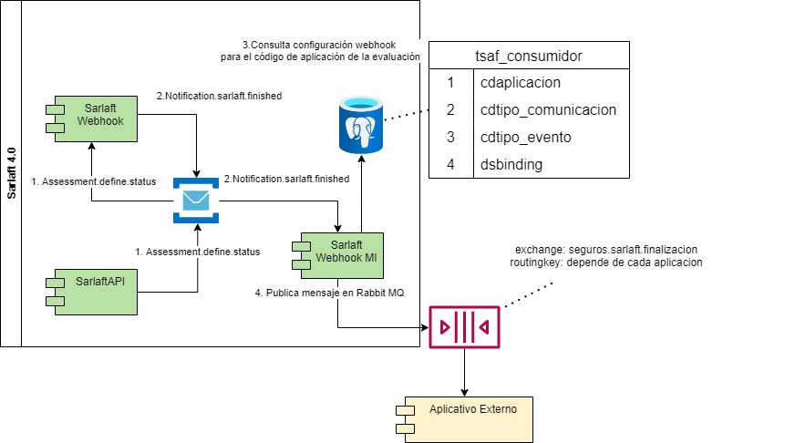
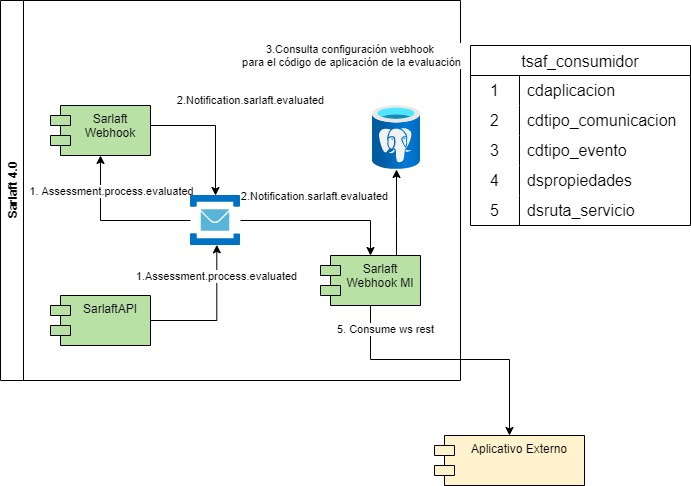

# 7. Webhook (Assessment)

> **Fuente Confluence:** [7. Webhook (Assessment)](https://segurosti.atlassian.net/wiki/spaces/EPA/pages/3222994946/7.+Webhook+Assessment)  
> **Última modificación:** 2023-06-14 — Diana Muñoz · versión 5  
> **Sección:** [Diseño Funcionalidades](./index.md)

## Archivos adjuntos

| Archivo | Enlace |
| --------- | -------- |
| `Sarlaft_Laura-WebhookFinalizacion3.jpg` | [Sarlaft_Laura-WebhookFinalizacion3.jpg](./attachments/Sarlaft_Laura-WebhookFinalizacion3.jpg) |
| `Sarlaft_Laura-WebhookFinalizacion2.jpg` | [Sarlaft_Laura-WebhookFinalizacion2.jpg](./attachments/Sarlaft_Laura-WebhookFinalizacion2.jpg) |
| `Sarlaft_Laura-WebhookFinalizacion1.jpg` | [Sarlaft_Laura-WebhookFinalizacion1.jpg](./attachments/Sarlaft_Laura-WebhookFinalizacion1.jpg) |
| `Sarlaft_Laura-WebhookFinalizacion2 (1)-20230613-210837.jpg` | [Sarlaft_Laura-WebhookFinalizacion2 (1)-20230613-210837.jpg](./attachments/Sarlaft_Laura-WebhookFinalizacion2 (1)-20230613-210837.jpg) |
| `Sarlaft_Laura-WebhookFinalizacion1 (1)-20230613-210805.jpg` | [Sarlaft_Laura-WebhookFinalizacion1 (1)-20230613-210805.jpg](./attachments/Sarlaft_Laura-WebhookFinalizacion1 (1)-20230613-210805.jpg) |
| `Sarlaft_Laura-WebhookFinalizacion3-20230613-165215.jpg` | [Sarlaft_Laura-WebhookFinalizacion3-20230613-165215.jpg](./attachments/Sarlaft_Laura-WebhookFinalizacion3-20230613-165215.jpg) |
| `Sarlaft_Laura-WebhookFinalizacion2-20230613-164249.jpg` | [Sarlaft_Laura-WebhookFinalizacion2-20230613-164249.jpg](./attachments/Sarlaft_Laura-WebhookFinalizacion2-20230613-164249.jpg) |
| `Sarlaft_Laura-WebhookFinalizacion1-20230613-162833.jpg` | [Sarlaft_Laura-WebhookFinalizacion1-20230613-162833.jpg](./attachments/Sarlaft_Laura-WebhookFinalizacion1-20230613-162833.jpg) |

### Webhook Finalización:

Este mecanismo permite comunicar al aplicativo que envió la solicitud de crear evaluación el resultado de la misma. Se realiza notificación webhook cuando la evaluación queda en los siguientes estados:

| Estado | Descripción |
| --- | --- |
| FINALIZADO | La evaluación ha cumplido todos los pasos: validaciones, formulario, requisitos. Por estar finalizado el negocio puede expedirse. |
| RECHAZADO | Alguna de las validaciones dejo una evidencia en estado FALLIDO y de esta forma la evaluación es rechazada. Por estar rechazado el negocio no puede expedirse. |
| PENDIENTE_ACCION_MANUAL | Estado que aplica solo para la aplicación del cotizador (6919) cuando el único pendiente de la evaluación es la validación de identidad del tomador. Por estar en este estado no se puede aun expedir el negocio, el aplicativo del cotizador (6919) debe completar la evaluación de identidad y adjuntar la evidencia a Sarlaft 4.0 |
| FINALIZADO_EXCEPCION | Es un estado especial para cuando un sarlaft finaliza sin diligenciar formulario, aplica para ciertos negocios que constituyen excepción en las reglas de negocio de Sarlaft 4.0.  Por estar finalizado el negocio puede expedirse. |
| FINALIZADO_SIN_CARGA | La evaluación ha cumplido todos los pasos: validaciones, formulario, requisitos. Algunos requisitos pudiesen haberse adjuntado pero no se han subido al gestor documental P8. Por estar finalizado el negocio puede expedirse. |

Existen dos tipos de comunicación de webhook, cada aplicativo puede elegir aquel que sea acorde a su arquitectura.

#### Mecanismo QUEUE:

En la tabla tsaf_consumidor se parametriza _**QUEUE **_para el código de aplicación y el cdtipo_evento _**FINALIZACION**_. El mensaje siempre se publica en el exchange_** seguros.sarlaft.finalizacion **_con el binding parametrizado en el campo dsbinding.

#### Mecanismo REST:

En la tabla tsaf_consumidor se parametriza _**REST **_para el código de aplicación y el cdtipo_evento _**FINALIZACION**_. El mensaje siempre se envía al servicio rest parametrizado en el campo dsruta_servicio utilizando el campo dspropiedades para la autenticación

Se soportan solo dos tipos de autenticación Seus 4 y token JWT.

Documentación mensaje webhook: [Descripción de Interfaces Principales - EGV Procesos Administrativos - Confluence (atlassian.net)](https://segurosti.atlassian.net/wiki/spaces/EPA/pages/1955070150/Descripci+n+de+Interfaces+Principales)

### Webhook Evaluación:

Este mecanismo permite comunicar al aplicativo que envió la solicitud de crear evaluación, por medio de un mecanismo masivo, el resultado inicial de la evaluación, en comparación es decir como si el resultado fuera del servicio web de assessment.

Se puede hacer el webhook por QUEUE o por REST parametrizado para el tipo de evento EVALUACION (cdtipo_evento)

Descripción integración masiva [Interfaz Procesos Masivos - EGV Procesos Administrativos - Confluence (atlassian.net)](/wiki/spaces/EPA/pages/1955070163/Interfaz+Procesos+Masivos)
