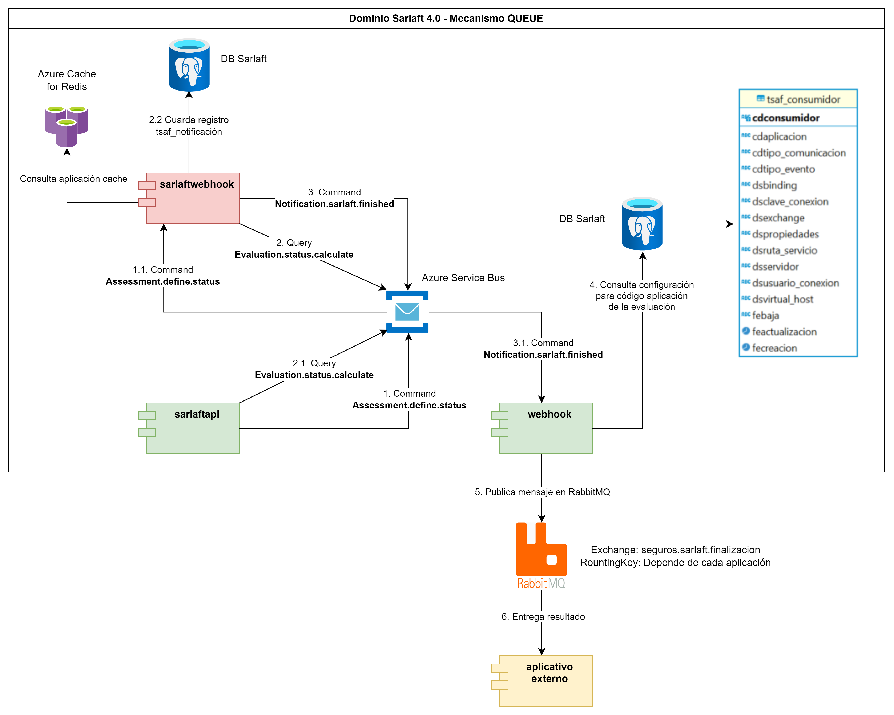
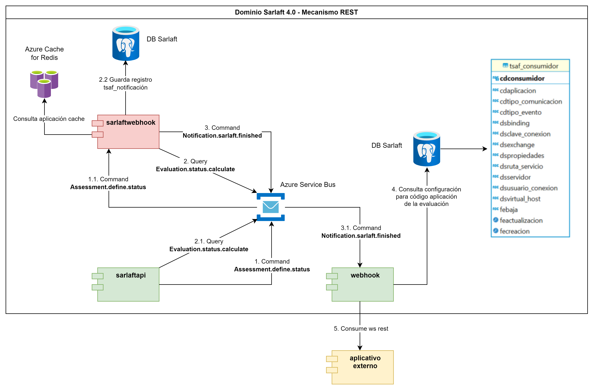
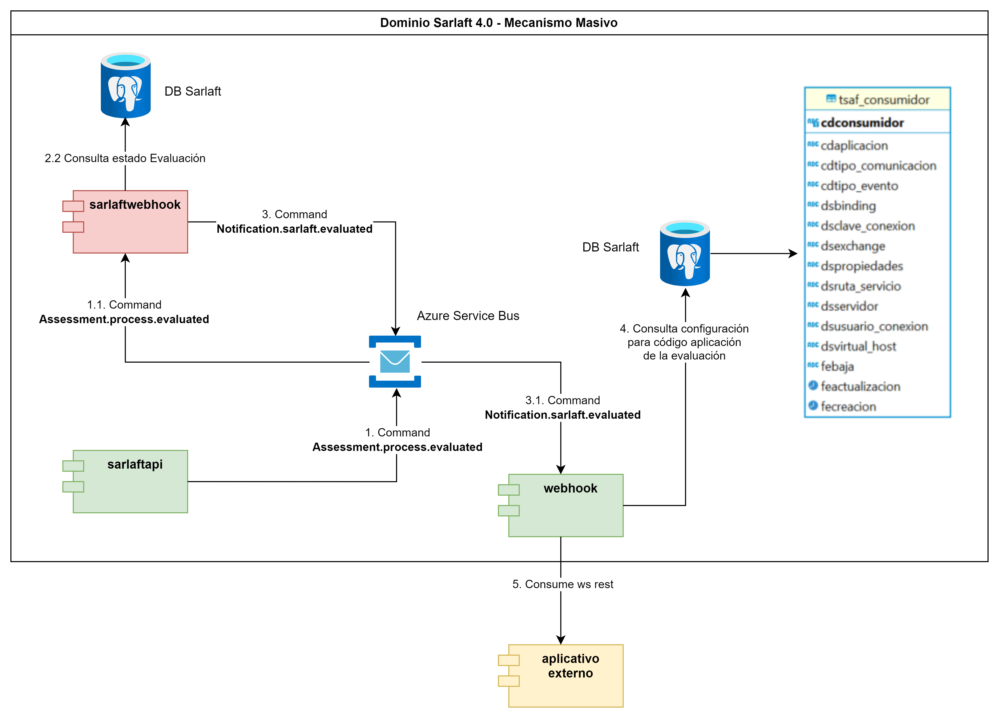
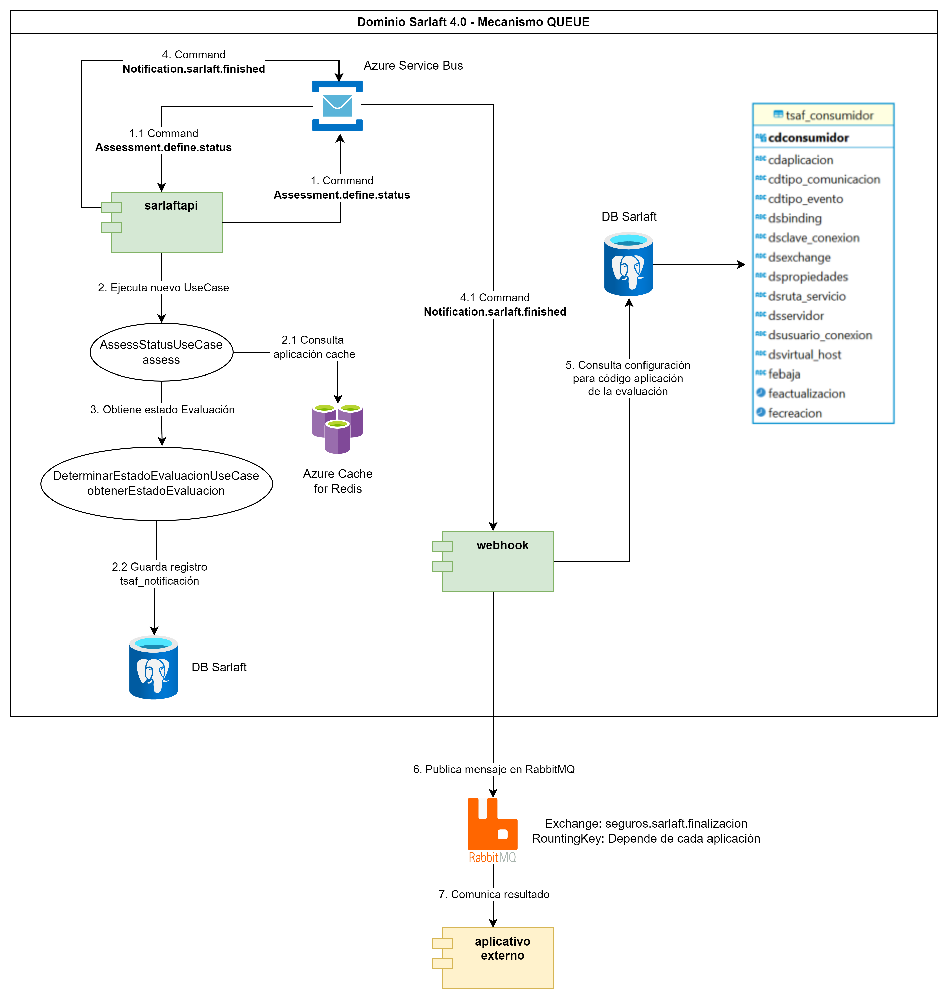
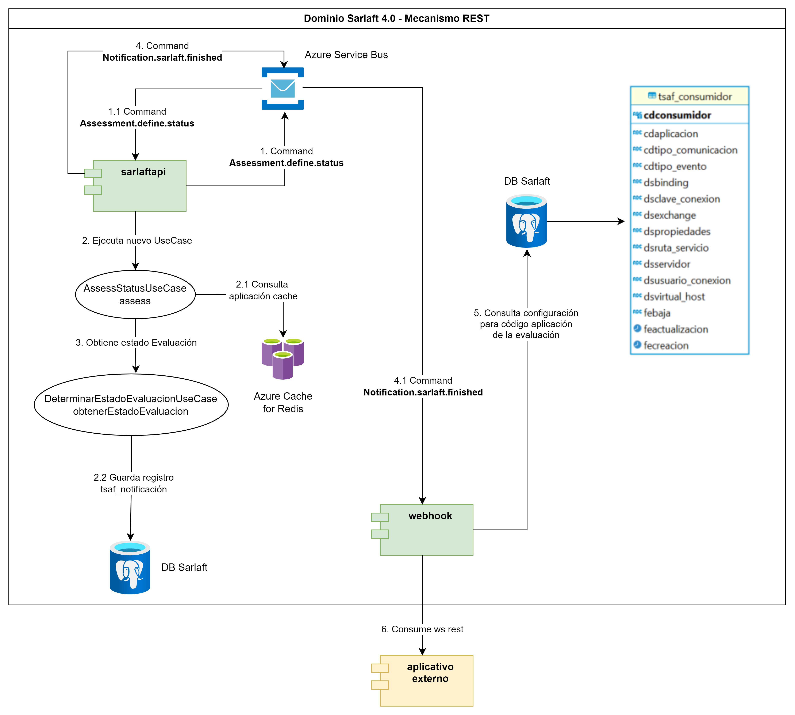
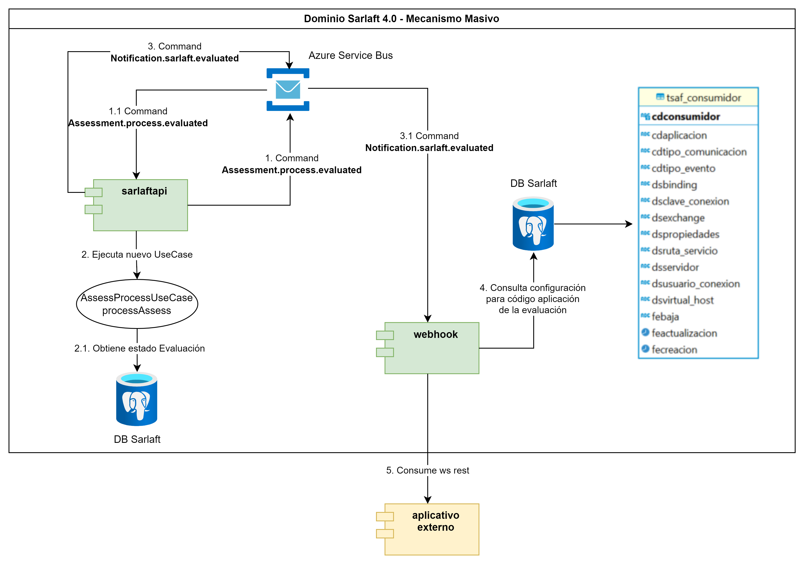

# Diagrama de la arquitectura actual del proceso webhook en Sarlaft 4.0

> **Fuente Confluence:** [Diagrama de la arquitectura actual del proceso webhook en Sarlaft 4.0](https://segurosti.atlassian.net/wiki/spaces/EPA/pages/3742531593/Diagrama+de+la+arquitectura+actual+del+proceso+webhook+en+Sarlaft+4.0)  
> **Última modificación:** 2024-05-15 — Julián Andrés Curubo García · versión 2  
> **Sección:** [Diseño Funcionalidades](./index.md)

## Archivos adjuntos

| Archivo | Enlace |
| --------- | -------- |
| `image-20240514-213031.png` | [image-20240514-213031.png](./attachments/image-20240514-213031.png) |
| `image-20240514-212631.png` | [image-20240514-212631.png](./attachments/image-20240514-212631.png) |
| `image-20240514-212611.png` | [image-20240514-212611.png](./attachments/image-20240514-212611.png) |
| `image-20240514-212000.png` | [image-20240514-212000.png](./attachments/image-20240514-212000.png) |
| `image-20240514-211846.png` | [image-20240514-211846.png](./attachments/image-20240514-211846.png) |
| `image-20240514-211832.png` | [image-20240514-211832.png](./attachments/image-20240514-211832.png) |

##### **Webhook de finalización**

###### **Comunicación a través del mecanismo de QUEUE y REST**

En este esquema, el microservicio sarlaftwebhook se encarga de recibir el comando "Assessment.define.status" y ejecutar el caso de uso AssessStatusUseCase#assess. Este caso de uso busca la información de la aplicación en el Azure Cache de Redis o, en su defecto, en la base de datos del aplicativo sarlaft 4.0 si no la encuentra en caché, con el fin de determinar si se deben aplicar notificaciones. En caso de que la aplicación esté parametrizada para recibir notificaciones, se procede a obtener el estado de la evaluación consultándola en la base de datos de sarlaft 4.0. Se valida que el estado de la evaluación corresponda a alguno de los siguientes estados: FINALIZADO, RECHAZADO, PENDIENTE_ACCION_MANUAL, FINALIZADO_EXCEPCION, FINALIZADO_SIN_CARGA. Si el estado de la evaluación coincide con alguno de los mencionados anteriormente, se registra un evento en la tabla tsaf_notificacion y se lanza el comando "Notification.sarlaft.finished", el cual es recibido por el microservicio integrador webhook.

##### **Webhook de evaluación**

###### **Comunicación a través del mecanismo masivo**

En este esquema, el microservicio sarlaftwebhook se encarga de recibir el comando "Assessment.process.evaluated" y ejecutar el caso de uso AssessProcessUseCase#processAssess. Este caso de uso consulta el estado de cada una de las evaluaciones recibidas en la base de datos de sarlaft 4.0 y, finalmente, emite el comando “Notification.sarlaft.evaluated”, el cual es recibido por el microservicio integrador webhook.

Se propone mantener la comunicación que se tiene a través del Azure Service Bus eliminando la comunicación por eventos con el microservicio sarlaftwebhook el cual desaparecería, transfiriendo las responsabilidades al microservicios sarlaftapi. Los comandos lanzandos por sarlaftapi, pasan por el Azure Service Bus y que escucharía nuevamente el microservicio sarlaftapi.

### **Diagrama de la arquitectura actual del proceso webhook en Sarlaft 4.0**

##### **Webhook de finalización**

###### **Comunicación a través del mecanismo de QUEUE y REST**

Para este mecanismo al eliminar el microservicio sarlaftwebhook, se propone:

- Mantener en el microservicio sarlaftapi la comunicación por el comando "Assessment.define.status".

- Implementar en el microservicio sarlaftapi que escuche el comando "Assessment.define.status".

- Implementar en el microservicio sarlaftapi un caso de uso llamado AssessStatusUseCase#assess como el que se viene manejando en el microservicio de sarlaftwebhook con el fin de que ahora sea sarlaftapi el que se encargue de buscar la información de la aplicación en el Azure Cache de Redis o, en su defecto, en la base de datos del aplicativo sarlaft 4.0 si no la encuentra en caché, con el fin de determinar si se deben aplicar notificaciones. En caso de que la aplicación esté parametrizada para recibir notificaciones, se procede a obtener el estado de la evaluación consultándola en la base de datos de sarlaft 4.0. Se valida que el estado de la evaluación corresponda a alguno de los siguientes estados: FINALIZADO, RECHAZADO, PENDIENTE_ACCION_MANUAL, FINALIZADO_EXCEPCION, FINALIZADO_SIN_CARGA. Si el estado de la evaluación coincide con alguno de los mencionados anteriormente, se registra un evento en la tabla tsaf_notificacion y se lanza el comando "Notification.sarlaft.finished", el cual es recibido por el microservicio integrador webhook.

- Implementar el comando "Notification.sarlaft.finished" en el microservicio sarlaftapi (como actualmente se maneja en sarlaftwebhook) para enviarse desde sarlaftapi y así comunicarse con el microservicio integrador sarlaftwebhook mi.

- Se eliminaría la comunicación por query para "Evaluation.status.calculate" ya que se tomaría directamente desde sarlaftapi donde está implementado.

##### **Webhook de evaluación**

###### **Comunicación a través del mecanismo masivo**

Para este mecanismo al eliminar el microservicio sarlaftwebhook, se propone:

- Mantener la comunicación por comando "Assessment.process.evaluated" en sura.sarlaft4.reactive.adapter.notificacion.NotificacionAsynpter.

- Implementar en el microservicio sarlaftapi que escuche el comando " Assessment.process.evaluated ".

- Implementar en el microservicio sarlaftapi el caso de uso AssessProcessUseCase#processAssess como el que se viene manejando en el micro de sarlaftwebhook el cual se encarga de consultar el estado de cada una de las evaluaciones recibidas en la base de datos de sarlaft 4.0 y, finalmente, emite el comando “Notification.sarlaft.evaluated”, el cual es recibido por el microservicio integrador webhook.

- Implementar el comando "Notification.sarlaft.evaluated" para enviarse desde sarlaftapi y así comunicarse con el microservicio sarlaftwebhook mi.

##### **Identificación de los puntos a mejorar y riesgos con la aplicación del cambio**

**Mejoras:**

- Eliminar el punto de fallo del microservicio de sarlaftwebhook.

- Eliminar el cuello de botella de atender el query por parte del microservicio de sarlaftapi.

- Al mantener la comunicación por el azure service bus se mantendría los siguientes ítems:

Gestión de los mensajes en el dead letter queue

Trazabilidad de los mensajes y eventos

Gestión de los mensajes: consulta, filtrado, estadísticas

Garantía de Entrega de los mensajes

Persistencia de Mensajes: los mensajes se almacenan de manera duradera, asegurando que no se pierdan y puedan ser recuperados y procesados posteriormente.

Autoescalado: manejo automático del aumento de la carga de trabajo sin intervención manual.

**Riesgos y contras:**

- Transferir la responsabilidad que venía manejando el microservicio sarlaftwebhook al microservicio sarlaftapi.

- Se deben realizar varios cambios a nivel de programación en el microservicio sarlaftapi.

- Aumenta la complejidad accidental en el microservicio de sarlaftapi.

- Se pronostica que los cambios que se deben realizar en el microservicio sarlaftapi aplique para pruebas de seguridad dinámicas y por checkmarx.

- Al mantener la comunicación a través del azure service bus se mantendría:

Gastos operativos

Tarifas de Transferencia de Datos

Retardo en la Entrega de los mensajes

Dependencia con la Red cuando se presente conectividad limitada o inestable

- Al mantener la comunicación por el azure service bus se podría presentar el problema con el tamaño máximo de los mensajes.
