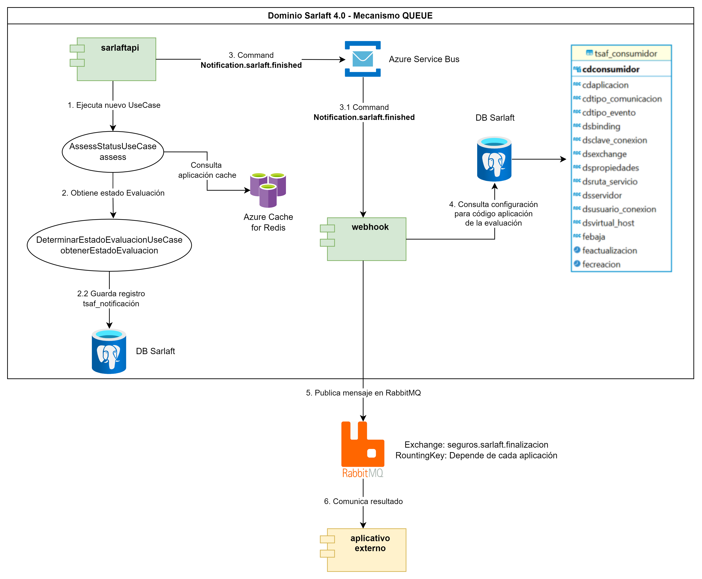
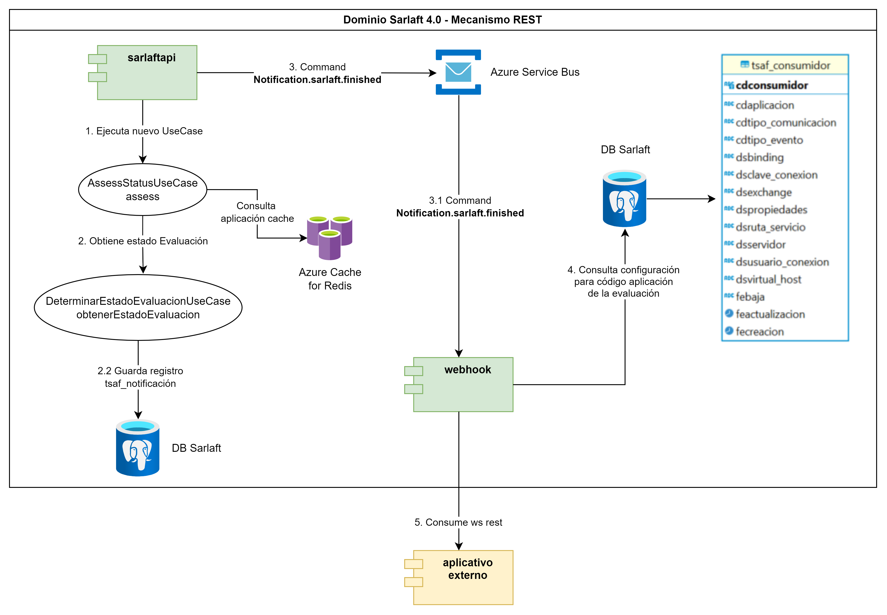
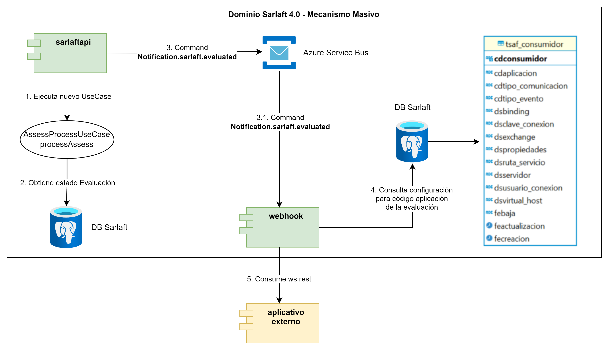

# Propuesta 1 - Omitir la comunicación que pasa por Azure Service Bus

> **Fuente Confluence:** [Propuesta 1 - Omitir la comunicación que pasa por Azure Service Bus](https://segurosti.atlassian.net/wiki/spaces/EPA/pages/3742892047/Propuesta+1+-+Omitir+la+comunicaci+n+que+pasa+por+Azure+Service+Bus)  
> **Última modificación:** 2024-05-15 — Julián Andrés Curubo García · versión 5  
> **Sección:** [Diseño Funcionalidades](./index.md)

## Archivos adjuntos

| Archivo | Enlace |
| --------- | -------- |
| `image-20240515-224607.png` | [image-20240515-224607.png](./attachments/image-20240515-224607.png) |
| `image-20240515-224554.png` | [image-20240515-224554.png](./attachments/image-20240515-224554.png) |
| `image-20240515-224450.png` | [image-20240515-224450.png](./attachments/image-20240515-224450.png) |
| `image-20240515-224430.png` | [image-20240515-224430.png](./attachments/image-20240515-224430.png) |
| `image-20240515-224417.png` | [image-20240515-224417.png](./attachments/image-20240515-224417.png) |

En esta primera propuesta se busca eliminar la comunicación del Azure Service Bus que se tiene para comunicar el microservicio de sarlaftapi con el microservicio de sarlaftwebhook a través de comandos y querys.

#### **Diseño del nuevo proceso de webhook, interacción de componentes, cambio de comunicaciones de mensajería tipo Query a comunicación por servicio rest.**

##### **Webhook de finalización**

###### **Comunicación a través del mecanismo de QUEUE:**

###### **Comunicación a través del mecanismo de REST:**

Para este mecanismo al eliminar el microservicio sarlaftwebhook, se propone:

- Eliminar del microservicio sarlaftapi la comunicación por el comando "Assessment.define.status"

- Implementar en el microservicio sarlaftapi un caso de uso llamado AssessStatusUseCase#assess como el que se viene manejando en el microservicio de sarlaftwebhook con el fin de que ahora sea sarlaftapi el que se encargue de buscar la información de la aplicación en el Azure Cache de Redis o, en su defecto, en la base de datos del aplicativo sarlaft 4.0 si no la encuentra en caché, con el fin de determinar si se deben aplicar notificaciones. En caso de que la aplicación esté parametrizada para recibir notificaciones, se valida que el estado de la evaluación que se encuentra en flujo corresponda a alguno de los siguientes estados: FINALIZADO, RECHAZADO, PENDIENTE_ACCION_MANUAL, FINALIZADO_EXCEPCION, FINALIZADO_SIN_CARGA. Si el estado de la evaluación coincide con alguno de los mencionados anteriormente, se registra un evento en la tabla tsaf_notificacion y se lanza el comando "Notification.sarlaft.finished", el cual es recibido por el microservicio integrador webhook.

- Implementar el comando "Notification.sarlaft.finished" en el microservicio sarlaftapi (como actualmente se maneja en sarlaftwebhook) para enviarse desde sarlaftapi y así comunicarse con el microservicio integrador sarlaftwebhook mi.

- Se eliminaría la comunicación por query para "Evaluation.status.calculate" ya que se tomaría directamente desde sarlaftapi donde está implementado.

- Debido a que ya no se utilizaría el comando "Assessment.define.status" se debe cambiar la comunicación para que ahora se llame el nuevo caso de uso "AssessStatusUseCase#assess" en vez del comando en las siguientes clases:

sura.sarlaft4.usecase.assessment.AgregarEvidenciaUseCase#enviarNotificacionEstado
sura.sarlaft4.usecase.assessment.validacionidentidad.ActualizarEvidenciaIdentidadUseCase#actualizarEvidenciasRefactor
sura.sarlaft4.usecase.assessment.validacionregistraduria.ActualizarEvidenciaRegistraduriaUseCase#actualizarEvidencia
sura.sarlaft4.usecase.sarlaft.GuardarDocumentoUseCase#procesarRequisito
sura.sarlaft4.usecase.sarlaft.GuardarFormularioUseCase#guardar
sura.sarlaft4.usecase.sarlaft.OmitirFormularioUseCase#procesar
sura.sarlaft4.usecase.terceros.GuardarFormularioTercerosUseCase#guardarFormularioTerceros
sura.sarlaft4.usecase.util.notificacion.EnviarNotificacionEstadoUtil#enviarNotificacionEstado

##### **Webhook de evaluación**

###### **Comunicación a través del mecanismo masivo:**

Para este mecanismo al eliminar el microservicio sarlaftwebhook, se propone:

- Se eliminaría del microservicio sarlaftapi la comunicación por comando "Assessment.process.evaluated" en sura.sarlaft4.reactive.adapter.notificacion.NotificacionAsynpter.

- Implementar en el microservicio sarlaftapi el caso de uso AssessProcessUseCase#processAssess, similar al que se maneja en el microservicio sarlaftwebhook. Este caso de uso se encarga de consultar el estado de cada una de las evaluaciones recibidas en la lista de evaluaciones del objeto EvaluacionMasiva en la base de datos de sarlaft 4.0. Finalmente, construye el objeto NotificacionEvaluacionNegocio el cual se lanza por el comando "Notification.sarlaft.evaluated", que es recibido por el microservicio integrador webhook.

- Implementar el comando "Notification.sarlaft.evaluated" para enviarse desde sarlaftapi y así comunicarse con el microservicio sarlaftwebhook mi.

- Debido a que ya no se utilizaría el comando "Assessment.process.evaluated" se debe cambiar la comunicación para que ahora se llame el nuevo caso de uso "AssessProcessUseCase#processAssess" en vez del comando en las siguientes clases:

sura.sarlaft4.usecase.assessment.ProcesarMasivosUseCase#enviarCommando

##### **Identificación de los puntos a mejorar y riesgos con la aplicación del cambio**

##### ** **

** Mejoras: **

- Eliminar el punto de fallo del microservicio de sarlaftwebhook.

- Eliminar el cuello de botella de atender el query por parte del microservicio de sarlaftapi.

- Al evitar la comunicación por el azure service bus se mejoran los siguientes ítems:

Gastos operativos.

Tarifas de Transferencia de Datos.

Retardo en la Entrega de los mensajes.

Dependencia con la Red cuando se presente conectividad limitada o inestable.

- Al evitar la comunicación por el azure service bus se elimina el problema con el tamaño máximo de los mensajes.

- Los cambios realizados en el microservicio de sarlaftapi no requerirían pruebas de seguridad dinámicas lo cual elimina la espera que implica que sean programadas.

**Riesgos y contras: **

- Transferir la responsabilidad que venía manejando el microservicio sarlaftwebhook al microservicio sarlaftapi.

- Se deben realizar varios cambios a nivel de programación en el microservicio sarlaftapi.

- Aumenta la complejidad accidental en el microservicio de sarlaftapi.

- Los cambios que se deben realizar en el microservicio sarlaftapi aplica para pruebas de seguridad estáticas por checkmarx.

- Al eliminar de la comunicación el paso de los mensajes a través del azure service bus se perdería:

Gestión de los mensajes en el dead letter queue

Trazabilidad de los mensajes y eventos

Gestión de los mensajes: consulta, filtrado, estadísticas

Garantía de Entrega de los mensajes

Persistencia de Mensajes: los mensajes se almacenan de manera duradera, asegurando que no se pierdan y puedan ser recuperados y procesados posteriormente.

Autoescalado: manejo automático del aumento de la carga de trabajo sin intervención manual.

Aumenta los tiempos de transacciones sobre todo con el assessment y guardar formulario.
