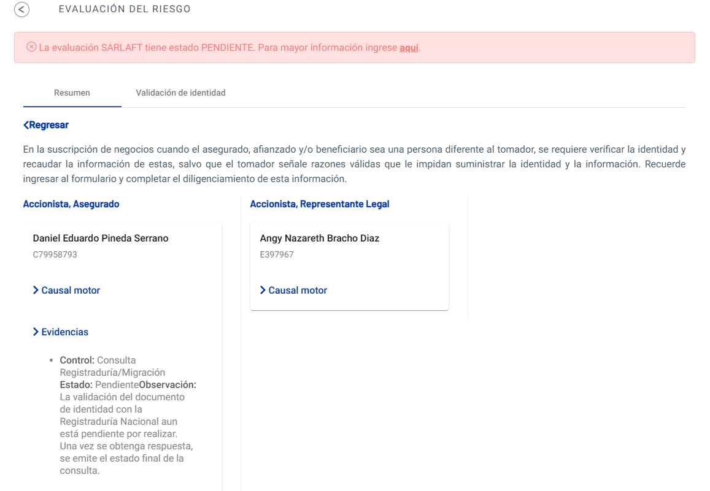
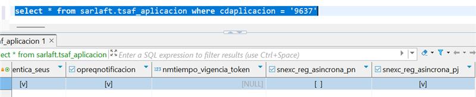
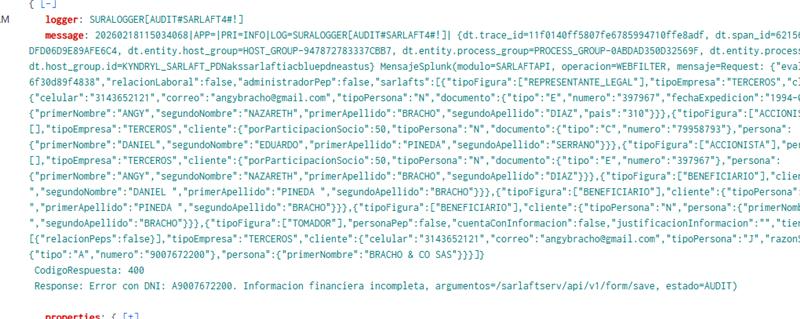
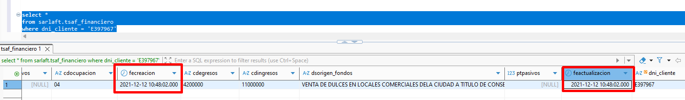

# Error en el aplicativo de Banca (Negocio en estado PENDIENTE)

> **Fuente Confluence:** [Error en el aplicativo de Banca (Negocio en estado PENDIENTE)](https://segurosti.atlassian.net/wiki/spaces/EPA/pages/5624856625)
> **Última modificación:** 2026-02-26 — Francisco Javier Melo Rodríguez · versión 1
> **Sección:** [Documentación de Incidentes](./index.md)

Este error se dio al momento de crear un negocio para el aplicativo banca (9637), se observó que este quedó en estado "PENDIENTE" a pesar de que se evidenció que no se había ingresado información financiera al módulo, con base en lo anterior se esperaba que el módulo rechazara el negocio, sin embargo, como antes se manifestó, el módulo lo dejó en estado PENDIENTE, la imagen 1 muestra la evidencia el aplicativo:



*Imagen 1. Imagen del error en la aplicación.*

También se debe tener en cuenta que los de Banca tienen configurado que la registraduría no debe ser asíncrona, como se observa en la imagen 2.



*Imagen 2. Registraduría síncrona.*

Finalmente se observó que este error está relacionado con el bug reportado en 2023: [https://dev.azure.com/SuraColombia/Gerencia_Tecnologia/_workitems/edit/374809/](https://dev.azure.com/SuraColombia/Gerencia_Tecnologia/_workitems/edit/374809/) donde al momento de crear la evaluación esta se queda en estado PENDIENTE, esto porque no se ha realizado el guardar formulario: donde se evidencia la falta de llamado al servicio `"/sarlaftserv/api/v1/form/save"`, entonces al momento de diligenciar el formulario se observó el error de la imagen 3, que se podría sintetizar como que no se diligenció información financiera.



*Imagen 3. Error observado en Splunk.*

En el siguiente JSON se logra observar que no se ha enviado la propiedad que corresponde a información financiera:

```json
{
  "evaluacionId": "4ebc45de-b60b-4408-8fec-6f30d89f4838",
  "relacionLaboral": false,
  "administradorPep": false,
  "sarlafts": [
    {
      "tipoFigura": [
        "REPRESENTANTE_LEGAL"
      ],
      "tipoEmpresa": "TERCEROS",
      "cliente": {
        "celular": "3143652121",
        "correo": "angybracho@gmail.com",
        "tipoPersona": "N",
        "documento": {
          "tipo": "E",
          "numero": "397967",
          "fechaExpedicion": "1994-06-20"
        },
        "persona": {
          "primerNombre": "ANGY",
          "segundoNombre": "NAZARETH",
          "primerApellido": "BRACHO",
          "segundoApellido": "DIAZ",
          "pais": "310"
        }
      }
    },
    {
      "tipoFigura": [
        "ACCIONISTA"
      ],
      "personaPep": false,
      "justificacionInformacion": "",
      "relacionesPep": [],
      "tipoEmpresa": "TERCEROS",
      "cliente": {
        "porParticipacionSocio": 50,
        "tipoPersona": "N",
        "documento": {
          "tipo": "C",
          "numero": "79958793"
        },
        "persona": {
          "primerNombre": "DANIEL",
          "segundoNombre": "EDUARDO",
          "primerApellido": "PINEDA",
          "segundoApellido": "SERRANO"
        }
      }
    },
    {
      "tipoFigura": [
        "ACCIONISTA"
      ],
      "personaPep": false,
      "justificacionInformacion": "",
      "relacionesPep": [],
      "tipoEmpresa": "TERCEROS",
      "cliente": {
        "porParticipacionSocio": 50,
        "tipoPersona": "N",
        "documento": {
          "tipo": "E",
          "numero": "397967"
        },
        "persona": {
          "primerNombre": "ANGY",
          "segundoNombre": "NAZARETH",
          "primerApellido": "BRACHO",
          "segundoApellido": "DIAZ"
        }
      }
    },
    {
      "tipoFigura": [
        "BENEFICIARIO"
      ],
      "cliente": {
        "tipoPersona": "N",
        "persona": {
          "primerNombre": "ANGEL ",
          "segundoNombre": "DANIEL ",
          "primerApellido": "PINEDA ",
          "segundoApellido": "BRACHO"
        }
      }
    },
    {
      "tipoFigura": [
        "BENEFICIARIO"
      ],
      "cliente": {
        "tipoPersona": "N",
        "persona": {
          "primerNombre": "ANTHONY ",
          "segundoNombre": "DAN ",
          "primerApellido": "PINEDA ",
          "segundoApellido": "BRACHO"
        }
      }
    },
    {
      "tipoFigura": [
        "BENEFICIARIO"
      ],
      "cliente": {
        "tipoPersona": "N",
        "persona": {
          "primerNombre": "AARON ",
          "segundoNombre": "DAVID ",
          "primerApellido": "PINEDA ",
          "segundoApellido": "BRACHO"
        }
      }
    },
    {
      "tipoFigura": [
        "TOMADOR"
      ],
      "personaPep": false,
      "cuentaConInformacion": false,
      "justificacionInformacion": "",
      "tieneRelacionPep": false,
      "relacionesPep": [
        {
          "relacionPeps": false
        }
      ],
      "tipoEmpresa": "TERCEROS",
      "cliente": {
        "celular": "3143652121",
        "correo": "angybracho@gmail.com",
        "tipoPersona": "J",
        "razonSocial": "BRACHO & CO SAS",
        "paisConstitucion": "57",
        "documento": {
          "tipo": "A",
          "numero": "9007672200"
        },
        "persona": {
          "primerNombre": "BRACHO & CO SAS"
        }
      }
    }
  ]
}
```

La solución a este incidente es pedirles el favor que envíen la información financiera completa y actualizada; se puede evidenciar que la información financiera es del 2021 en la imagen 4.



*Imagen 4. Información financiera desactualizada*
