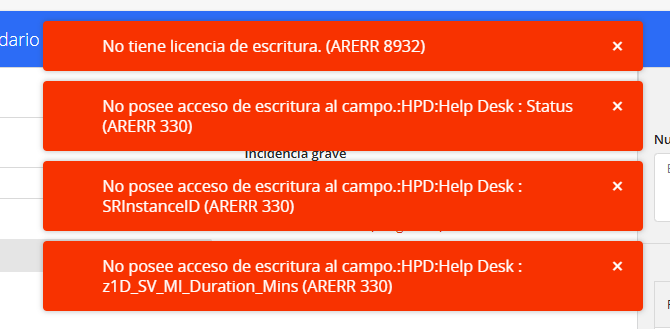
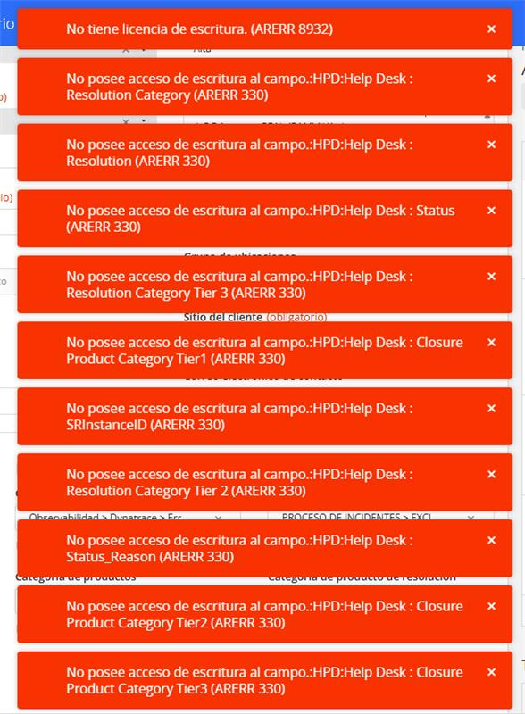

# Solucionar INC asignados en BMC Helix

> **Fuente Confluence:** [Solucionar INC asignados en BMC Helix](https://segurosti.atlassian.net/wiki/spaces/EPA/pages/5174886473)
> **Última modificación:** 2025-12-01 — Antiguo usuario (Deleted) · versión 7
> **Sección:** [Documentación de Incidentes](./index.md)

## Requisitos previos

Se necesita solicitar permisos en los siguientes links:

- [Consola de especialista](https://surasoporteti-smartit.onbmc.com/smartit/app/#/ticket-consoleStudio)
- [Dynatrace](https://xmy91541.live.dynatrace.com/index.jsp?state=SaGz5x2Fw352RbsBciM64uIrXhaNTGrqrEubS62hmLw&code=0d66cc1a-b4da-4469-b3da-bbf8b0122984#dashboard;id=ae98fe1e-0ab1-4764-89ab-61abf99558d4;gf=all;gtf=-2h)

Para poder gestionar y cerrar incidentes (INC) en BMC Helix, es necesario:

- Tener **derechos de escritura** para evitar los siguientes errores.

## Consideraciones sobre los INC

- Cada **INC puede variar** según el caso, por lo que el procedimiento para solucionarlo **dependerá del tipo de incidente**.
- No existe un único flujo estándar, ya que la respuesta depende del análisis del incidente y las acciones requeridas.
- **Al resolver el INC, recuerda incluir lo siguiente en la comunicación final:**

> **"Tu opinión es importante. Ayúdanos calificando la atención del servicio una vez te llegue el correo."**

Es importante que si el INC es relacionado con un time out del servicio de data crédito se envíe un hilo por correo a los líderes de negocio responsables, con el siguiente formato:

- **Cantidad de eventos generados:**
- **Servicio involucrado:** <https://servicesesb.datacredito.com.co/wss/dhws3/services/DHServicePlus> y <https://servicesesb.datacredito.com.co/wss/HCPL_WS/HcplWSClientes> (ejemplo de los servicios)
- **Duración del error:**
- **Fecha y hora del incidente:** (Rango inicial y rango final, con formato completo dd/mm/aaaa hh:mm - dd/mm/aaaa hh:mm)
- **Tipos de excepciones observadas en el sistema:**

## Recomendación

Para mayor claridad, se anexa un video donde se explica el **INC más común** y cómo se realiza su solución paso a paso.

**Video:** [solución de incidentes asignados en Splunk](https://suramericana.sharepoint.com/sites/MESA7-CALIDADDEINFORMACIN/_layouts/15/stream.aspx?id=%2Fsites%2FMESA7%2DCALIDADDEINFORMACIN%2FShared%20Documents%2FGeneral%2FProyecto%20SARLAFT%204%2E0%2FDocumentacionDesarrollo%2FSoluci%C3%B3n%20de%20INC%2FSolucionIncidentes1%2Emp4&referrer=StreamWebApp%2EWeb&referrerScenario=AddressBarCopied%2Eview%2Edb64009c%2Dabd0%2D4339%2D9bca%2D2fb19d239c25).
