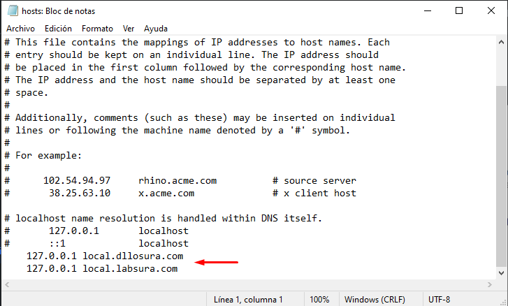
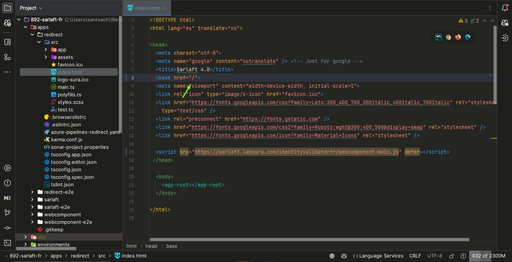
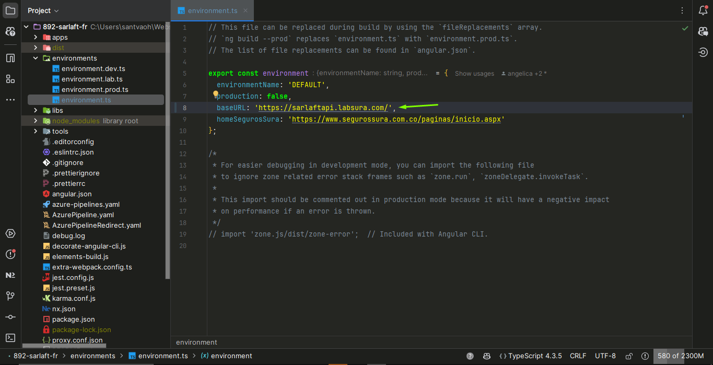
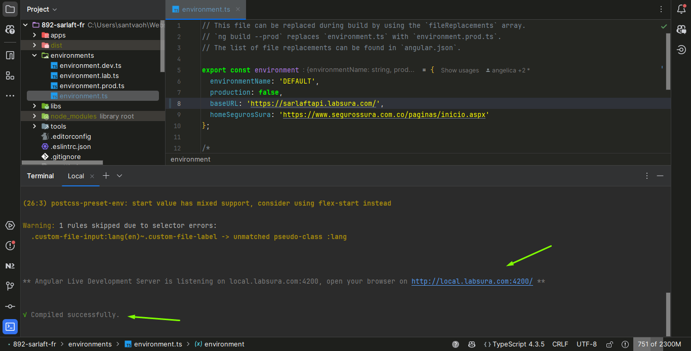
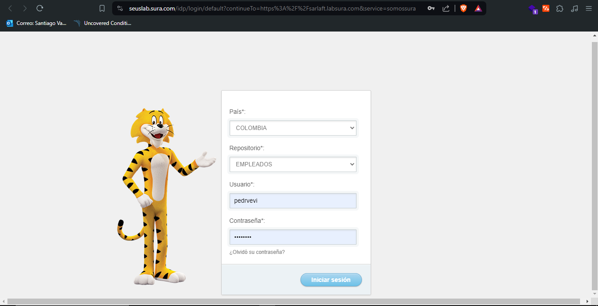
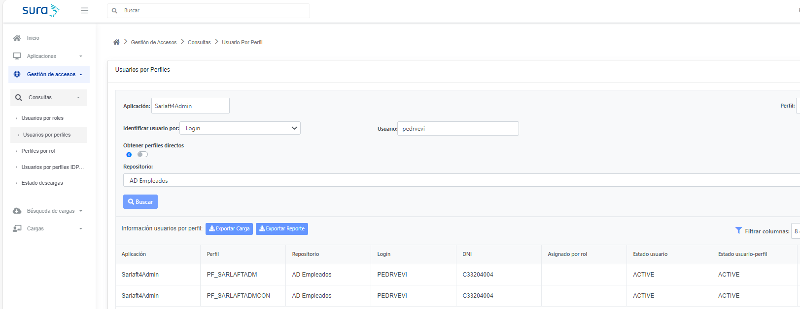
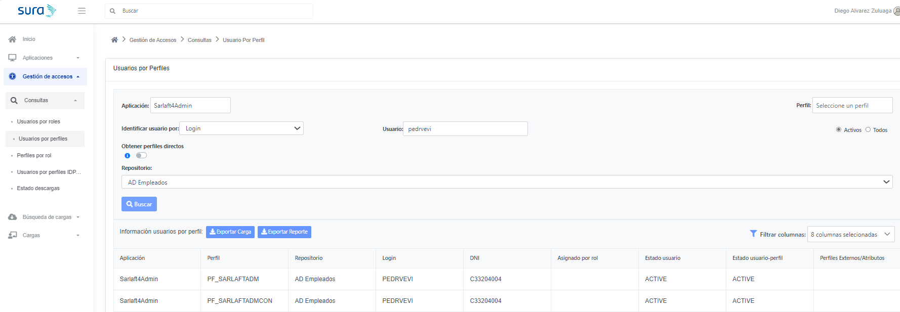

# Configuración Ambiente - Pasos importantes

> **Fuente Confluence:** [Configuración Ambiente - Pasos importantes](https://segurosti.atlassian.net/wiki/spaces/EPA/pages/3467214883)
> **Última modificación:** 2024-05-29 — Santiago Valencia Ochoa (Unlicensed) · versión 29
> **Sección:** [Front](./index.md)

Esta documentación se hizo utilizando el IDE de WebStorm**, **pero funciona igual para otros IDEs o editores de código*

**Desplegar aplicaciones localmente:**

Dependiendo de que aplicación del proyecto se desee desplegar localmente de se deben de seguir los siguientes pasos, en este caso se va a usar de ejemplo `redirect` pero aplica de igual manera para las otras aplicaciones:

---

- En su maquina acceder o buscar la siguiente ruta mediante su explorador de archivos `C:\Windows\System32\drivers\etc` una vez ubicado en la carpeta `etc` buscar y abrir el archivo `hosts` mediante su editor de texto de preferencia. Una vez abierto el archivo, debe modificarlo agregando las siguientes líneas al final del mismo y guardando los cambios:

`127.0.0.1 local.dllosura.com`
`127.0.0.1 local.labsura.com`

- Ahora debe de abrir el `index.html` de la aplicación que requiere desplegar, una vez abierto, modificar la linea de código `<base href="/redirect/">` y reemplazarla por `<base href="/">`, en este caso se esta usando **redirect** de ejemplo, pero es similar tanto para **sarlaft**, como para **webcomponent**.

- Ahora se debe abrir el archivo `environment.ts` y modificar linea de código
`baseURL: 'https://sarlaftapi.sura.com.co',` y reemplazarla por `baseURL: 'https://sarlaftapi.labsura.com/',`de esta manera el ambiente local se va a desplegar apuntando al back de laboratorio.

Es esencial tener en cuenta que las modificaciones realizadas en el **paso 2 y 3 no deben incluirse en los commits** ya que únicamente son modificaciones para que funcione el ambiente local*

- Finalmente, para iniciar la aplicación angular requerida se debe ejecutar el comando `ng serve redirect --host local.labsura.com` en su terminal de preferencia, si esta iniciando otra aplicación diferente debe de reemplazar **redirect** por el nombre de la otra aplicación que necesite inicializar. Una vez se complete el proceso, acceder a la siguiente URL base para empezar a desarrollar sus cambios en local: `http://local.labsura.com:4200/`.

- Hay ocasiones en las que se le solicitara un login para laboratorio, puede usar **pedrvevi** para usuario y contraseña. Además tener en cuenta, que una vez logeado debe de verificar que la url base siga siendo `http://local.labsura.com:4200/` y no `https://sarlaft.labsura.com/`

**Adicional para ambiente de desarrollo (no disponible actualmente):**

- Para el ambiente de desarrollo en el paso 3 se debe de usar `baseURL: 'https://sarlaftapi.dllosura.com/',`

- Para el ambiente de desarrollo en el paso 4, se debe usar `ng serve redirect --host local.dllosura.com` y `http://local.dllosura.com:4200/`

Siguiendo estos pasos tendrá la configuración básica para su ambiente local y podrá a empezar a realizar modificaciones en código que se podrán reflejar en su front local, debe de tener en cuenta que una vez guardado un cambio debe de esperar unos segundos a que el servidor local se reinicie para actualizar los cambios en la vista del navegador. Por último debe de estar atento a la terminal para asegurarse que no hayan errores en los cambios aplicados.

---

**Desplegar el FrontEnd del módulo de clientes localmente:**

## Usuario con acceso a las opciones del front:

Para que se muestren las diferentes opciones que dispone el front del módulo de clientes, se requiere tener un usuario que tenga los perfiles de **PF_SARLAFTADM** y **PF_SARLAFTADMCON **sobre la aplicación **Sarlaft4Admin.**

- Para el entorno de laboratorio se puede usar el usuario **PEDRVEVI** el cual ya cuenta con los perfiles asignados:

- Para el entorno de desarrollo se puede usar el usuario **PEDRVEVI** el cual ya cuenta con los perfiles asignados:

