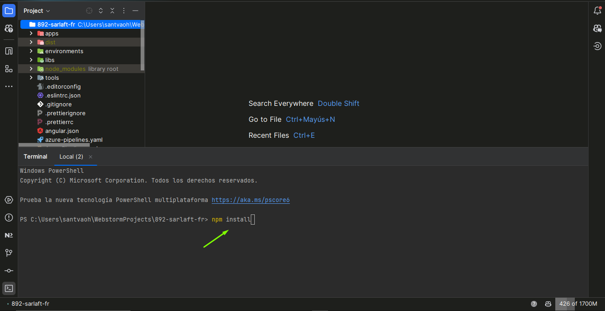
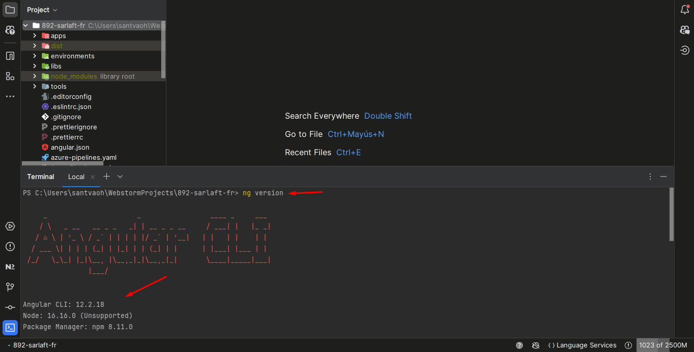
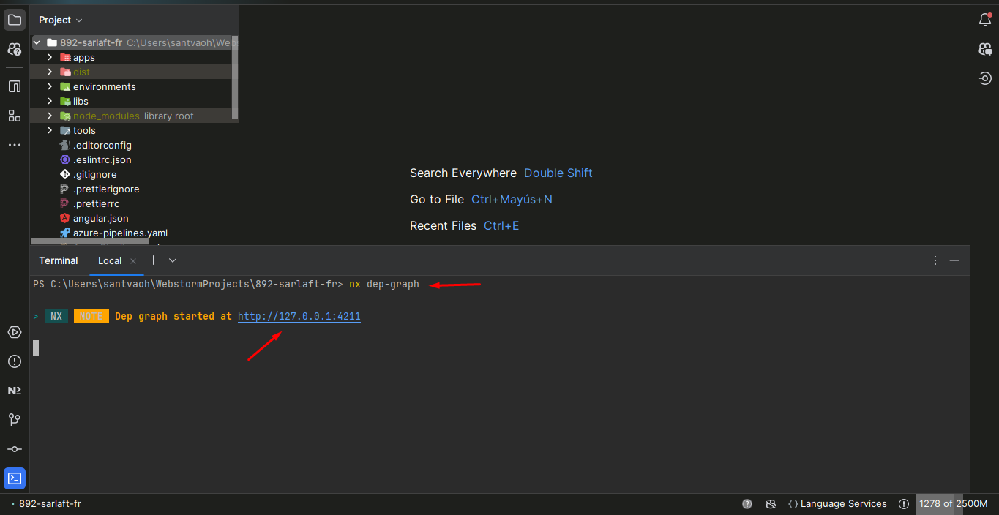
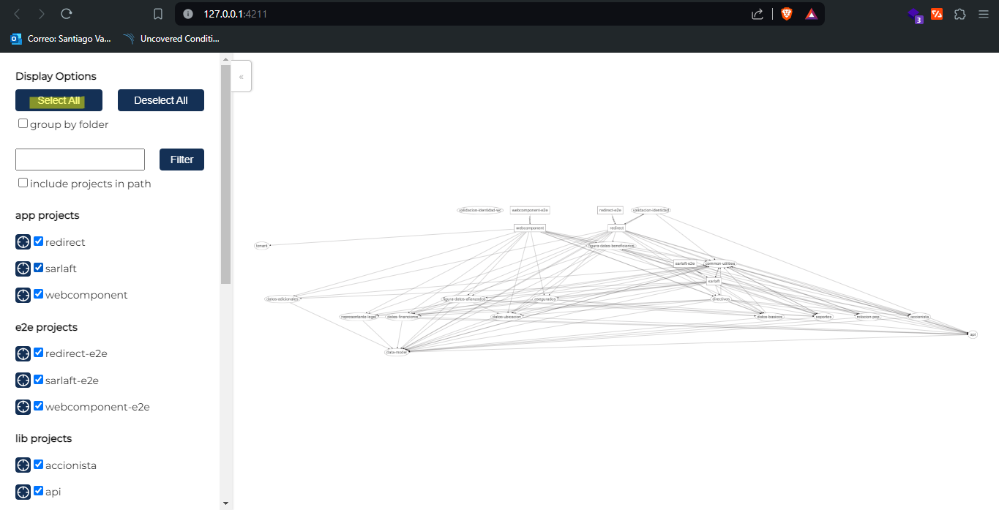

# Configuración ambiente

> **Fuente Confluence:** [Configuración ambiente](https://segurosti.atlassian.net/wiki/spaces/EPA/pages/2233466927)
> **Última modificación:** 2024-07-26 — Santiago Valencia Ochoa (Unlicensed) · versión 24
> **Sección:** [Front](../index.md)

## Contenido

- [Configuración Ambiente - Pasos importantes](ConfiguracionAmbientePasosImportantes.md)

---

**Elementos requeridos para la configuración del ambiente:**

- [Node.js v16.16.0 (LTS)](https://nodejs.org/en/blog/release/v16.16.0)

**IDEs o editores de código recomendados para el proyecto:**

- [Visual Studio Code](https://code.visualstudio.com/)

- [Web Storm](https://www.jetbrains.com/es-es/webstorm/)

**Extensiones recomendadas:**

- **Nx Console** (Disponible en Visual Studio Code y Web Storm): extensión para manipular mejor el workspace del monorepo

---

**Repositorios:**

- [https://dev.azure.com/SuraColombia/Gerencia_Tecnologia/_git/892-sarlaft-fr](https://dev.azure.com/SuraColombia/Gerencia_Tecnologia/_git/892-sarlaft-fr) (Principal)

- [https://dev.azure.com/SuraColombia/Gerencia_Tecnologia/_git/892-sarlaft-fr-conf](https://dev.azure.com/SuraColombia/Gerencia_Tecnologia/_git/892-sarlaft-fr-conf) (Configuración)

---

**Errores:**

- [error:0308010C:digital envelope routines::unsupported](../Errores/ErrorDigitalEnvelopeRoutines.md)

---

**Pasos para la configuración:**

- Una vez clonado el repositorio principal en su maquina, primeramente se deben de instalar las dependencias del proyecto, para instalarlas ejecute el comando `npm install` en su terminal de preferencia, asegúrese de estar ubicado en el directorio raíz del proyecto. Este proceso puede tardar varios minutos.

- Para verificar que se instalo todo correctamente ejecutar el comando `ng version` en su terminal y asegurarse que las versiones coincidan con las recomendadas.

- Por último verificar el estado de dependencias ejecutando el comando `nx dep-graph` en su terminal y acceder al link arrojado.

- [Configuración Ambiente - Pasos importantes](ConfiguracionAmbientePasosImportantes.md)
