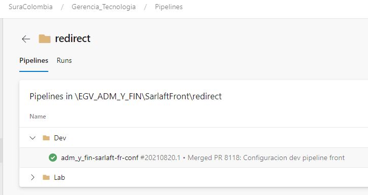
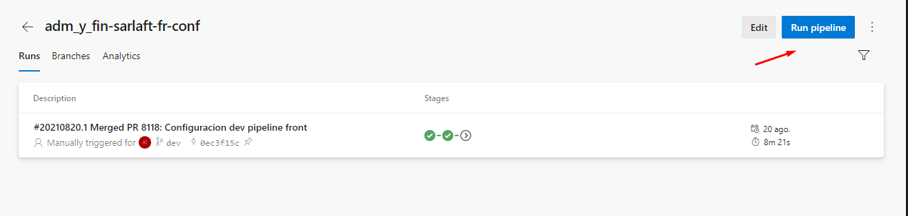

# Despliegue

> **Fuente Confluence:** [Despliegue](https://segurosti.atlassian.net/wiki/spaces/EPA/pages/2505998354)
> **Última modificación:** 2021-11-23 — Jorge Andres Guerrero Cardozo · versión 3
> **Sección:** [Front](./index.md)

Información Asociada al despliegue de los diferentes componentes Web

---

URL de Configuraciones de Pipelines: [https://dev.azure.com/SuraColombia/Gerencia_Tecnologia/_git/adm_y_fin-sarlaft-fr-conf](https://dev.azure.com/SuraColombia/Gerencia_Tecnologia/_git/adm_y_fin-sarlaft-fr-conf)

Despliegues:

Ejecución:

Se debe seleccionar el pipeline correspondiente y darle Run Pipeline:

