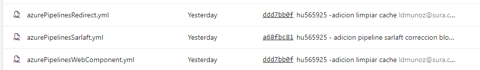
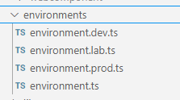

# Despliegue con Plantillas

> **Fuente Confluence:** [Despliegue con Plantillas](https://segurosti.atlassian.net/wiki/spaces/EPA/pages/3968991251)
> **Última modificación:** 2024-08-15 — Diana Muñoz · versión 1
> **Sección:** [Front](./index.md)

Para compilar los proyectos de sarlaft, redirect y webcomponent dependiente de la configuración de ambiente: desarrollo, laboratorio y producción.

```text
Ambiente desarrollo:
"build_dev:redirect": "ng build redirect --configuration=dev",
"build_dev:sarlaft": "ng build sarlaft --configuration=dev",
"build_dev:webcomponent": "ng build webcomponent --configuration=dev --output-hashing none && node elements-build.js",

Ambiente laboratorio:
"build_lab:redirect": "ng build redirect --configuration=lab",
"build_lab:sarlaft": "ng build sarlaft --configuration=lab",
"build_lab:webcomponent": "ng build webcomponent --configuration=lab --output-hashing none && node elements-build.js",

Ambiente Producción:
"build_pdn:redirect": "ng build redirect --configuration=production",
"build_pdn:sarlaft": "ng build sarlaft --configuration=production",
"build_pdn:webcomponent": "ng build webcomponent --configuration=production --output-hashing none && node elements-build.js",
```text

```text
Se crean 4 tareas para despliegue local de los proyectos sarlaft y redirect

    Local apuntando a ambiente desarrollo
    "start_dev:redirect": "ng serve redirect --configuration=dev --host local.dllosura.com",
    "start_dev:sarlaft": "ng serve sarlaft --configuration=dev --host local.dllosura.com",

    Local apuntando a ambiente laboratorio

    "start_lab:redirect": "ng serve redirect --configuration=lab --host local.labsura.com",
    "start_lab:sarlaft": "ng serve sarlaft --configuration=lab --host local.labsura.com",
```

**   Pipelines:**
   Redirect:
   [https://dev.azure.com/SuraColombia/Gerencia_Tecnologia/_build?definitionId=4111](https://dev.azure.com/SuraColombia/Gerencia_Tecnologia/_build?definitionId=4111)

   Sarlaft:
   [https://dev.azure.com/SuraColombia/Gerencia_Tecnologia/_build?definitionId=4504](https://dev.azure.com/SuraColombia/Gerencia_Tecnologia/_build?definitionId=4504)

   Web component
   [https://dev.azure.com/SuraColombia/Gerencia_Tecnologia/_build?definitionId=4505](https://dev.azure.com/SuraColombia/Gerencia_Tecnologia/_build?definitionId=4505)

 ** Repositorio de pipelines:**

[https://dev.azure.com/SuraColombia/Gerencia_Tecnologia/_git/892-sarlaft-fr](https://dev.azure.com/SuraColombia/Gerencia_Tecnologia/_git/892-sarlaft-fr)

**Enviroments:**

[https://dev.azure.com/SuraColombia/Gerencia_Tecnologia/_git/892-sarlaft-fr](https://dev.azure.com/SuraColombia/Gerencia_Tecnologia/_git/892-sarlaft-fr)


