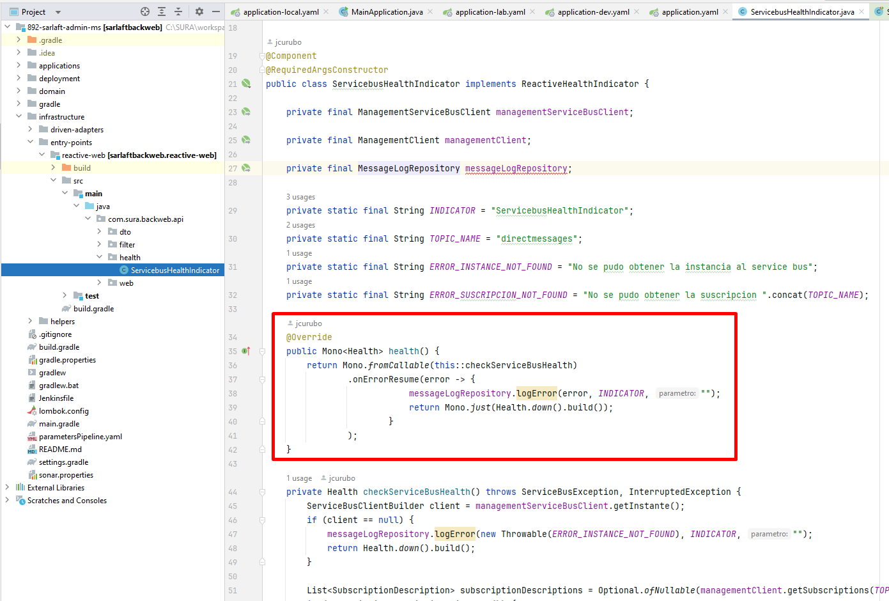
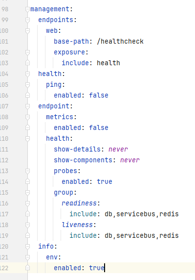
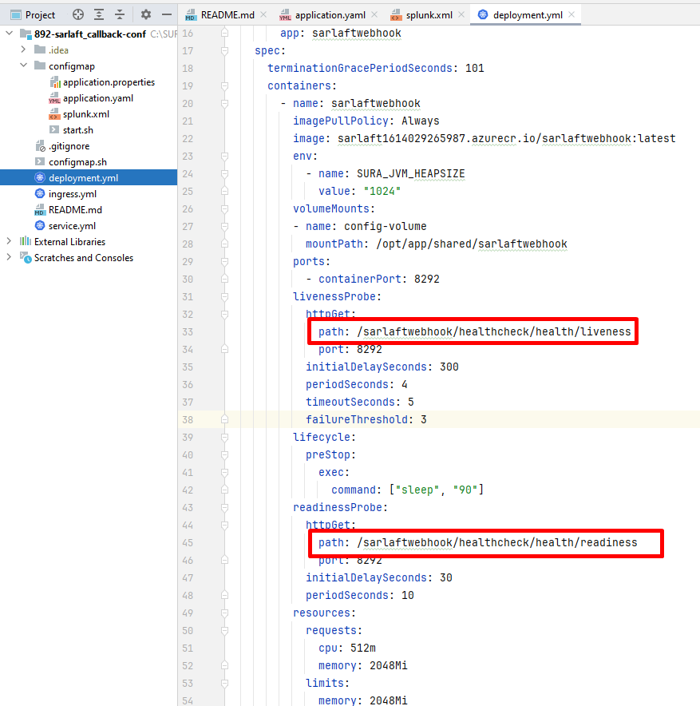
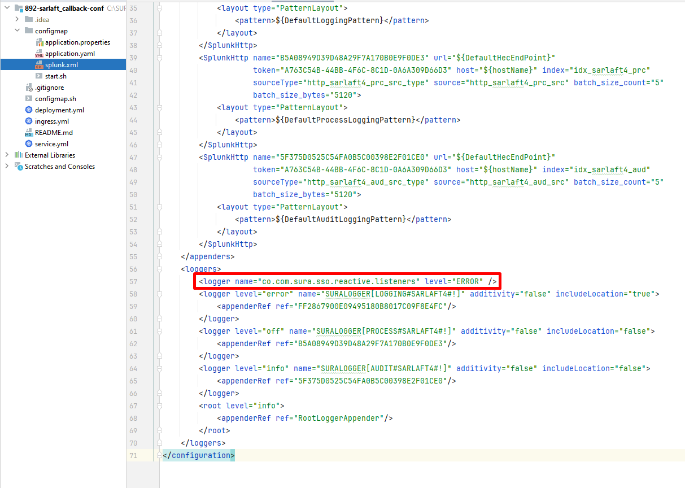

# Configuración HealtchCheck con librería actuator - SarlaftBackWeb

> **Fuente Confluence:** [Configuración HealtchCheck con librería actuator - SarlaftBackWeb](https://segurosti.atlassian.net/wiki/spaces/EPA/pages/3598778517)
> **Última modificación:** 2024-03-11 · versión 2
> **Sección:** [Microservicio Backweb](./index.md)

Este nuevo servicio web de healthCheck permite evaluar las conexiones principales del microservicio de tal forma que cuando desde el aks en azure, se haga el ping para evaluar la salud del microservicio, se evalué de igual forma la conexión al service bus de azure, base de datos Postgresql (nube) y redis (nube).

Con la librería de spring actuator `spring-boot-starter-actuator` se logra este objetivo, se incluye la librería en el build.gradle

La validación con la base de datos se hace automáticamente con el indicador por defecto DataSourceHealthIndicator que trae la librería, y obtiene el datasource utilizando la información de conexión a la base de datos del archivo application.yml.

La validación con redis se hace automáticamente con el indicador por defecto RedisHealthIndicator que trae la librería, y obtiene la conexión a redis utilizando la información de conexión del archivo application.yml.

La validación con el sevice bus se utiliza una clase personalizada `ServicebusHealthIndicator` en la cual se usa las dependencias:

```groovy
implementation 'com.microsoft.azure:azure-servicebus:3.6.7'
implementation 'com.azure:azure-messaging-servicebus:7.14.7'
implementation 'org.reactivecommons:async-service-bus-starter:1.1.39-BETA'
```


Se realiza la siguiente configuración en el **application.yaml**


Se realiza la siguiente configuración en el archivo **deployment.yml** en el proyecto de configuración para cada ambiente.

Debido al que el microservicio tiene seguridad seus, se presenta una incompatibilidad entre la librería ssosura y actuator para lo cual se debe incluir la siguiente línea en el archivo de splunk dentro de la sección de loggers:

`<logger name="co.com.sura.sso.reactive.listeners" level="ERROR" />`

