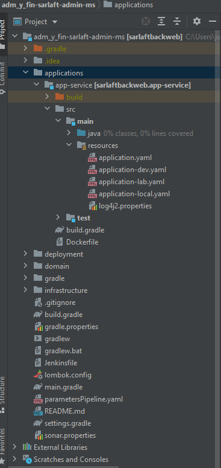
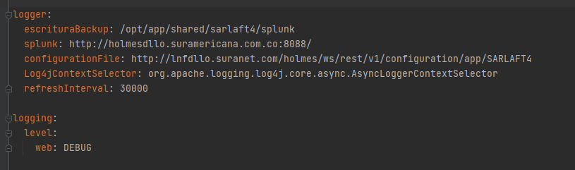
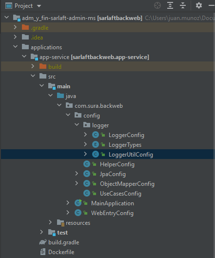
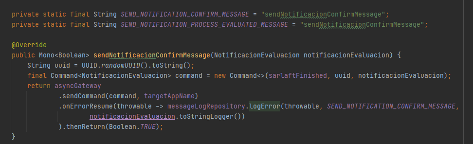
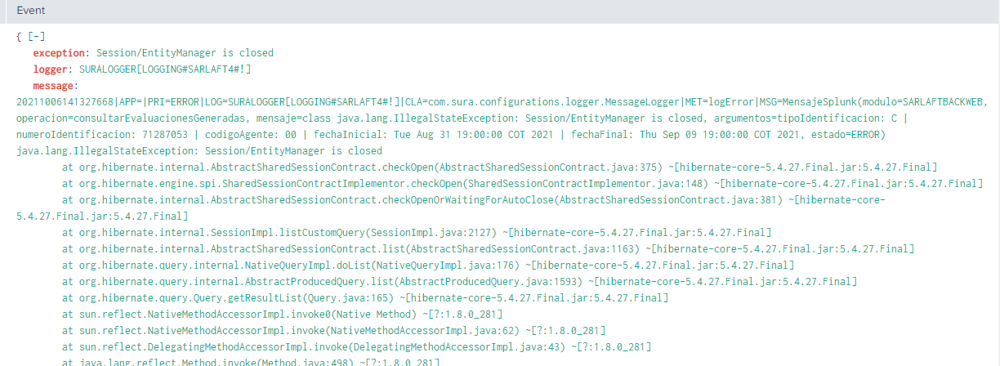
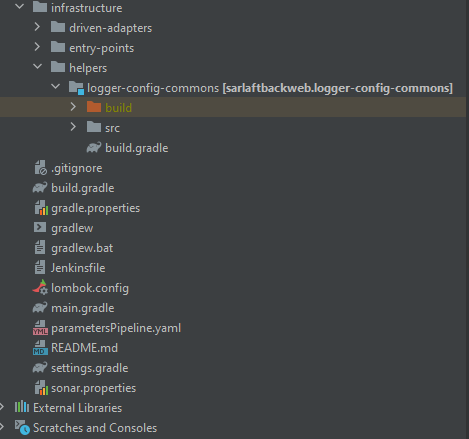

# Backweb Log de Errores en Splunk

> **Fuente Confluence:** [Backweb Log de Errores en Splunk](https://segurosti.atlassian.net/wiki/spaces/EPA/pages/2432270358)
> **Última modificación:** 2021-10-06 · versión 2
> **Sección:** [Microservicio Backweb](./index.md)

Al microservicio de backweb se le implemento la funcionalidad de realizar el envió de logs a Splunk.

Repositorio utilizado : `https://splunk.jfrog.io/splunk/ext-releases-local`

librería utilizada: `com.splunk.logging:splunk-library-javalogging:1.7.3`

`'org.apache.logging.log4j', name: 'log4j-core', version: '2.14.1'`

La configuración se encuentra en los archivos de configuración .yml para los distintos ambientes parametrizados.

La configuración y parametrización** **del log se encuentra en  la clase `LoggerUtilConfig` ubicada en el paquete `com.sura.backweb.config.logger`.

Para utilizar la funcionalidad, se creo una interfaz con su implementacion. Esta contiene el método `logError` que debe ser llamado y se le deben enviar los parámetros requeridos para que pueda realizar el envió de logs a splunk, como se muestra en el siguiente ejemplo:

Repositorio: `MessageLogRepository` `messageLogRepository`;

El modulo que contiene la clase (`MessageLogger`) que implementa la interfaz (`MessageLogRepository` ) se encuentra en el paquete helpers de la capa de infraestructura.

