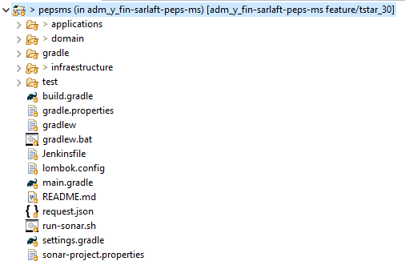
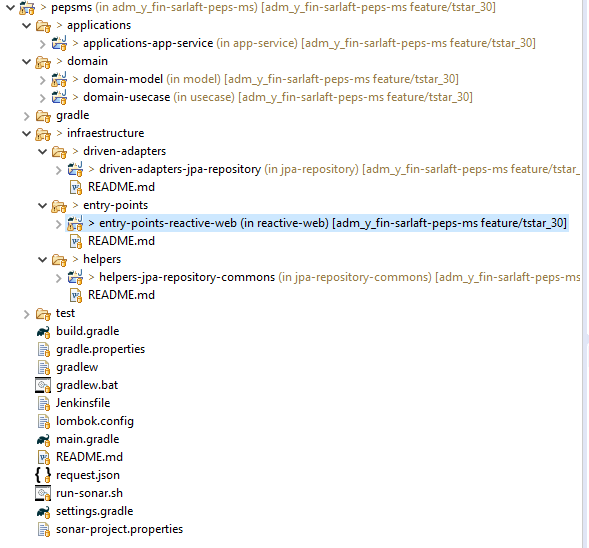
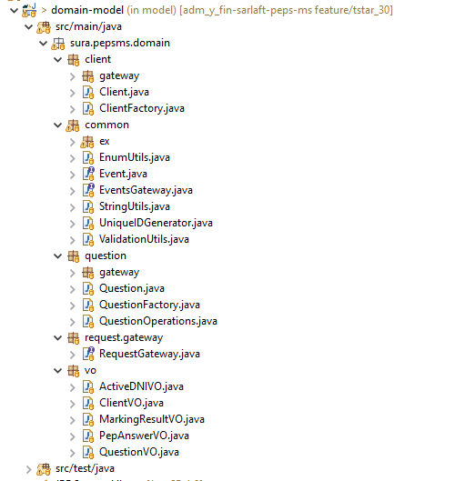
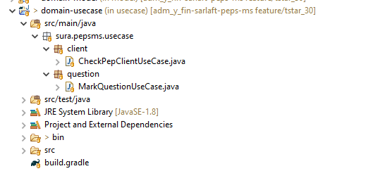
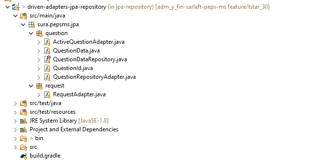
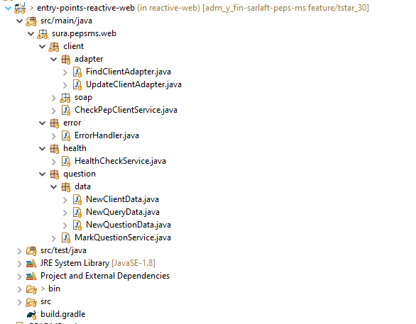

# Estructura Proyecto - PEPSMS

> **Fuente Confluence:** [https://segurosti.atlassian.net/wiki/spaces/EPA/pages/1809908172](https://segurosti.atlassian.net/wiki/spaces/EPA/pages/1809908172)
> **Fecha extracción:** 2026-03-30

## Generalidades

El api para consulta y marcación de clientes PEP está construido a partir del generador de legos de Sura en su versión 0.0.19. Se basa en arquitectura hexagonal y aplicación de programación reactiva, adicional se implementa seguridad a través de SEUS.


Figura 1. Estructura generada a partir de lego (_legoapp-0.0.19.jar_)

El proyecto está dividido en los siguientes subproyectos (Figura 2):

- **applications-app-service**: contiene configuraciones generales del aplicativo.

- **domain-model**: representa los objetos de dominio (negocio) del aplicativo, sus características y comportamientos. Los objetos están construidos de manera inmutable, tal que, existan fábricas u objetos de comportamientos separados de su representación básica para la definición de validaciones sobre sus datos.

- **domain-usecase**: contiene todos los casos de uso (actividades) que se ejecutan en la aplicación

- **driven-adapters-jpa-repository**: aquí se encuentran las implementaciones para el control de persistencia de los objetos de domino, adicional de implementaciones concretas para consulta de información de base de datos

- **entry-points-reactive-web**: define los diferentes endpoints que se habilitarán en la aplicación. Aquí también se encuentran las implementaciones de invocación a servicios SOAP requeridos para consutlar y registrar información de personas

- **helpers-jpa-repository-commons**: representa objetos utilitarios para el manejo de persistencia. Este es usado directamente por driven-adapters-jpa-repository


Figura 2. División de proyecto


Figura 3. Estructura proyecto definición dominio


Figura 4. Estructura proyecto definición casos de uso


Figura 5. Estructura proyecto implementación persistencia de objetos de dominio


Figura 6. Estructura proyecto definición de endpoints aplicación

## Configuración base de datos

Se requiere el uso de dos conexiones a base de datos. La configuración se encuentra definida en el archivo _**application.yml**_** **del proyecto _**applications-app-service**_, adicional de contener_ _clases de configuración para cada una de las conexiones.

```yaml
spring:
  application:
    name: pepsms
  datasource-pdn:
    url: jdbc:oracle:thin:@//mdebdl05.suranet.com:1537/LABPDN
    driverClassName: oracle.jdbc.OracleDriver
    username: MAPEOINFO
    password: MAPEO
    dialect: org.hibernate.dialect.Oracle12cDialect
  datasource-pdnha:
    url: jdbc:oracle:thin:@//mdebddd06.suranet.com:1537/DLLOLFHA
    driverClassName: oracle.jdbc.OracleDriver
    username: OPS$PROCEDIM
    password: IBMPROCEDIM
    dialect: org.hibernate.dialect.Oracle12cDialect
```

### Conexión principal

```java
...

@Configuration
@EnableTransactionManagement
@EnableJpaRepositories(entityManagerFactoryRef = "pdnEntityManagerFactory", transactionManagerRef = "pdnTransactionManager", basePackages = {
        "sura.pepsms.jpa.question" })
public class PDNConfiguration {

    @Primary
    @Bean(name = "pdnDataSourceProperties")
    @ConfigurationProperties("spring.datasource-pdn")
    public DataSourceProperties pdnDataSourceProperties() {
        return new DataSourceProperties();
    }

    @Primary
    @Bean(name = "pdnDataSource")
    @ConfigurationProperties("spring.datasource-pdn.configuration")
    public DataSource pdnDataSource(
            @Qualifier("pdnDataSourceProperties") DataSourceProperties pdnDataSourceProperties) {
        return pdnDataSourceProperties.initializeDataSourceBuilder().type(HikariDataSource.class).build();
    }

    @Primary
    @Bean(name = "pdnEntityManagerFactory")
    public LocalContainerEntityManagerFactoryBean pdnEntityManagerFactory(
            EntityManagerFactoryBuilder pdnEntityManagerFactoryBuilder,
            @Qualifier("pdnDataSource") DataSource pdnDataSource,
            @Value("${spring.datasource-pdn.dialect}") String dialect) {
        Map<String, String> pdnJpaProperties = new HashMap<>();
        pdnJpaProperties.put("hibernate.dialect", dialect);
        return pdnEntityManagerFactoryBuilder.dataSource(pdnDataSource).packages("sura.pepsms.jpa.question")
                .persistenceUnit("pdnDataSource").properties(pdnJpaProperties).build();
    }

    @Primary
    @Bean(name = "pdnTransactionManager")
    public PlatformTransactionManager primaryTransactionManager(
            @Qualifier("pdnEntityManagerFactory") EntityManagerFactory primaryEntityManagerFactory) {
        return new JpaTransactionManager(primaryEntityManagerFactory);
    }
}
```

### Conexión secundaria

```java
...

@Configuration
@EnableTransactionManagement
@EnableJpaRepositories(entityManagerFactoryRef = "pdnhaEntityManagerFactory", transactionManagerRef = "pdnhaTransactionManager", basePackages = {
        "sura.pepsms.jpa.request" })
public class PDNHAConfiguration {

    @Bean(name = "pdnhaDataSourceProperties")
    @ConfigurationProperties("spring.datasource-pdnha")
    public DataSourceProperties pdnhaDataSourceProperties() {
        return new DataSourceProperties();
    }

    @Bean(name = "pdnhaDataSource")
    @ConfigurationProperties("spring.datasource-pdnha.configuration")
    public DataSource pdnhaDataSource(
            @Qualifier("pdnhaDataSourceProperties") DataSourceProperties pdnhaDataSourceProperties) {
        return pdnhaDataSourceProperties.initializeDataSourceBuilder().type(HikariDataSource.class).build();
    }

    @Bean(name = "pdnhaEntityManagerFactory")
    public LocalContainerEntityManagerFactoryBean pdnhaEntityManagerFactory(
            EntityManagerFactoryBuilder pdnhaEntityManagerFactoryBuilder,
            @Qualifier("pdnhaDataSource") DataSource pdnhaDataSource,
            @Value("${spring.datasource-pdnha.dialect}") String dialect) {

        Map<String, String> pdnhaJpaProperties = new HashMap<>();
        pdnhaJpaProperties.put("hibernate.dialect", dialect);

        return pdnhaEntityManagerFactoryBuilder.dataSource(pdnhaDataSource).packages("sura.pepsms.jpa.request")
                .persistenceUnit("pdnhaDataSource").properties(pdnhaJpaProperties).build();
    }

    @Bean(name = "pdnhaTransactionManager")
    public PlatformTransactionManager pdnhaTransactionManager(
            @Qualifier("pdnhaEntityManagerFactory") EntityManagerFactory pdnhaEntityManagerFactory) {
        return new JpaTransactionManager(pdnhaEntityManagerFactory);
    }
}
```

## Servicios para consulta y registro de información de personas

Se consumen servicios SOAP para consultar y registrar información de personas (Información registrada en _**application.yml**_** **del proyecto _**applications-app-service**_, junto con clase de configuración)

```yaml
soap-client:
   query-endpoint: http://appslab.suranet.com/ServiciosWebSic/services/ConsultaModeloClientesWS?wsdl
   update-endpoint: https://appslab.suranet.com/ServiciosWebSic/services/ActualizacionModeloClientesWS?wsdl
```

### Configuración sevicios SOAP

```java
...

@Configuration
public class SOAPConfig {

    @Bean
    public WsConsultaModeloClientesHttpService queryClientService(
            @Value("${soap-client.query-endpoint}") String endpoint) {
        return new WsConsultaModeloClientesHttpService(getWsdlLocation(endpoint));
    }

    @Bean
    public WsActualizacionModeloClientesHttpService updateClientService(
            @Value("${soap-client.update-endpoint}") String endpoint) {
        return new WsActualizacionModeloClientesHttpService(getWsdlLocation(endpoint));
    }

    private URL getWsdlLocation(String endpoint) {
        try {
            return new URL(endpoint);
        } catch (MalformedURLException ex) {
            throw new WebServiceException(ex);
        }
    }
}

```

## Clase de servicio HealthCheckService.java

Usada para verificar que la aplicación se encuentre instalada y activa
