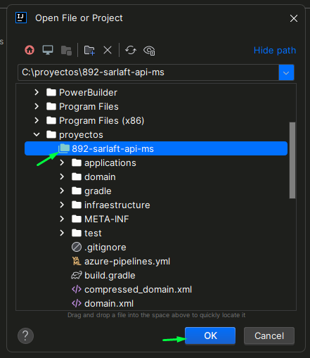
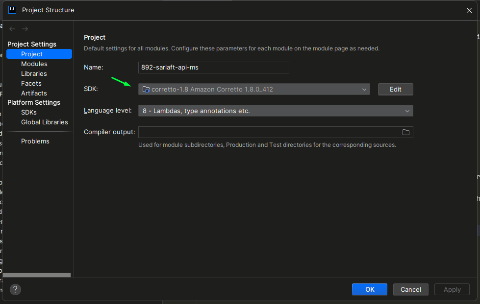
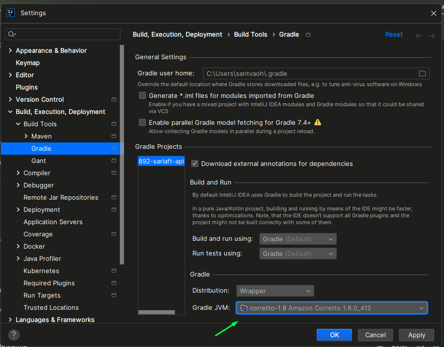
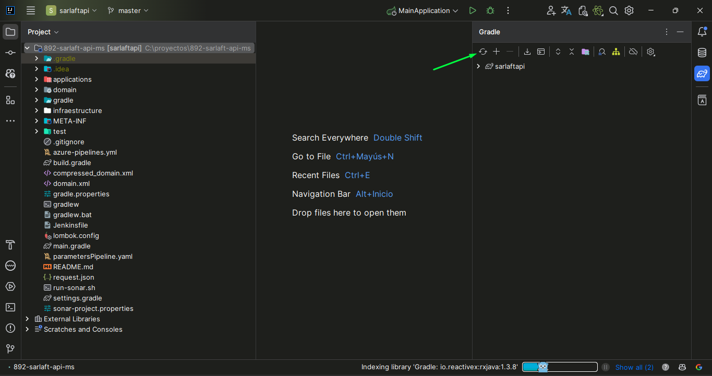
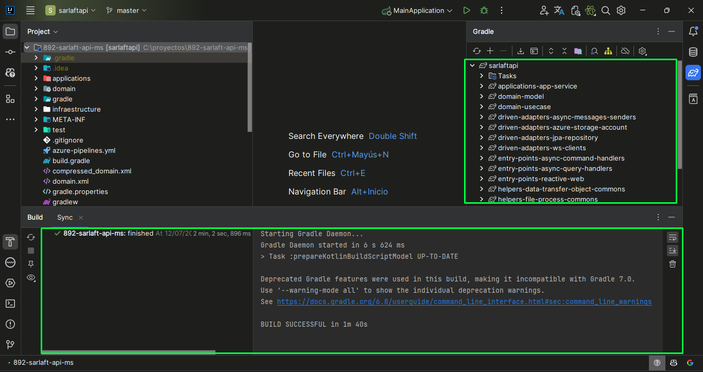
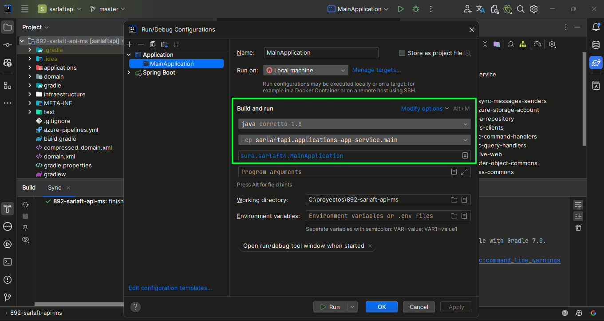
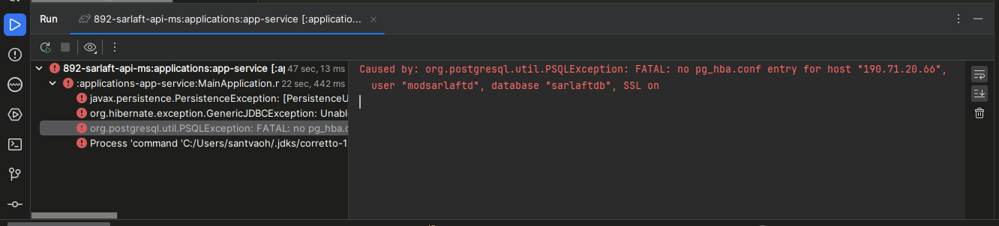
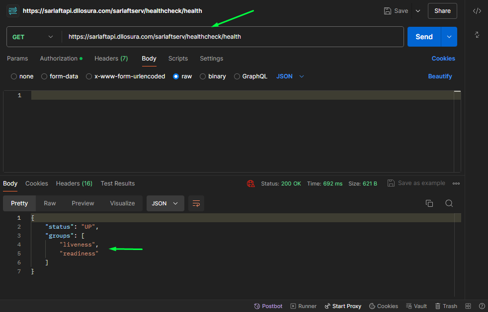

# Configuración Ambiente - SarlaftAPI

> **Fuente:** [Confluence - Configuración Ambiente - SarlaftAPI](https://segurosti.atlassian.net/wiki/spaces/EPA/pages/1801159141/Configuraci%C3%B3n+Ambiente+-+SarlaftAPI)  
> **Página padre:** [Microservicio SarlaftAPI](./index.md)  
> **Documento adjunto:** `ConfiguraciónAmbiente_SarlaftAPI.docx` → guardado en [docs/docx/](../docx/)

---

## Elementos requeridos para la configuración del ambiente

- Java 21
- Gradle `8.10.2`
- Certificados de seguridad para la JVM

## IDEs o editores de código recomendados

- [IntelliJ IDEA](https://www.jetbrains.com/idea/download/?section=windows)
- [Visual Studio Code](https://code.visualstudio.com/)

## Plugins recomendados

- SonarQube
- Lombok

---

## Repositorios

### Repositorio Principal

```
https://dev.azure.com/SuraColombia/Gerencia_Tecnologia/_git/892-sarlaft-api-ms
```

### Repositorio de Configuración

```
https://dev.azure.com/SuraColombia/Gerencia_Tecnologia/_git/892-sarlaft-api-conf
```

### Repositorio Pruebas SoapUI y JMeter

```
https://dev.azure.com/SuraColombia/Gerencia_Tecnologia/_git/892-sarlaft-pa
```

## Pipelines

```
https://dev.azure.com/SuraColombia/Gerencia_Tecnologia/_build?definitionId=3349
```

## SonarQube

```
https://sonarqube.suramericana.com.co/solucionescorporativas/dashboard?id=892-sarlaft-api-ms
```

---

## Ambientes

| Ambiente | URL |
|---------|-----|
| Local | http://local.suramericana.com.co:8091/sarlaftserv |
| Desarrollo | https://sarlaftapi.dllosura.com/sarlaftserv |
| Laboratorio | https://sarlaftapi.labsura.com/sarlaftserv |
| Producción | https://sarlaftapi.sura.com.co/sarlaftserv |

---

## Pasos de Configuración

### 1. Clonar el Repositorio

Clonar el repositorio principal en su máquina local.

```bash
git clone https://dev.azure.com/SuraColombia/Gerencia_Tecnologia/_git/892-sarlaft-api-ms
```

### 2. Instalar Certificados de Seguridad en la JVM

Antes de abrir el proyecto en el IDE, instalar los certificados de seguridad en la JVM.  
Se puede hacer mediante **[KeyStore Explorer](https://keystore-explorer.org/downloads.html)**.

> ⚠️ Los certificados deben solicitarse a un compañero del equipo.



### 3. Configurar el JDK

Cuando los certificados estén instalados correctamente, abrir el proyecto en el IDE y configurarlo para que use el **JDK 21** instalado en la máquina.





### 4. Construir el Proyecto con Gradle

Construir el proyecto mediante Gradle. En caso de error durante la construcción, verificar que los certificados estén correctamente instalados y que ninguno esté vencido.





### 5. Configurar el Template de Arranque

Configurar el template de arranque de la aplicación.



### 6. Iniciar la Aplicación — Verificar Permisos de BD

Intentar iniciar la aplicación. En caso de recibir un error de conexión a la base de datos, se debe solicitar permisos para que la IP acceda a la base de datos de desarrollo.



### 7. Verificar Health Check

Una vez iniciada la aplicación, verificar su funcionamiento mediante el endpoint de health check de la API.



---

## Documento de Referencia

El documento completo en formato Word está disponible en:

📄 **[ConfiguraciónAmbiente_SarlaftAPI.docx](../docx/ConfiguracionAmbiente_SarlaftAPI.docx)**  
*(Descargado desde Confluence - página 1801159141)*
