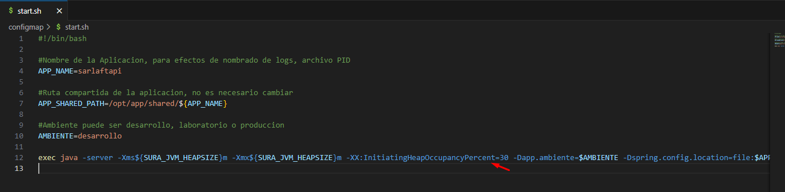

# Configuración Garbage Collector

> **Fuente Confluence:** [Configuración Garbage Collector](https://segurosti.atlassian.net/wiki/spaces/EPA/pages/4743725057/Configuraci%C3%B3n+Garbage+Collector)
> **Última modificación:** 2025-05-27 — Mauricio Marin Martinez · versión 1
> **Sección:** [Microservicio SarlaftAPI](./index.md)

La propiedad `-XX:InitiatingHeapOccupancyPercent` es una opción de la JVM (Java Virtual Machine) que se utiliza para configurar el umbral de ocupación del heap que desencadena el inicio de un ciclo de recolección de basura concurrente (Concurrent Garbage Collection).

### Detalles:

- **Propósito**: Define el porcentaje de ocupación del heap (memoria utilizada) que debe alcanzarse para que el recolector de basura G1GC inicie un ciclo de recolección concurrente.
- **Valor predeterminado**: Generalmente, el valor predeterminado es 45%.
- **Configuración personalizada**: Al establecerlo en 30, se indica que el ciclo de recolección de basura debe iniciarse cuando el 30% del heap esté ocupado.

### Beneficios:

- **Reducción de pausas**: Ayuda a reducir las pausas de la aplicación al iniciar la recolección de basura antes de que el heap esté demasiado lleno.
- **Optimización de rendimiento**: Es útil en aplicaciones con requisitos de baja latencia, ya que permite un manejo más proactivo de la memoria.

Se realiza la configuración en el proyecto conf de sarlaft api de la siguiente manera:

La iniciativa surge de la necesidad por los errores de tipo Long garbage-collection time que se han venido presentado en el microservicio de sarlaft api.

Hu: [https://dev.azure.com/SuraColombia/Gerencia_Tecnologia/_workitems/edit/745111](https://dev.azure.com/SuraColombia/Gerencia_Tecnologia/_workitems/edit/745111)
