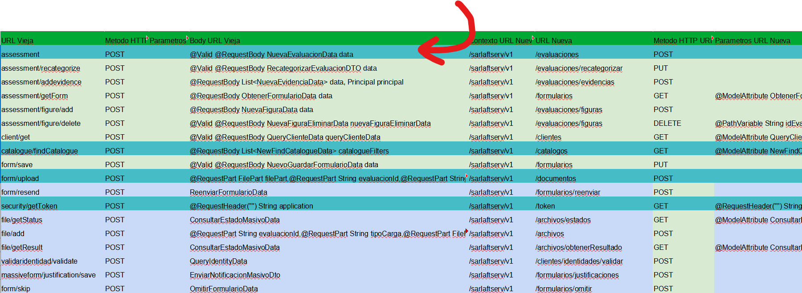

# Consumo de Nuevos Endpoints para el Web Component - SarlaftAPI

> **Fuente:** [Confluence - Consumo de Nuevos Endpoints para el Web Component](https://segurosti.atlassian.net/wiki/spaces/EPA/pages/3784671252/Consumo+de+Nuevos+Endpoints+para+el+Web+Component)  
> **Página padre:** [Servicios Web - SarlaftAPI](https://segurosti.atlassian.net/wiki/spaces/EPA/pages/1801126297/Servicios+Web+-+SarlaftAPI)

---

## Descripción

Documentación del mapeo de endpoints anteriores a los nuevos endpoints resultantes, generados a partir de la iniciativa **SOAT 2024**. Solo se expusieron **nuevos servicios o controladores** para manejar el objeto de error personalizado; no se realizaron cambios a nivel de validaciones en los casos de uso.

---

## Recursos de Referencia

| Recurso | Enlace |
|---------|--------|
| Colección de Postman para probar la nueva API REST | [Enlace a la colección](https://suramericana.sharepoint.com/:f:/r/sites/MESA7-CALIDADDEINFORMACIN/Shared%20Documents/General/Proyecto%20SARLAFT%204.0/DocumentacionDesarrollo/IniciativaSoat_2024/Documentos%20Complementarios%20SARLAFT/sarlaft/nuevos%20endpoints?csf=1&web=1&e=igXtjV) |
| Ambientes configurados | [Enlace a los ambientes](https://suramericana.sharepoint.com/:f:/r/sites/MESA7-CALIDADDEINFORMACIN/Shared%20Documents/General/Proyecto%20SARLAFT%204.0/DocumentacionDesarrollo/IniciativaSoat_2024/Documentos%20Complementarios%20SARLAFT/sarlaft?csf=1&web=1&e=JJ7Cu4) |

---

## Archivos Excel Adjuntos

> 📎 **[`Mapeo Nuevas URLs (3).xlsx`](../xlsx/Mapeo%20Nuevas%20URLs%20(3).xlsx)** — Especifica el mapeo de los endpoints anteriores a los nuevos endpoints resultantes.

> 📎 **[`RespuestasErroresSarlaft4_HT505291_ParteBrayan.xlsx`](../xlsx/RespuestasErroresSarlaft4_HT505291_ParteBrayan.xlsx)** — Excepciones identificadas para los endpoints coloreadas de amarillo o verde.

> 📎 **[`EXCEPCIONES_ENCONTRADAS.xlsx`](../xlsx/EXCEPCIONES_ENCONTRADAS.xlsx)** — Excepciones identificadas para endpoints adicionales.

---

## Listado de Excepciones Identificadas

### Grupo 1 (en `RespuestasErroresSarlaft4_HT505291_ParteBrayan.xlsx`)

Excepciones identificadas para los endpoints:
- `assessment/recategorize`
- `assessment/addevidence`
- `assessment/getForm`
- `assessment/figure/add`
- `assessment/figure/delete`
- `client/get`
- `form/save`

> Las excepciones están **coloreadas de amarillo o verde** en el Excel; las que no están coloreadas es porque no se encontraron.

### Grupo 2 (en `EXCEPCIONES_ENCONTRADAS.xlsx`)

Excepciones identificadas para los endpoints:
- `form/resend`
- `file/getStatus`
- `file/add`
- `file/getResult`
- `validaridentidad/validate`
- `massiveform/justification/save`
- `form/skip`

---

## Nota sobre Endpoints Excluidos

Los endpoints coloreados con el color específico indicado en la figura **no se configuraron** porque alguien más los configuró previamente y se aclaró que no había que trabajarlos.
