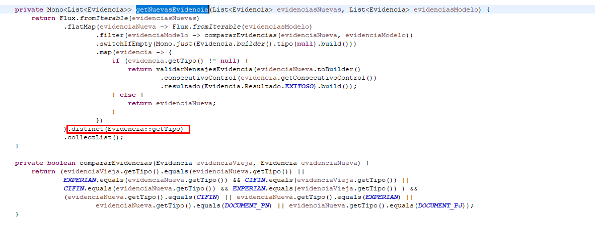
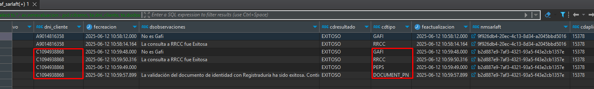

# Evitar Duplicidad en Evidencias - SarlaftAPI

> **Fuente:** [Confluence - Evitar Duplicidad en Evidencias](https://segurosti.atlassian.net/wiki/spaces/EPA/pages/4786421765/Evitar+Duplicidad+en+Evidencias)  
> **Página padre:** [Microservicio SarlaftAPI](../index.md)  
> **Iniciativa:** [HU 801841](https://dev.azure.com/SuraColombia/Gerencia_Tecnologia/_workitems/edit/801841)

---

## Problema

Se reportaron errores en producción con el mensaje:

```
exception: Multiple representations of the same entity 
[sura.sarlaft4.jpa.evidencia.EvidenciaData#95c3345c-15b0-4e42-9f8b-d6152bd348ee] 
are being merged
```

### Causa Raíz

El error surge cuando se invoca el **servicio de agregar figura** luego de haber creado una evaluación (tanto para persona natural como para persona jurídica), y ocurre cuando:

1. En la consulta de historial SARLAFT de la figura que se desea agregar, existen **evidencias duplicadas** para la evidencia de tipo `DOCUMENT_PN`.
2. Existe una validación en el código que, si la evidencia es de tipo `DOCUMENT_PN`, la agrega al stack de evidencias nuevas.
3. Si hay más de una evidencia del mismo tipo, al momento de guardar el SARLAFT se genera un **conflicto por duplicidad**.

---

## Solución

Se modificó la clase **`PrepararEvaluacionUtil`**, específicamente en la función `getNuevasEvidencia`.



### Operador `.distinct()` de Project Reactor

El operador `.distinct` en Reactor **conserva la primera evidencia** que aparece en el flujo con un valor único de tipo. Las evidencias posteriores con el mismo tipo serán descartadas.

---

## Ejemplo de Comportamiento

### Antes de la corrección

El microservicio consultaba evidencias para un DNI y podía incluir duplicados:


### Después de la corrección

Cuando se crea el SARLAFT para la nueva figura, solo se crea **una evidencia de cada tipo**, evitando duplicados:


