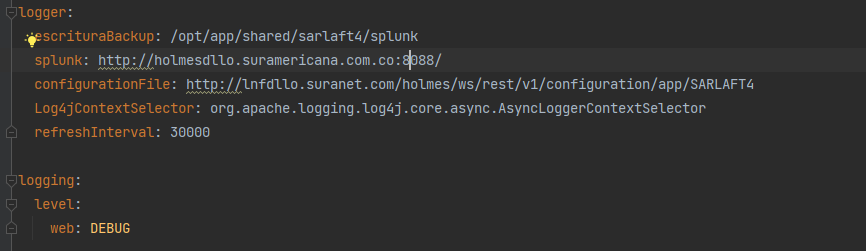
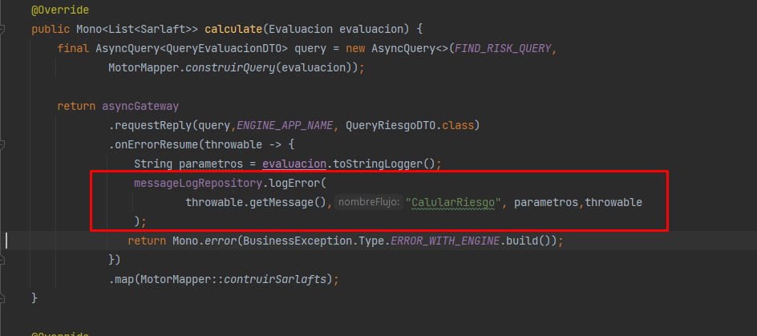

# Log Errores Splunk - SarlaftAPI

> **Fuente:** [Confluence - Log Errores Splunk SarlaftApi](https://segurosti.atlassian.net/wiki/spaces/EPA/pages/2391769098/Log+Errores+Splunk+SarlaftApi)  
> **Página padre:** [Microservicio SarlaftAPI](../index.md)

---

## Descripción

Al microservicio de SarlaftAPI se le implementó la funcionalidad de realizar el envío de logs a **Splunk**.

---

## Configuración en `main.gradle`

**Repositorio utilizado:**  
```
https://splunk.jfrog.io/splunk/ext-releases-local
```


**Librería utilizada:**
```
com.splunk.logging:splunk-library-javalogging:1.7.3
org.apache.logging.log4j:log4j-core:2.14.1
```


---

## Configuración en `application.yml`

El archivo de configuración `.yml` contiene los datos de conexión y parámetros de Splunk:



---

## Implementación en el Módulo Application

La configuración y parametrización del log se encuentra en la clase `LoggerUtilConfig` ubicada en el paquete:

```
package sura.sarlaft4.logger;
```


---

## Implementación en el Módulo Domain

En el módulo de **Domain** se crean:

1. **Clase:** `MensajeSplunk`
2. **Interfaz:** `MessageLogRepository`


---

## Módulo en Infraestructura (helpers)

Se crea un módulo adicional en infraestructura dentro del paquete de helpers:


---

## Forma de Implementar la Escritura en Splunk

La escritura de logs en Splunk se realiza de la siguiente manera:


