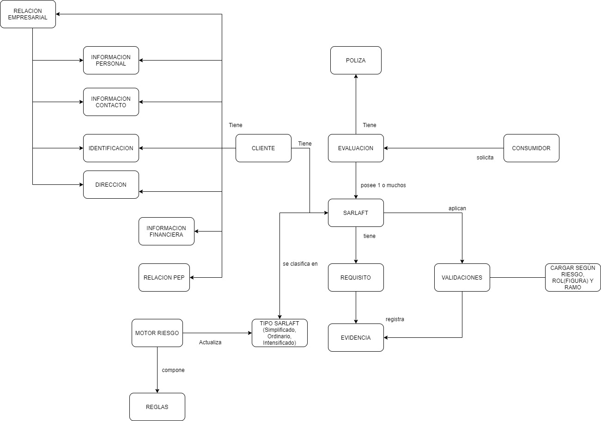
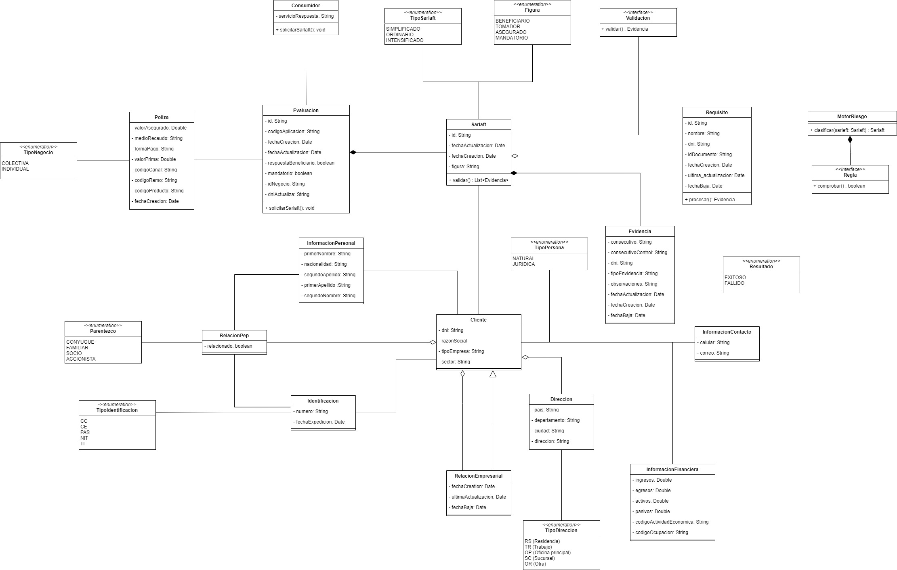
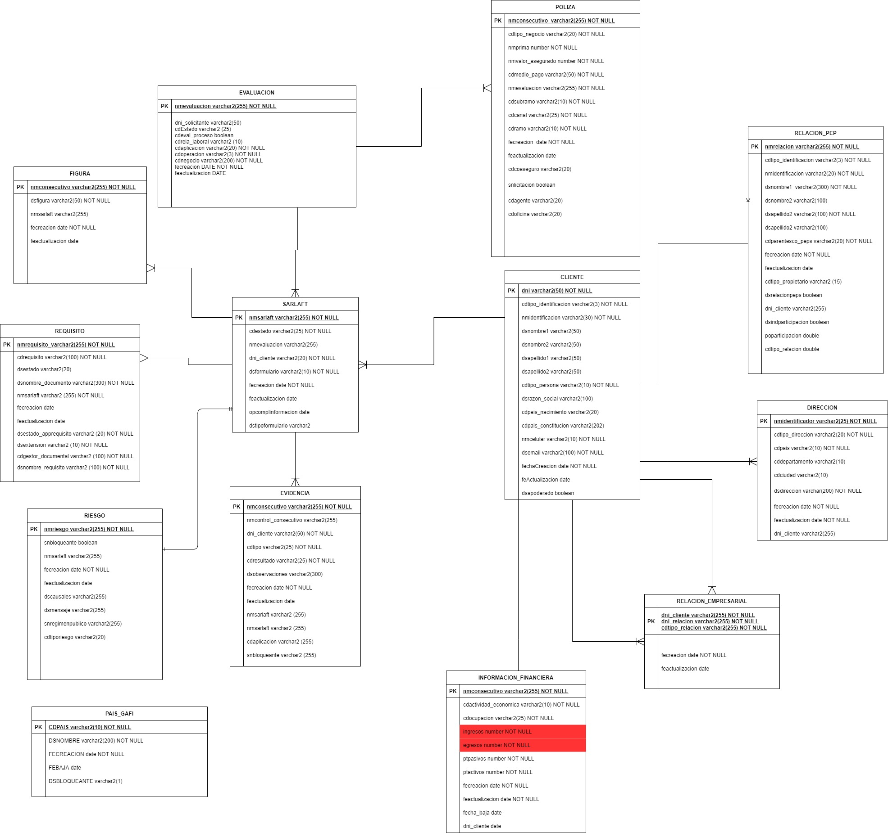
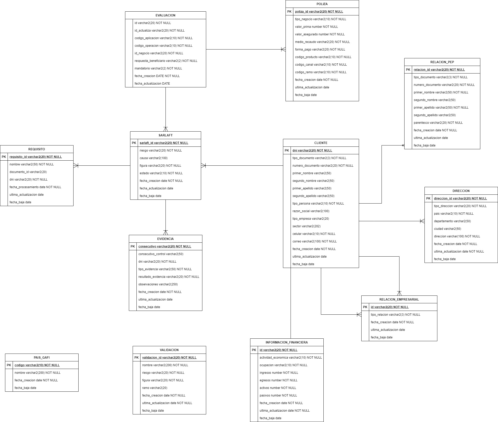

# Modelo de Dominio, Clases y Base de Datos - SarlaftAPI

**Fuente Confluence:** [Modelo Dominio, Clases y BD - SarlaftAPI](https://segurosti.atlassian.net/wiki/spaces/EPA/pages/1809908116)  
**Página padre:** [Microservicio SarlaftAPI](./index.md)

---

## Modelo de Dominio

Define las entidades de negocio principales y sus relaciones en el sistema SARLAFT 4.0.

---

## Modelo de Clases

Representa la estructura orientada a objetos del proyecto (clases Java del dominio).

---

## Modelo de Base de Datos

Describe las tablas, columnas y relaciones del esquema de persistencia en PostgreSQL.

---

## Archivo DrawIO

El archivo fuente editable (`.xml`) se descargó en: [img/domain_model_.xml](./img/domain_model_.xml)

También disponible en SharePoint:  
[domain_model_.xml en SharePoint](https://suramericana-my.sharepoint.com/:u:/g/personal/ldmunoz_sura_com_co/EV1E6FrlpFBKmWmGcUqhXKwB9njsduoUFQLg9kAd56qSVQ?e=ZOMay0)

---

## Referencias

- [Configuración Base de Datos R2DBC](./ConfiguracionBaseDatosR2DBC.md) — detalles de la configuración R2DBC sobre PostgreSQL
- [Estructura Proyecto](./EstructuraProyecto.md) — organización hexagonal del código
