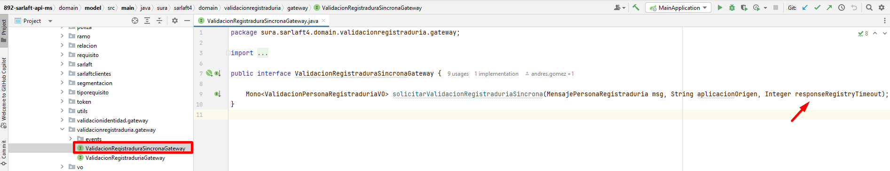

# Parametrización para Tiempo de Timeout - Consumo Registraduría - SarlaftAPI

> **Fuente:** [Confluence - Parametrización para tiempo de timeout consumo registraduria - sarlaftapi](https://segurosti.atlassian.net/wiki/spaces/EPA/pages/3768090815/Parametrizaci%C3%B3n+para+tiempo+de+timeout+consumo+registraduria+-+sarlaftapi)  
> **Página padre:** [Microservicio SarlaftAPI](../index.md)

---

## Descripción

Se parametriza el tiempo para el timeout de la respuesta del **web service de Registraduría**.

---

## Configuración en `application.yaml`

En el proyecto `892-sarlaft-api-conf` → `application.yaml`, por medio de la propiedad `timeout`, se parametriza el tiempo en **milisegundos** que se debe esperar la respuesta del WS de la Registraduría antes de manejarse como un error por timeout.

---

## Implementación en Código

Este nuevo parámetro se envía a la firma `solicitarValidacionRegistraduriaSincrona` de la interfaz **`ValidacionRegistraduraSincronaGateway`**:

---

## Notas

- La parametrización permite ajustar el timeout sin necesidad de un despliegue del microservicio principal.
- El valor se configura por ambiente en el repositorio de configuración `892-sarlaft-api-conf`.
- Para más información sobre el HealthCheck que también valida la conexión a Registraduría, ver [Configuración HealthCheck](./ConfiguracionHealthCheck.md).
