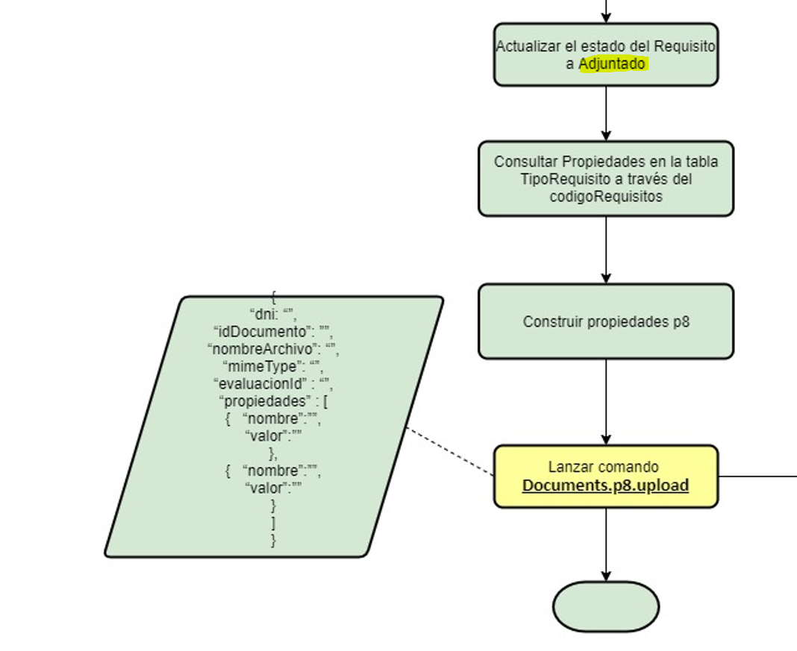

# Comunicación P8

**Fuente Confluence:** [Comunicación P8](https://segurosti.atlassian.net/wiki/spaces/EPA/pages/2358509754)  
**Sección:** [Proceso Evaluación](./index.md)

---

## Descripción

- **Objetivo:** Esta funcionalidad permite lanzar un mensaje a la función `appp8` de RabbitMQ a partir de la construcción del mensaje con asignación del requisito como estado ADJUNTO cuando fue cargado el documento a P8.

- **Descripción:** Una vez el documento es cargado a P8 y se asigna el estado de ADJUNTO del requisito y éste es guardado en bases de datos, se procede a realizar la consulta de la tabla `TSAF_TIPO_REQUISITO` mediante el código de requisito. Con la información de esta consulta y otros datos de la petición del servicio se procede a construir el mensaje que será lanzado a la cola de mensajes mediante la función **appp8**.

- **Endpoint:** `/sarlaftserv/form/upload`

- **Perfil de Seus4:** `PF_CONSUMSERVSARLAFTAPI`

## Adjuntos de Ejemplo

- `json_ejemplo_lanzar_mensaje_p8.json` — Ejemplo JSON Request
- `mensaje_rabbit_mq_p8.json` — Ejemplo de resultado en la función `appp8`

> Los archivos JSON están adjuntos en la página de Confluence.

## Dependencias

- Base de Datos Sarlaft
- Aplicaciones Externas
- RabbitMQ

## Diagrama

> Diagrama de servicio que representa el flujo de la construcción del mensaje y su envío.
