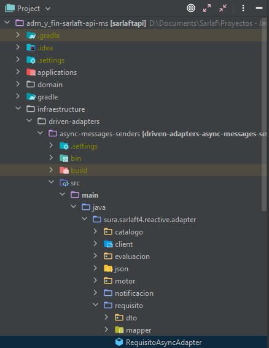
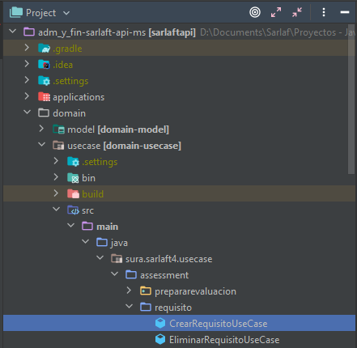
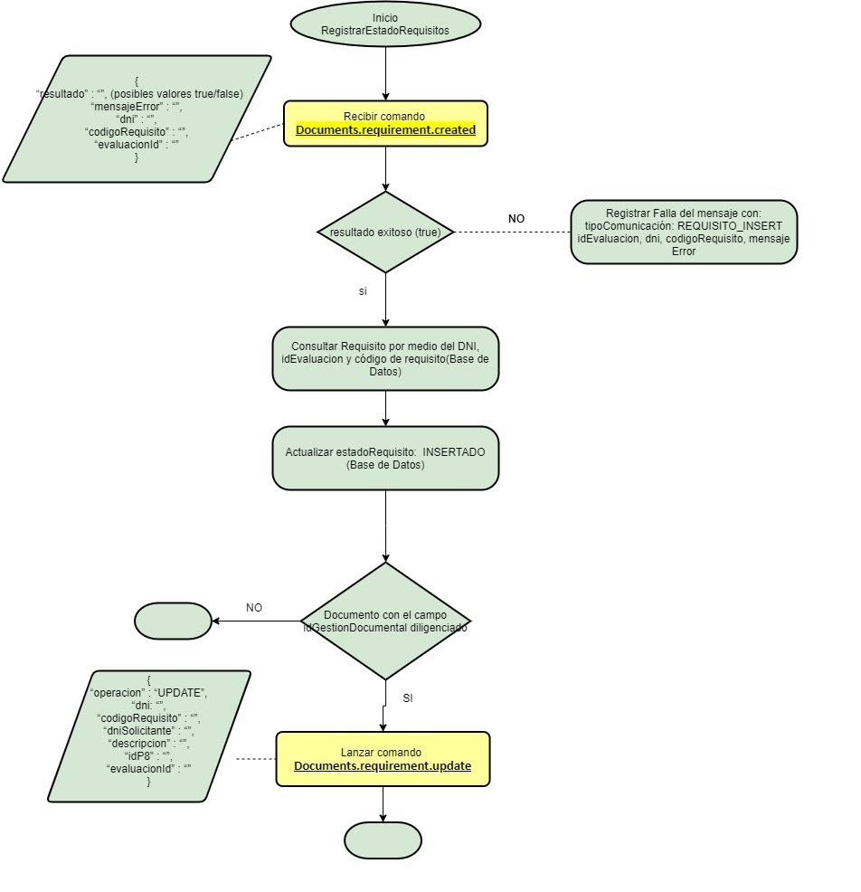
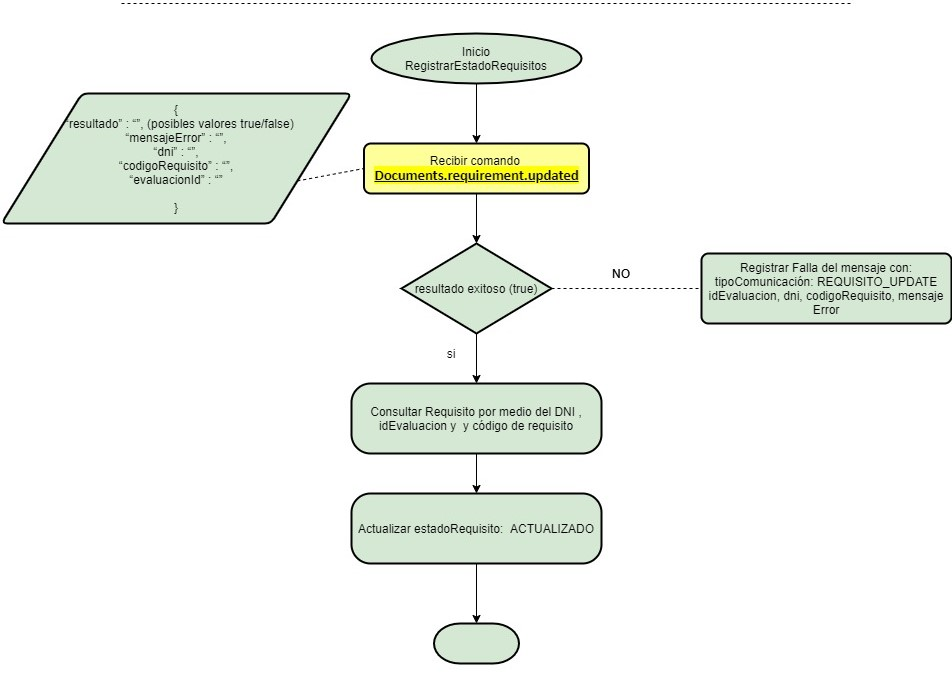
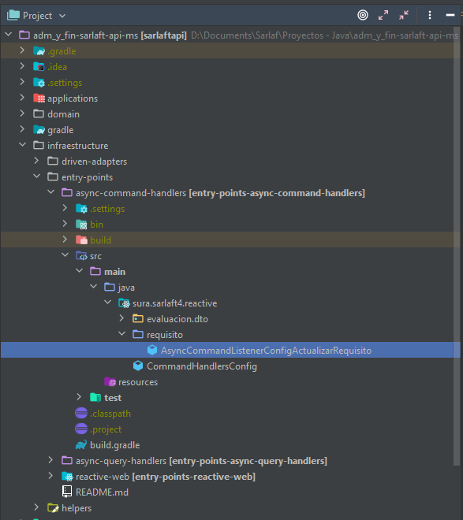

# Comunicación Requisitos

**Fuente Confluence:** [Comunicación Requisitos](https://segurosti.atlassian.net/wiki/spaces/EPA/pages/2338947077)  
**Sección:** [Proceso Evaluación](./index.md)

---

## Descripción - CrearRequisito

Se crea clase Adapter en el módulo **async-message-sender** para lanzar comando **Documents.requirements.insert** el cual es utilizado en los web services **wsAssesment** y **wsAdicionarFigura**.

Este comando es lanzado por la cantidad total de requerimientos en una evaluación, es decir, se toman todos los **sarlaft** de la evaluación e internamente se toman los **requisitos** y por cada uno de estos se envía el comando anteriormente descrito.

Para más información verificar en link de HU y descripción de Flujo (En el flujo este se representa a partir de la línea roja).

**Referencia de HU:** https://jira.suramericana.com.co/browse/TSTAR-1453

**Flujo de HU:**

---

## Ubicación en el Proyecto — Adapter

- **Paquete:** `sura.sarlaft4.reactive.adapter.requisito`
- **Path:** `infraestructure/driven-adapters/async-messages-senders/src/main/java/sura/sarlaft4/reactive/adapter/requisito/RequisitoAsyncAdapter.java`

## Ubicación en el Proyecto — Usecase

- **Package:** `sura.sarlaft4.usecase.assessment.requisito`
- **Path:** `domain/usecase/src/main/java/sura/sarlaft4/usecase/assessment/requisito/CrearRequisitoUseCase.java`

## Uso actual del Usecase

### `CrearEvaluacionUseCase`

- **Paquete:** `sura.sarlaft4.usecase.assessment`
- **Path:** `domain/usecase/src/main/java/sura/sarlaft4/usecase/assessment/CrearEvaluacionUseCase.java`
- **Método llamado:** `Mono<Evaluacion> ejecutarCrearRequisitos(Evaluacion evaluacion)`

### `AgregarFiguraUseCase`

- **Paquete:** `sura.sarlaft4.usecase.assessment`
- **Path:** `domain/usecase/src/main/java/sura/sarlaft4/usecase/assessment/AgregarFiguraUseCase.java`
- **Método llamado:** `Mono<Tuple2<Evaluacion, Sarlaft>> ejecutarCrearRequisitos(Tuple2<Evaluacion, Sarlaft> tuple)`

---

## Descripción - ActualizarRequisito

Se crea un entrypoint para recibir un requisito por comando. Al recibirlo se debe verificar el resultado de inserción del requisito con el campo **resultado**, según esto se debe insertar reporte en la tabla de **tsaf_notificacion** o proceder con la actualización de estado de Requisito en la tabla **tsaf_requisito** y envío de comando **documents.requirements.update** en caso que el requisito tenga el campo **idGestionDocumental** diligenciado y sea parte del primer flujo.

Para más información verificar en link de HU y descripción de Flujo.

**Referencia de HU:** https://jira.suramericana.com.co/browse/TSTAR-1504

**Flujo de HU-1504:**

**Referencia de HU:** https://jira.suramericana.com.co/browse/TSTAR-1505

**Flujo de HU-1505:**

---

## Ubicación en Proyecto — Handler

- **Paquete:** `sura.sarlaft4.reactive.requisito`
- **Path:** `infraestructure/entry-points/async-command-handlers/src/main/java/sura/sarlaft4/reactive/requisito/AsyncCommandListenerConfigActualizarRequisito.java`

## Ubicación en Proyecto — Usecase

- **Package:** `sura.sarlaft4.usecase.requisito`
- **Path:** `domain/usecase/src/main/java/sura/sarlaft4/usecase/requisito/ActualizarRequisitoUseCase.java`

## Clases Relacionadas

| Clase | Paquete | Path |
|-------|---------|------|
| `NotificacionRepository` (interface) | `sura.sarlaft4.domain.requisito.gateway` | `domain/model/src/main/java/sura/sarlaft4/domain/requisito/gateway/RequisitoRepository.java` |
| `RequisitoRepositoryAdapter` | `sura.sarlaft4.jpa.requerido` | `infraestructure/driven-adapters/jpa-repository/src/main/java/sura/sarlaft4/jpa/requerido/RequisitoRepositoryAdapter.java` |
| `RequisitoRepository` (interface) | `sura.sarlaft4.domain.requisito.gateway` | `domain/model/src/main/java/sura/sarlaft4/domain/requisito/gateway/RequisitoRepository.java` |
| `RequisitoGateway` (Interface) | `sura.sarlaft4.domain.requisito.gateway` | `domain/model/src/main/java/sura/sarlaft4/domain/requisito/gateway/RequisitoGateway.java` |
| `RequisitoAsyncAdapter` | `sura.sarlaft4.reactive.adapter.requisito` | `infraestructure/driven-adapters/async-messages-senders/src/main/java/sura/sarlaft4/reactive/adapter/requisito/RequisitoAsyncAdapter.java` |
