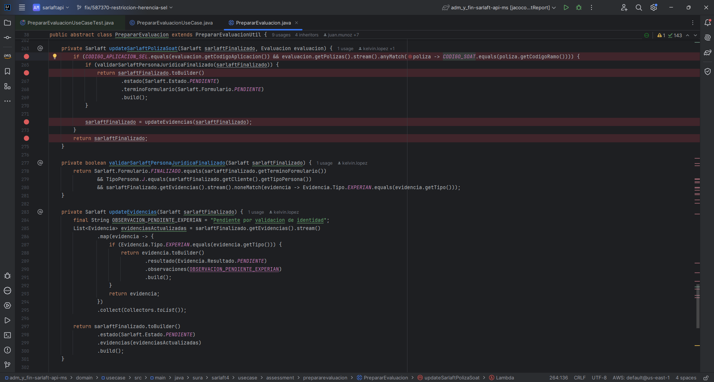

# Herencia Sarlaft API para el SOAT

> **Fuente:** [Confluence - Herencia Sarlat API para el SOAT](https://segurosti.atlassian.net/wiki/spaces/EPA/pages/3917152264/Herencia+Sarlat+API+para+el+SOAT)  
> **Página padre:** [Proceso Evaluación - SarlaftAPI](./index.md)

---

## Descripción

Se realizó un ajuste que modifica la herencia de las evidencias de una evaluación asociada al SOAT:

- **NO HEREDAR** la validación de identidad de **EXPERIAN** para el aplicativo **SEL**
- **MANTENER LA HERENCIA** en el aplicativo **278** (SOAT SURA)

---

## Métodos Impactados

Los 3 principales métodos impactados en el proyecto `892-sarlaft-api-ms`, ubicados en la clase abstracta `PrepararEvaluacion.java`:

1. `updateSarlaftPolizaSoat`
2. `validarSarlaftPersonaJuridicaFinalizado`
3. `updateEvidencias`

Y se ajustaron los siguientes métodos con el objetivo de llevar la evaluación al método `updateSarlaftPolizaSoat`:

- `procesarSarlaft`
- `procesarListaSarlaft`
- `requiereDiligenciarFormulario`

---

## Escenarios Propuestos

### Escenario 1 — Aplicativo SEL + SOAT + Persona Jurídica (NO hereda)

**Dado que:**
- Se crea una evaluación del aplicativo **SEL**
- El ramo es **SOAT**
- Es **persona jurídica**

**Cuando:**
- Se ingresa la información del formulario
- Se finaliza la validación de identidad
- Finaliza la evaluación
- Se vuelve a crear otro negocio con la misma información

**Entonces:**
- **NO herede** el sarlaft
- Solicite nuevamente todo el flujo del formulario y la validación de identidad

---

### Escenario 2 — Aplicativo SOAT SURA (278) + SOAT + Persona Jurídica (SÍ hereda)

**Dado que:**
- Se crea una evaluación del aplicativo **SOAT SURA - 278**
- El ramo es **SOAT**
- Es **persona jurídica**

**Cuando:**
- Se ingresa la información del formulario
- Se finaliza la validación de identidad
- Finaliza la evaluación
- Se vuelve a crear otro negocio con la misma información

**Entonces:**
- **Herede** el sarlaft
- No se solicite diligenciar el formulario nuevamente

---

### Escenario 3 — Aplicativo COTIZADOR DE CANALES (6919) + Ramo 040 + Persona Natural (SÍ hereda)

**Dado que:**
- Se crea una evaluación del aplicativo **COTIZADOR DE CANALES - 6919**
- El ramo es **040**
- Es **persona natural**

**Cuando:**
- Se ingresa la información del formulario
- Se finaliza la validación de identidad
- Finaliza la evaluación
- Se vuelve a crear otro negocio con la misma información

**Entonces:**
- **Herede** el sarlaft
- No se solicite diligenciar el formulario nuevamente
