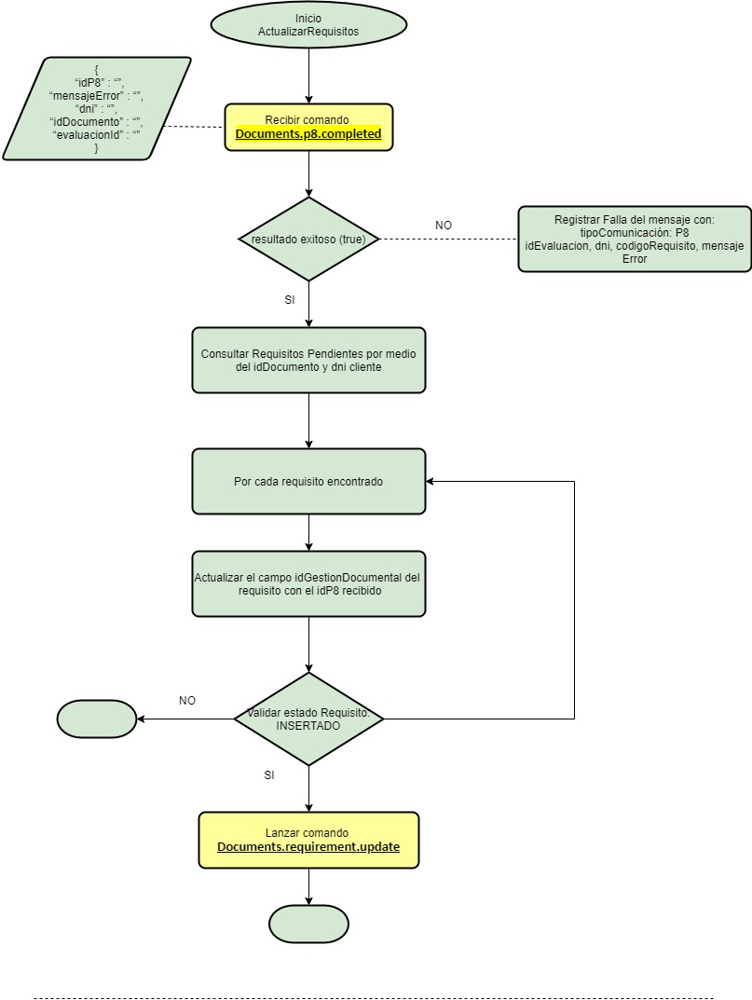

# Registro de ID Documento P8

**Fuente Confluence:** [Registro de ID documento P8](https://segurosti.atlassian.net/wiki/spaces/EPA/pages/2371649550)  
**Sección:** [Proceso Evaluación](./index.md)

---

## Descripción

- **Objetivo:** Esta funcionalidad permite recibir un mensaje de la cola `sarlaft-api` desde RabbitMQ y lo procesa de acuerdo a si llega o no mensaje de error, generando las actualizaciones respectivas en bases de datos.

- **Descripción:** Una vez se publica un mensaje en la cola de `sarlaft-api` de RabbitMQ, se procede a leerlo y dependiendo si llega o no mensaje de error:

  **Si llega mensaje de error:**  
  Se deja el mensaje en la tabla `tsaf_notificacion` con:
  - `cdestado` = `"error"`
  - `dsmensajeerror` = mensaje de error enviado
  - `cdtipo` = `"P8"`
  - Se actualiza la fecha `feactualizacion`

  **Si el mensaje de error llega vacío:**  
  Se actualiza la tabla requisito en el campo `cdgestor_documental` con el id de P8 que llega en el mensaje, además de actualizar la fecha de actualización del requisito. Si el estado del requisito está en **ADJUNTO**, el campo `dsestado_apprequisito` se le asigna el valor de **INSERTADO**.

  Una vez realizado esto, se verifica el sarlaft asociado a ese requisito; si el estado del sarlaft es **FINALIZADO_SIN_CARGA**, se realiza el cambio a **FINALIZADO** actualizando también la fecha del sarlaft respectivo.

## Adjuntos de Ejemplo

- `mensaje_NO_ERROR_1507.json` — Ejemplo del mensaje sin error para RabbitMQ
- `mensaje_ERROR_1507.json` — Ejemplo del mensaje con error para RabbitMQ

> Los archivos JSON están adjuntos en la página de Confluence.

## Diagrama

> Diagrama del flujo para la funcionalidad de registro de id documento P8.
