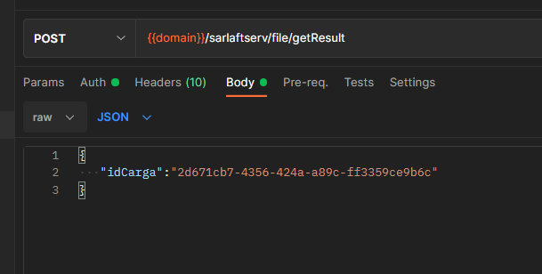
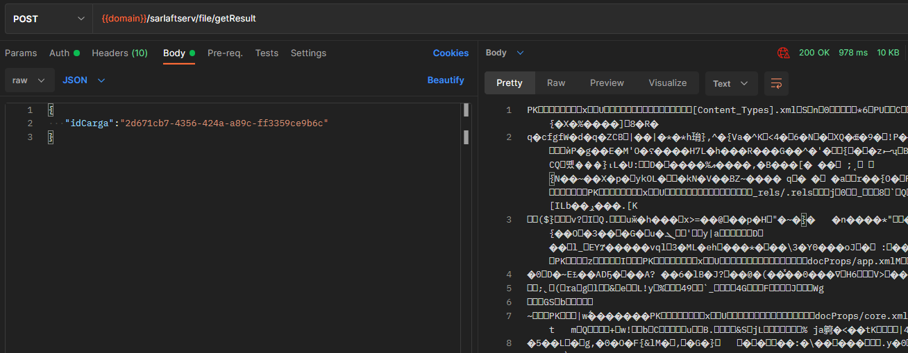

# Servicio Resultado Carga Masiva Excel

**Fuente Confluence:** [Servicio Resultado Carga Masiva Excel](https://segurosti.atlassian.net/wiki/spaces/EPA/pages/2653683726)  
**Sección:** [Procesos Carga Masiva](./index.md)

---

## Descripción

- **Objetivo:** Obtener el archivo con el resultado de la carga masiva.
- **Endpoint:** `/sarlaftserv/file/getResult`
- **Perfil de Seus4:** `PF_CONSUMSERVSARLAFTAPI`
- **Method:** `POST`

## Request

> **Nota:** El id de la carga debe estar registrado en caché, el cual contiene información del documento que se debe descargar.  
> Ver más: [Carga Excel Carga Masiva](../ServiciosWeb/CargaExcelCargaMasiva.md)

**Parámetros Body:**

- **idCarga:** Indicador de la carga masiva.

## Response

> **Nota:** Al consumirse el servicio desde un navegador descargará directamente el archivo.

