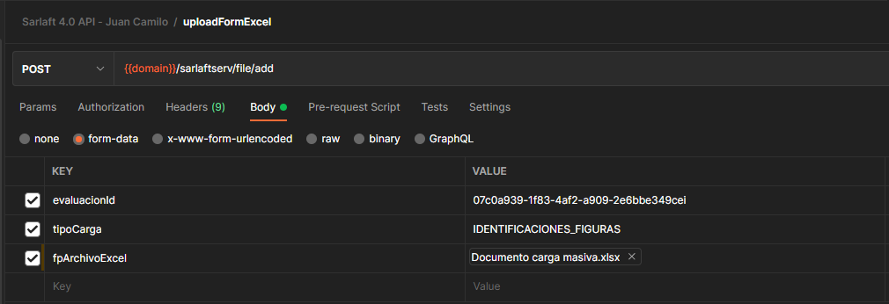

# Carga Excel Carga Masiva

**Fuente Confluence:** [Carga Excel Carga Masiva](https://segurosti.atlassian.net/wiki/spaces/EPA/pages/2370895967)
**Sección:** [Servicios Web](../index.md)

---

- **Objetivo:** Permite comenzar con el proceso de carga masiva con la carga de un archivo excel.
- **Endpoint:** /sarlaftserv/file/add
- **Perfil de Seus4:** PF_CONSUMSERVSARLAFTAPI
- **Ejemplo de request:**

**Parámetros:**

1. evaluacionId: 07c0a939-1f83-4af2-a909-2e6bbe349cei (cambiar caracteres para que sea un evaluacionId nuevo)
2. tipoCarga: IDENTIFICACIONES_FIGURAS
3. fpArchivoExcel: Documento a subir, no debe superar los 2 MB y se aceptan sólo archivos XLXS y XLS (Sólo archivos excel)

- **Ejemplo de response:**
  - Cuando es la primera vez que se inicia el proceso de carga masiva para una evaluación y el proceso queda en estado RECIBIDO o INICIADO:
    - Header:
      - status 202
      - retry-after
      - location
    - Body:
      - { "cargaId" : "id" }
  - Cuando es la primera vez que se inicia el proceso de carga masiva para una evaluación y el proceso queda en estado FINALIZADO:
    - Header:
      - status 302
      - retry-after
      - location
    - Body:
      - { "cargaId" : "id" }
  - Cuando se intenta comenzar el proceso de carga masiva con una evaluación que ya está en estado RECIBIDO O INICIADO:
    - Header:
      - status 400
    - Body:
      - La evaluacion tiene actualmente una carga pendiente

- **Dependencias:**
  - Cache Redis
  - Reactive commons - RabbitMQ
  - Azure Storage Account
