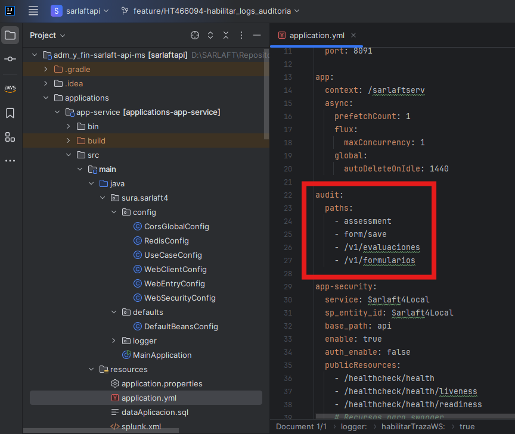

# Logs de los Nuevos Endpoints de Sarlaft API

**Fuente Confluence:** [Logs de los Nuevos Endpoints de Sarlaft API](https://segurosti.atlassian.net/wiki/spaces/EPA/pages/3784376357)
**Sección:** [Servicios Web - Consumo de Nuevos Endpoints](./index.md)

---

| Servicio Viejo | Servicio Nuevo | Filtro de Splunk para Request y Response |
|---|---|---|
| assessment | /evaluaciones | `index="idx_sarlaft4_*" message="*modulo=SARLAFTAPI*" message="*operacion=WEBFILTER*" message="*/sarlaftserv/v1/evaluaciones*"` |
| assessment/recategorize | /evaluaciones/recategorizar | `index="idx_sarlaft4_*" message="*modulo=SARLAFTAPI*" message="*operacion=WEBFILTER*" message="*/sarlaftserv/v1/evaluaciones/recategorizar*"` |
| assessment/figure/add | /evaluaciones/figuras | `index="idx_sarlaft4_*" message="*modulo=SARLAFTAPI*" message="*operacion=WEBFILTER*" message="*/sarlaftserv/v1/evaluaciones/figuras*"` |
| assessment/figure/delete | /evaluaciones/figuras | `index="idx_sarlaft4_*" message="*modulo=SARLAFTAPI*" message="*operacion=WEBFILTER*" message="*/sarlaftserv/v1/evaluaciones/figuras*"` |
| form/save | /formularios | `index="idx_sarlaft4_*" message="*modulo=SARLAFTAPI*" message="*operacion=WEBFILTER*" message="*/sarlaftserv/v1/formularios*"` |

## Configurar Logs para Nuevos Endpoints

Para agregar logs de nuevos endpoints se modifico el archivo application.yml con los nuevos parámetros especificados en la siguiente imagen:

La idea es suministrar la lista de endpoints a auditar que exponga la aplicación de Sarlaft API; es suficiente con pasar un poco de contexto del path del endpoint a loguear en splunk ya que este identifica si el contexto suministrado esta contenido dentro del path de la petición http.
