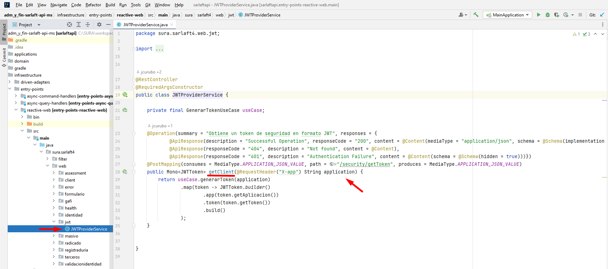
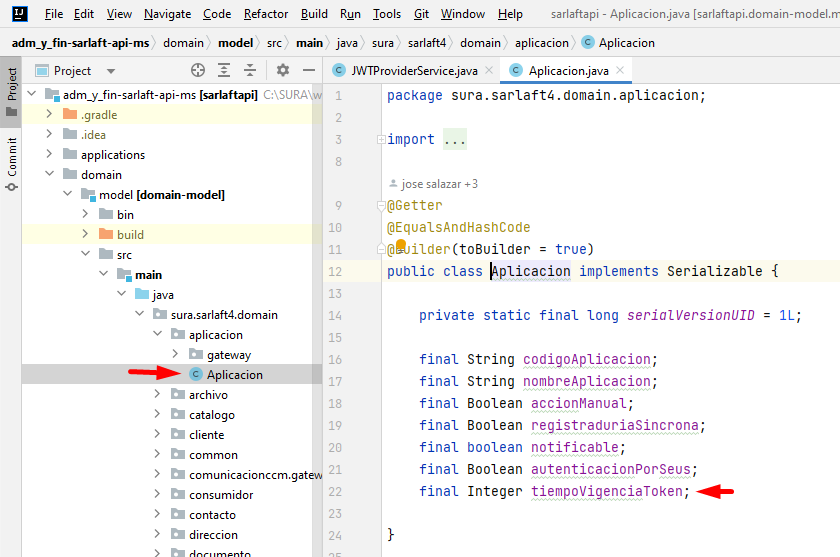
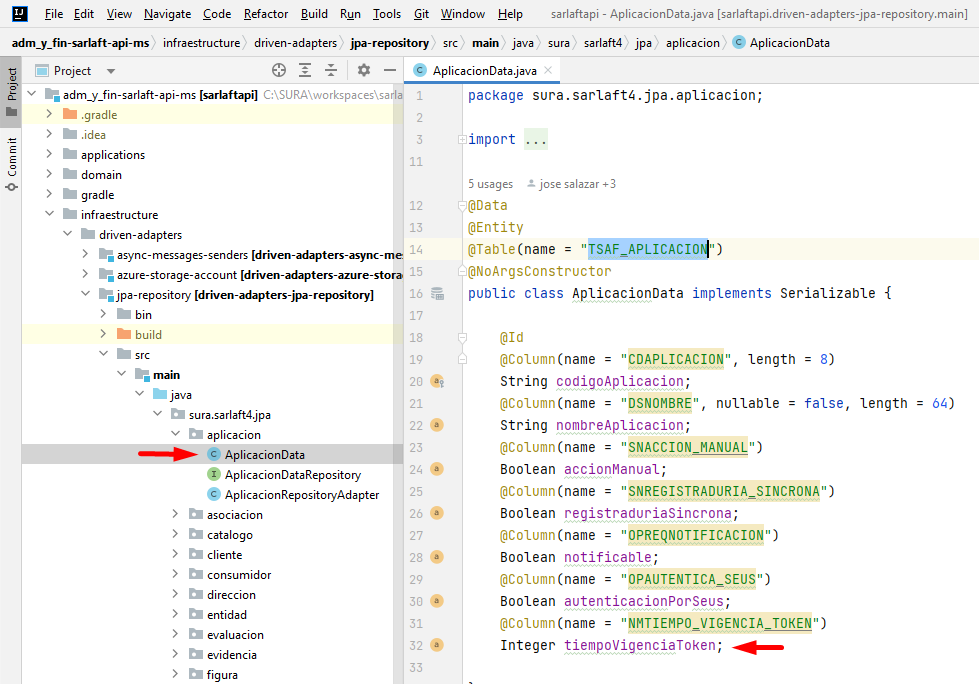
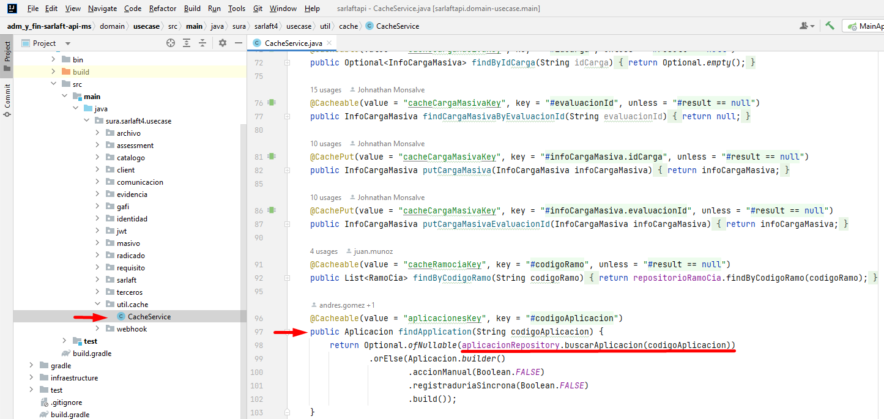
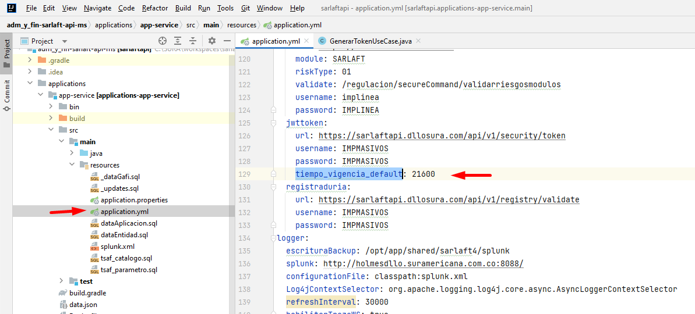
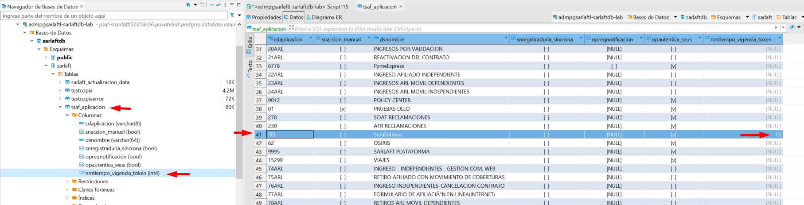

# Implementación de la solución

**Fuente Confluence:** [Implementación de la solución](https://segurosti.atlassian.net/wiki/spaces/EPA/pages/3289284759)
**Sección:** [Servicios Web - Parametrización tiempo de vida del token JWT](./index.md)

---

El cambio se realizó en el microservicio sarlaftapi sobre el proyecto [adm_y_fin-sarlaft-api-ms](https://dev.azure.com/SuraColombia/Gerencia_Tecnologia/_git/adm_y_fin-sarlaft-api-ms)

Se agregó a la clase del dominio `Aplicacion.java` el atributo `tiempoVigenciaToken` el cual corresponde al tiempo de vida del token JWT en minutos.

Se agregó el campo `tiempoVigenciaToken` (`NMTIEMPO_VIGENCIA_TOKEN`) a la entidad `AplicacionData` correspondiente a la tabla `TSAF_APLICACION` en base de datos sarlaft:

Se implemento en `CacheService.java` la consulta en caché del tiempo de vida del token por código de aplicación, para que en caso tal de existir en caché se devuelva el valor que existe en el área de caché `aplicacionesKey` para el código de aplicación consultado. De no existir en caché, se accede a consultar la parametrización en base de datos.

En el archivo de configuración `application.yml` se definió la propiedad `tiempo_vigencia_default` con la cual se establece el valor por defecto del tiempo de vida del token JWT con el valor de 21600 minutos (15 días) el cual aplicará para aquellos aplicativos que no tengan parametrizado el tiempo de vida del token en la tabla `TSAF_APLICACION`.

En la base de datos de sarlaft se parametrizó en la tabla `TSAF_APLICACION` como tiempo de vida del token JWT solicitado por el aplicativo SEL (x-app = digital) el valor de 15 minutos:

