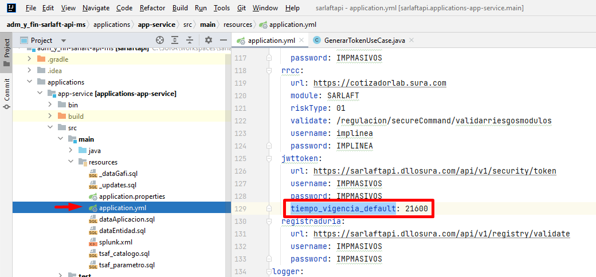
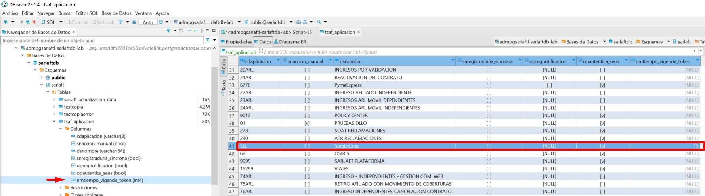

# Parametrización tiempo de vida del token JWT por aplicación

**Fuente Confluence:** [Parametrización tiempo de vida del token JWT por aplicación.](https://segurosti.atlassian.net/wiki/spaces/EPA/pages/3289448494)
**Sección:** [Servicios Web - Creación token JWT](../index.md)

---

Esta funcionalidad surge como solución al incidente de seguridad 5587183 el cual se describe a continuación:

> "Se identifica un token JWT con vigencia de 15 días emitidos desde suraenlinea para el consumo de SARLAFTAPI lo cual puede ser aprovechado por un atacante. Se recomienda que el tiempo de vida sea el mínimo necesario para la operación que se requiere hacer (considerar un máximo de tiempo en cuestión de minutos u horas), no durante tantos días."

Para ello se optó por parametrizar en la tabla `TSAF_APLICACION` de la base de datos de sarlaft, el tiempo de vida del token JWT para que sea diferenciable por código del aplicativo que requiera del token para acceder a los servicios de sarlaftapi. Cuando el código de aplicación no tenga configuración o no se encuentre parametrizado se devuelve por defecto un tiempo de vida de 15 días (21600 minutos) o según como se tenga configurado en la propiedad `tiempo_vigencia_default` del `application.yml`

Se parametrizó para el caso del aplicativo SEL (SuraEnLinea) un tiempo de vigencia para el token JWT de 15 minutos:

## Sub-páginas

- [Implementación de la solución](./ImplementacionSolucion.md)
- [¿Cómo parametrizar tiempo de vida del token JWT?](./ComoParametrizarTiempoVidaTokenJWT.md)
