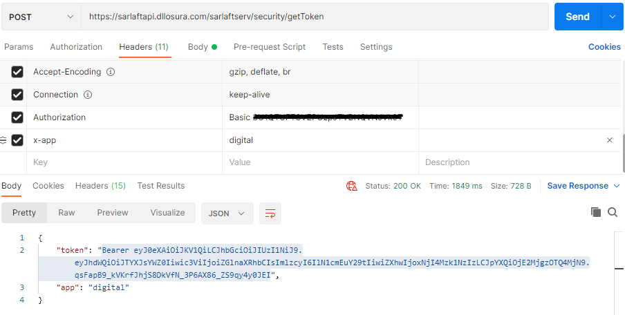

# Creación token JWT

**Fuente Confluence:** [Creación token JWT](https://segurosti.atlassian.net/wiki/spaces/EPA/pages/2075164717)
**Sección:** [Servicios Web](../index.md)

---

- **Objetivo:** Servicio REST para obtener un token JWT de conexión hacia la API.
  Este token Jwt será utilizado generalmente para consumo de la API desde el WebComponent.
- **Endpoint:** /sarlaftserv/security/getToken
- **Parámetros:** Se debe enviar el nombre de la aplicación que consume el servicio como parámetro del *Request Headers.* Nombre de la variable es *X-APP*
- **Perfil de Seus4:** PF_SECURITY_TOKEN
- **Ejemplo de consumo Request:**
  Body vacío => **{}**
  Header: x-app : digital

## Sub-páginas

- [Parametrización tiempo de vida del token JWT por aplicación](./ParametrizacionTiempoVidaTokenJWT/index.md)
