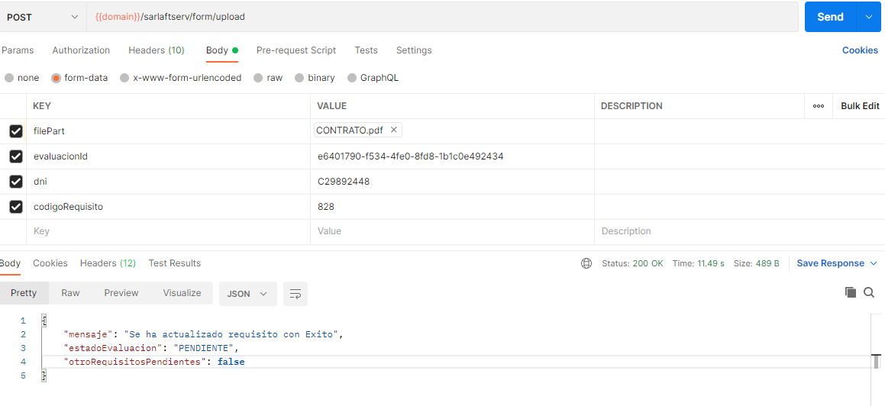

# Servicio adjuntar soporte a un requisito

**Fuente Confluence:** [Servicio adjuntar soporte a un requisito](https://segurosti.atlassian.net/wiki/spaces/EPA/pages/2158264321)
**Sección:** [Servicios Web](../index.md)

---

- **Objetivo:** Permite adjuntar documentos soportes de requisitos solicitados a una figura dentro del proceso de sarlaft.
- **Endpoint:** /sarlaftserv/form/upload
- **Perfil de Seus4:** PF_CONSUMSERVSARLAFTAPI

**Nuevo endpoint:** /sarlaftserv/v1/documentos

**Perfil de Seus4:** aun no creado para consumo interno

- **Ejemplo Request:**



**Parámetros:**

1. filePart: Documento a subir no debe superar los 2MB y se aceptan los siguientes tipos: **(zip,pdf,png,jpg).**
2. evaluacionId: 07c0a939-1f83-4af2-a909-2e6bbe349cea
3. dni: C10172156
4. codigoRequisito: 828

**Validación para tipos de archivos:**

Se implementó la validación a nivel de los bytes del archivo binario que se adjuntan a través de los servicios **sarlaftserv/v1/documentos** y **sarlaftserv/form/upload** usando la librería **org.apache.tika:tika-core:2.9.2** de tal forma que ya no se valide el tipo de archivo por medio de la extensión que lleva el nombre sino que se valide a nivel de sus bytes[]. Los tipos de archivos permitidos son los siguientes:

```text
JPG("image/jpeg"),
PDF("application/pdf"),
EML("message/rfc822"),
MSG("application/x-tika-msoffice"),
PNG("image/png");
```

**Ejemplo Response:**

[`responseSarlaftApi.json`](./ServicioAdjuntarSoporteRequisito/responseSarlaftApi.json)

- **Dependencias:**
  - Base de Datos Saralft.
  - Azure Storage Account.
  - Cache Radis.
