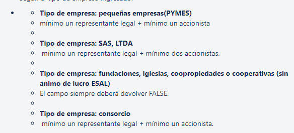

# Servicio guardar formulario

**Fuente Confluence:** [Servicio guardar formulario](https://segurosti.atlassian.net/wiki/spaces/EPA/pages/2150432783)
**Sección:** [Servicios Web](../index.md)

---

- **Objetivo:** Permite guardar el formulario persona natural simplificado, ordinario, intensificado para capturar la información del cliente.
  - Cada que se realice un guardado de una Figura se validara según el tipo de empresa si cuenta o no cuenta con los directivos necesarios para continuar el proceso estas son las validaciones:

    

    En caso de que los requerimientos mínimos no se cumplan el servicio devolverá una excepción indicando que no cumple con la cantidad necesaria de directivos.

- **Endpoint:** /sarlaftserv/form/save
- **Perfil de Seus4:** PF_CONSUMSERVSARLAFTAPI
- **Ejemplos Json Request:**

[`PersonaJuridica_CelularOpcional.json`](./ServicioGuardarFormulario/PersonaJuridica_CelularOpcional.json) | [`AccionistaSimplificado-CorreoYCelularOpcional.json`](./ServicioGuardarFormulario/AccionistaSimplificado-CorreoYCelularOpcional.json) | [`save-form-assessment-consorcio-1.json`](./ServicioGuardarFormulario/save-form-assessment-consorcio-1.json) | [`RequestPN.json`](./ServicioGuardarFormulario/RequestPN.json) | [`GuardarPJ.json`](./ServicioGuardarFormulario/GuardarPJ.json) | [`save-form-simplificado-relacion-peps-familia.json`](./ServicioGuardarFormulario/save-form-simplificado-relacion-peps-familia.json) | [`save-form-simplificado-relacion-peps-socio.json`](./ServicioGuardarFormulario/save-form-simplificado-relacion-peps-socio.json) | [`save-form-simplificado-relacion-peps-socio-5%.json`](./ServicioGuardarFormulario/save-form-simplificado-relacion-peps-socio-5%25.json) | [`save-form-assessment-consorcio-agente-legal-1.json`](./ServicioGuardarFormulario/save-form-assessment-consorcio-agente-legal-1.json)

- **Dependencias:**
  - Base de Datos Saralft.

- Reglas de calidad de servicio (Validaciones):

[`Reglas de Calidad Actualizadas Backend.xlsx`](../../xlsx/Reglas%20de%20Calidad%20Actualizadas%20Backend.xlsx)
