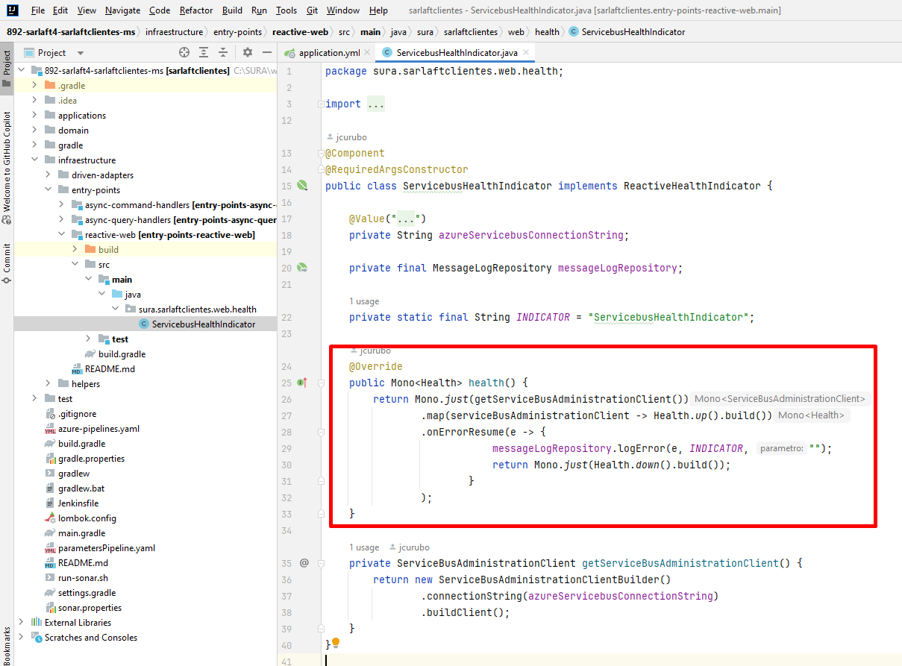
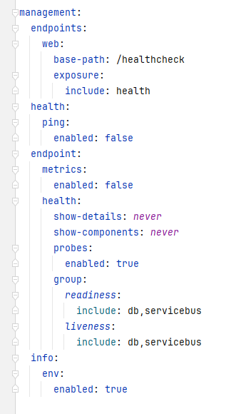
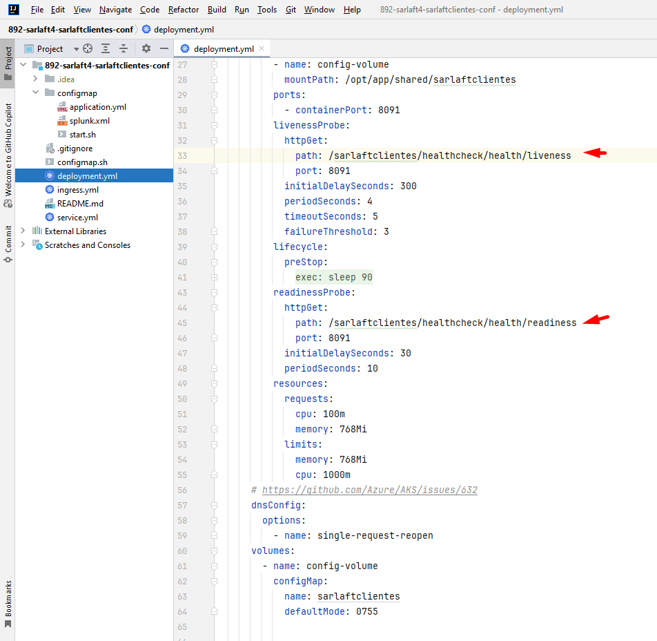

# Configuración HealtchCheck con librería actuator - sarlaftclientes

> **Fuente Confluence:** [Configuración HealtchCheck con librería actuator - sarlaftclientes](https://segurosti.atlassian.net/wiki/spaces/EPA/pages/3532554423)
> **Última modificación:** 2024-03-11 · versión 5
> **Sección:** [Microservicio SarlaftClientesMS](./index.md)

Este nuevo servicio web de healthCheck permite evaluar las conexiones principales del microservicio de tal forma que cuando desde el aks en azure, se haga el ping para evaluar la salud del microservicio se evalué de igual forma la conexión al service bus de azure y a la base de datos.

Conexión a base de datos Postgresql (nube)

Con la librería de spring actuator `spring-boot-starter-actuator` se logra este objetivo, se incluye la librería en el build.gradle

La validación con la base de datos se hace automáticamente con el indicador por defecto DataSourceHealthIndicator que trae la librería, y obtiene el datasource utilizando la información de conexión a la base de datos del archivo application.yml.

La validación con el sevice bus se utiliza una clase personalizada `ServicebusHealthIndicator` en la cual se usa la dependencia `'com.azure:azure-messaging-servicebus:7.14.7'`

Se realiza la siguiente configuración en el **application.yaml**

Se realiza la siguiente configuración en el archivo **deployment.yml** en el proyecto de configuración para cada ambiente.

