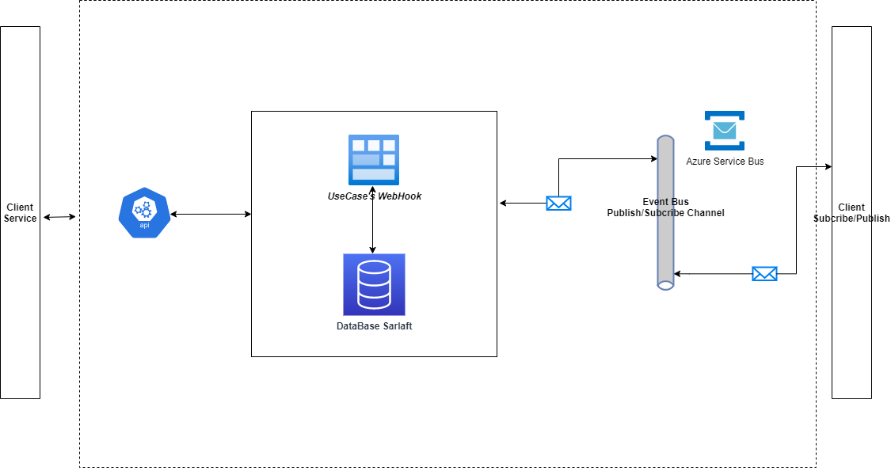

# Diseño Arquitectura - Microservicio Webhook

> **Fuente Confluence:** [Diseño Arquitectura - Microservicio Webhook](https://segurosti.atlassian.net/wiki/spaces/EPA/pages/2310865646/Dise%C3%B1o+Arquitectura+-+Microservicio+Webhook)
> **Última modificación:** 2021-08-09 — erikson.sanchez · versión 3
> **Sección:** [Microservicio Webhook](./index.md)

Este diagrama muestra la interacción de componentes en Sarlaft Webhook

