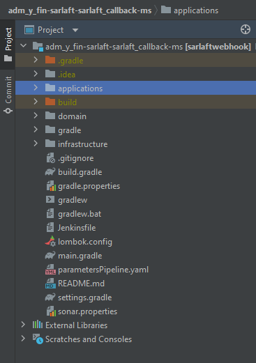
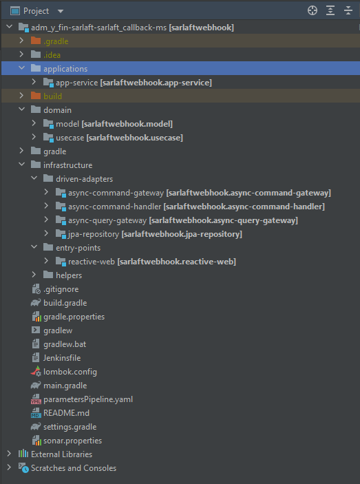

# Estructura Proyecto - Microservicio Webhook

> **Fuente Confluence:** [Estructura Proyecto - Microservicio Webhook](https://segurosti.atlassian.net/wiki/spaces/EPA/pages/2312274273/Estructura+Proyecto+-+Microservicio+Webhook)
> **Última modificación:** 2022-01-04 — Diana Muñoz · versión 4
> **Sección:** [Microservicio Webhook](./index.md)

El microservicio de Webhook está construida a partir del generador de legos de Sura en su versión 0.0.19, se basa en arquitectura hexagonal, se aplica programación reactiva e implementación de seguridad a través de SEUS, generando los siguientes componentes (Figura 1):



*Figura 1. Estructura del proyecto.*

El proyecto está dividido en los siguientes subproyectos (Figura 2):



*Figura 2. Subproyectos.*

1. **applications-app-service**: contiene configuraciones generales del aplicativo, importa los módulos de las otras capas que siguen la Clean Architecture (Dominio e Infraestructura). Es la encargada de la interacción con el framework utilizado, sus complementos y la configuración de la ejecución del microservicio.

   En el archivo de configuración `application.yaml` se encuentran las propiedades parametrizables para la respuesta de la petición en el RabbitMq (host, username, password) y los parámetros para consumir base de datos y seguridad SEUS.

2. **domain**: La capa de dominio es la capa más interna del proyecto y es la encargada de dar las directivas del proceso teniendo en cuenta la lógica de negocio:
   - **a. model**: representa los objetos de dominio (negocio) del aplicativo, sus características y comportamientos.
   - **b. use-case**: contiene los casos de uso (actividad) que se ejecuta en la aplicación desde el proxy de la capa de infraestructura. Interactúa con los modelos para la conversión de los datos de entrada para las operaciones webhook y encargado de notificar el resultado de las operaciones a RabbitMq/Service Bus ó al entry point respectivo solicitado por API.

3. **infrastructure**:
   - **a. async-command-gateway:** adaptador que permite poner las respuestas que son procesadas por los casos de uso, una vez se termina el procesamiento de la logica de negocio se notifica por medio de este adaptador a una cola en RabbitMq/Service Bus.
   - **b. async-command-handler:** adaptador que permite el procesamiento del mensaje de entrada, en este punto se procesa el mensaje de entrada y se delega flujo de la lógica al caso de uso, generalmente en los casos de uso que procesan los mensajes de entrada se combina la interacción con base de datos, servicios externos y el envió de mensajes asincronos al RabbitMq/Service.
   - **c. async-query-gateway:** adaptador que se encarga de realizar consultas aplicando el patron request-reply en este adaptador se lanza una consulta y se espera respuesta de la misma en un timeout especificado, una vez se recibe el mensaje de entrada se delega su procesamiento al caso de uso indicado que retorna el mensaje de procesado que el adaptador se encarga de sincronizar al RabbitMq/Service.
   - **d. jpa-repository:** aquí se encuentran las implementaciones para el control de persistencia de los objetos de domino, adicional de implementaciones concretas para consulta de información de base de datos.
   - **e. entry-points-reactive-web:** define los diferentes endpoints que se habilitarán en la aplicación, aquí se ubican los controlers que exponen los metodos de API Rest.

**Configuración base de datos**

La configuración de base de datos del proyecto se realiza en base al archivo ***application.yml*** del proyecto ***applications-app-service***, adicional de contener la clase ***JpaConfig.java*** de configuración para la conexión la cual en un momento dado nos permitirá aplicar las configuraciones que se necesiten a la medida.

Properties

```yaml
spring:
  application:
    name: sarlaftwebhook
  profiles: lab
  rabbitmq:
    host: 52.191.18.5
    username: aQxL69yrDTonEnBUrgRxfE_RZfMxFoiZ
    password: BTO4yfx7bMr5AHWBAck7FgZ-7yLJEDub
  datasource:
    driverClassName: "org.postgresql.Driver"
    url: "jdbc:postgresql://psql-srsarlaftl37d1de56.privatelink.postgres.database.azure.com:5432/sarlaftdb?currentSchema=sarlaft&sslmode=require"
    username: "usuario"
    password: "password"
  jpa:
    show-sql: true
    database: postgresql
    databasePlatform: org.hibernate.dialect.PostgreSQLDialect
```

Configuration

```java
...

@Configuration
public class JpaConfig {

    @Bean
    public DBSecret dbSecret(Environment env) {
        return DBSecret.builder()
                .url(env.getProperty("spring.datasource.url"))
                .username(env.getProperty("spring.datasource.username"))        
                .password(env.getProperty("spring.datasource.password"))        
                .build();
    }

    @Bean
    public DataSource datasource(DBSecret secret, @Value("${spring.datasource.driverClassName}") String driverClass) {
        HikariConfig config = new HikariConfig();
        config.setJdbcUrl(secret.getUrl());
        config.setUsername(secret.getUsername());
        config.setPassword(secret.getPassword());
        config.setDriverClassName(driverClass);
        return new HikariDataSource(config);
    }

    @Bean
    public LocalContainerEntityManagerFactoryBean entityManagerFactory(
            DataSource dataSource,
            @Value("${spring.jpa.databasePlatform}") String dialect) {
        LocalContainerEntityManagerFactoryBean em = new LocalContainerEntityManagerFactoryBean();
        em.setDataSource(dataSource);
        em.setPackagesToScan("com.sura.webhook.jpa");

        JpaVendorAdapter vendorAdapter = new HibernateJpaVendorAdapter();       
        em.setJpaVendorAdapter(vendorAdapter);

        Properties properties = new Properties();
        properties.setProperty("hibernate.dialect", dialect);
        // properties.setProperty("hibernate.hbm2ddl.auto", "update"); // remove this for non auto create schema
        em.setJpaProperties(properties);

        return em;
    }
}
```
