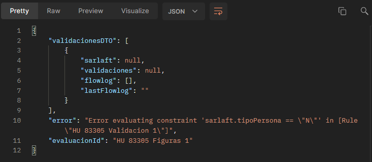

# Validación por figura | Proceso de actualización

> **Fuente Confluence:** [Validación por figura | Proceso de actualización](https://segurosti.atlassian.net/wiki/spaces/EPA/pages/2856812545/Validaci+n+por+figura+Proceso+de+actualizaci+n)
> **Última modificación:** 2022-08-24 — Diego Alejandro Vélez González · versión 2
> **Sección:** [Actualización](./index.md)

## Archivos adjuntos

| Archivo | Enlace |
|---------|--------|
| `Query-Error-Reponse.json` | [Query-Error-Reponse.json](./attachments/Query-Error-Reponse.json) |
| `Query-Reponse.json` | [Query-Reponse.json](./attachments/Query-Reponse.json) |
| `response.png` | [response.png](./attachments/response.png) |
| `Query-Request.json` | [Query-Request.json](./attachments/Query-Request.json) |
| `request.png` | [request.png](./attachments/request.png) |
| `response-error.png` | [response-error.png](./attachments/response-error.png) |
| `request-error.png` | [request-error.png](./attachments/request-error.png) |

- **Objetivo:**  Proveer una conexión  al motor de validaciones de figuras para una evaluación de actualización.

- **Query:** Evaluacion.sarlaft.actualizacion.validaciones

- **Nota:** los ejemplos a continuación se hicieron desde un proyecto sender que se comunicaba en la cola de service bus.

| Data Request | Data | Tipo | Observaciones/Valores |
| --- | --- | --- | --- |
| sarlaft.tipoPersona | Requerido | String | N → Persona NaturaJ → Persona Jurídica |
| sarlaft.tipoRiesgo | Requerido | String | INTENSIFICADOSIMPLIFICADOORDINARIO |
| evaluacionId | Opcional | String | dato para realizar traza a la petición - splunk |

| Data Response | Data | Tipo | Observaciones/Valores |
| --- | --- | --- | --- |
| validaciones | Requerido | List | validaciones que debe tener la figura |
| validaciones[n].codigo | Requerido | String | Nombre de la validación |
| validaciones[n].bloqueante | Requerido | Boolean | Indicador si es bloqueante en el proceso |
| error | Requerido | String | si retorna un mensaje diferente a null nos indica que ocurrió un error en el proceso de ejecutar las validaciones, o algún campo requerido no se envió |
| flowlog | No Requerido | List | permite ver las condiciones que cumplió la figura en proceso del motor, Dato técnico del proyecto |
| lastflowlog | No Requerido | String | Datos Técnico del proyecto |

- Error

**Query Request:**

[/wiki/download/attachments/2856812545/Query-Request.json?version=2&modificationDate=1661311988413&cacheVersion=1&api=v2](/wiki/download/attachments/2856812545/Query-Request.json?version=2&modificationDate=1661311988413&cacheVersion=1&api=v2)

**Query Response:**

[/wiki/download/attachments/2856812545/Query-Reponse.json?version=2&modificationDate=1661312015629&cacheVersion=1&api=v2](/wiki/download/attachments/2856812545/Query-Reponse.json?version=2&modificationDate=1661312015629&cacheVersion=1&api=v2)

**Query Error Response:**

[/wiki/download/attachments/2856812545/Query-Error-Reponse.json?version=2&modificationDate=1661312038672&cacheVersion=1&api=v2](/wiki/download/attachments/2856812545/Query-Error-Reponse.json?version=2&modificationDate=1661312038672&cacheVersion=1&api=v2)
