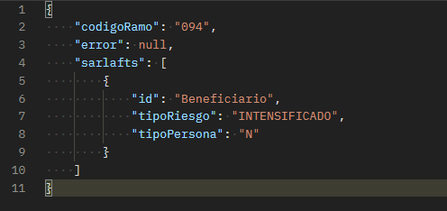
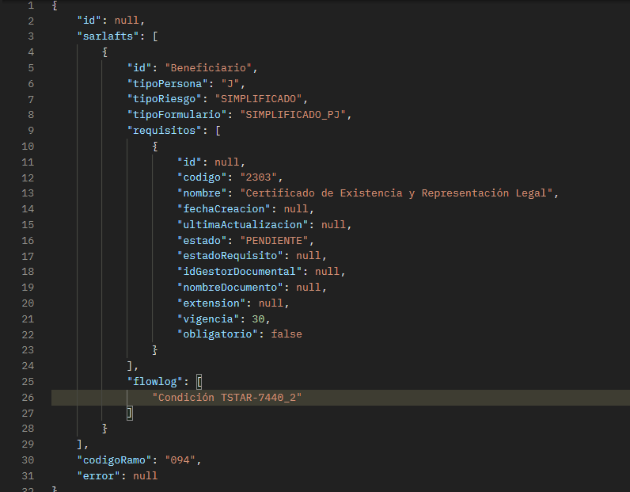

# Tipo de formulario y requisitos por figura | ApiTerceros

> **Fuente Confluence:** [Tipo de formulario y requisitos por figura | ApiTerceros](https://segurosti.atlassian.net/wiki/spaces/EPA/pages/2740748352/Tipo+de+formulario+y+requisitos+por+figura+ApiTerceros)
> **Última modificación:** 2022-05-23 — Diego Alejandro Vélez González · versión 3
> **Sección:** [ApiTerceros](./index.md)

## Archivos adjuntos

| Archivo | Enlace |
|---------|--------|
| `Response.json` | [Response.json](./attachments/Response.json) |
| `Request.json` | [Request.json](./attachments/Request.json) |
| `image-20220523-174620.png` | [image-20220523-174620.png](./attachments/image-20220523-174620.png) |
| `image-20220523-171011.png` | [image-20220523-171011.png](./attachments/image-20220523-171011.png) |
| `image-20220523-170829.png` | [image-20220523-170829.png](./attachments/image-20220523-170829.png) |
| `Query-Error-Response.json` | [Query-Error-Response.json](./attachments/Query-Error-Response.json) |
| `Query-Response.json` | [Query-Response.json](./attachments/Query-Response.json) |
| `Query-Request.json` | [Query-Request.json](./attachments/Query-Request.json) |
| `image-20220406-031042.png` | [image-20220406-031042.png](./attachments/image-20220406-031042.png) |
| `image-20220406-025322.png` | [image-20220406-025322.png](./attachments/image-20220406-025322.png) |
| `image-20220406-024809.png` | [image-20220406-024809.png](./attachments/image-20220406-024809.png) |

- **Objetivo:**  Proveer una conexión a terceros al motor de tipo de formulario y requisitos de las figuras de un Evaluación en el proceso de Sarlaft.

- **Query:** Evaluacion.externos.sarlaft.formulario.requisitos

- **Nota:** los ejemplos a continuación se hicieron desde un proyecto sender que se comunicaba en la cola de service bus.

| Data Request | Data | Tipo | Observaciones/Valores |
| --- | --- | --- | --- |
| codigoRamo | Requerido | String | Ejemplos: 041 → Soat094 → ARL |
| error | Requerido | String | null |
| sarlafts | Requerido | List | Sarlafts a procesar |
| sarlafts[n].id | Requerido | String | Ejemplo: 00005120-5a52-4fd8-9acf-423e861fdf44 |
| sarlafts[n].tipoPersona | Requerido | String | N → Persona NaturaJ → Persona Juridica |
| sarlafts[n].tipoRiesgo | Requerido | String | INTENSIFICADOSIMPLIFICADOORDINARIO |

| Data Response | Data | Tipo | Observaciones/Valores |
| --- | --- | --- | --- |
| id | No Requerido | String | id de la evaluación a procesar |
| sarlafts | Requerido | List | Sarlafts procesados |
| sarlafts[n].id | Requerido | String | id del sarlaft procesado |
| sarlafts[n].tipoPersona | Requerido | String | N → Persona NaturaJ → Persona Juridica |
| sarlafts[n].tipoRiesgo | Requerido | String | INTENSIFICADOSIMPLIFICADOORDINARIO |
| sarlafts[n].tipoFormulario | Requerido | String | SIMPLIFICADO_PNSIMPLIFICADO_PJORDINARIO_PNORDINARIO_PJINTENSIFICADO_PNINTENSIFICADO_PJ |
| sarlafts[n].requisitos[n] | Requerido | List | Requisitos de la figura |
| sarlafts[n].requisitos[n].id | Requerido | String | id del requisito |
| sarlafts[n].requisitos[n].codigo | Requerido | String | código del requisito |
| sarlafts[n].requisitos[n].nombre | Requerido | String | Nombre del requisito |
| sarlafts[n].requisitos[n].fechaCreacion | Requerido | Date | Fecha de creación |
| sarlafts[n].requisitos[n].ultimaActualizacion | Requerido | Date | Fecha de actualización |
| sarlafts[n].requisitos[n].estado | Requerido | String | Estado del requisito |
| sarlafts[n].requisitos[n].estadoRequisito | Requerido | String | Estado del requisito |
| sarlafts[n].requisitos[n].idGestorDocmental | Requerido | String | id del gestor documental |
| sarlafts[n].requisitos[n].nombreDocumento | Requerido | Boolean | Indicador si es bloqueante en el proceso |
| sarlafts[n].requisitos[n].extension | Requerido | String | Extensión |
| sarlafts[n].requisitos[n].vigencia | Requerido | Long | días de vigencia |
| sarlafts[n].requisitos[n].obligatorio | Requerido | boolean | Indica la obligatoriedad del requisito |
| sarlafts[n].flowlog | No Requerido | List | permite ver las condiciones que cumplió la figura en proceso del motor, Dato técnico del proyecto |
| error | Requerido | String | si retorna un mensaje diferente a null nos indica que ocurrió un error en el proceso de ejecución, o algún campo requerido no se envió |
| codigoRamo | Requerido | String | Ejemplos: 041 → Soat094 → ARL |

**Query Request:**

[/wiki/download/attachments/2740748352/Response.json?version=2&modificationDate=1653328164268&cacheVersion=1&api=v2](/wiki/download/attachments/2740748352/Response.json?version=2&modificationDate=1653328164268&cacheVersion=1&api=v2)

**Query Response:**

[/wiki/download/attachments/2740748352/Response.json?version=2&modificationDate=1653328164268&cacheVersion=1&api=v2](/wiki/download/attachments/2740748352/Response.json?version=2&modificationDate=1653328164268&cacheVersion=1&api=v2)
