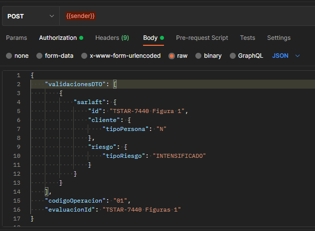
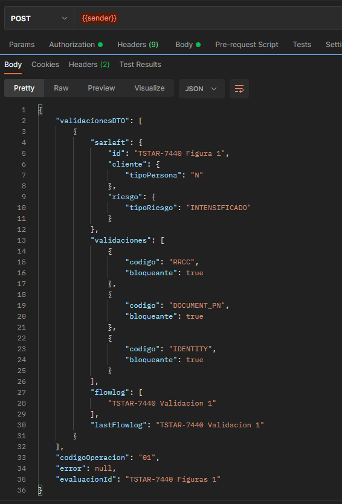
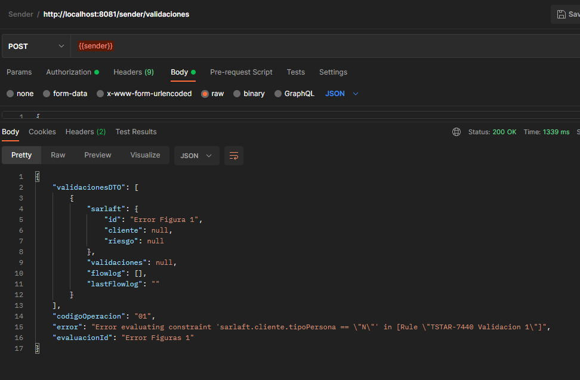

# Validación por figura | ApiTerceros

> **Fuente Confluence:** [Validación por figura | ApiTerceros](https://segurosti.atlassian.net/wiki/spaces/EPA/pages/2676588688/Validaci+n+por+figura+ApiTerceros)
> **Última modificación:** 2022-04-06 — Edwin Didier Méndez Rojas - Ceiba Software · versión 1
> **Sección:** [ApiTerceros](./index.md)

## Archivos adjuntos

| Archivo | Enlace |
| --------- | -------- |
| `Query-Error-Response.json` | [Query-Error-Response.json](./attachments/Query-Error-Response.json) |
| `Query-Response.json` | [Query-Response.json](./attachments/Query-Response.json) |
| `Query-Request.json` | [Query-Request.json](./attachments/Query-Request.json) |
| `image-20220406-031042.png` | [image-20220406-031042.png](./attachments/image-20220406-031042.png) |
| `image-20220406-025322.png` | [image-20220406-025322.png](./attachments/image-20220406-025322.png) |
| `image-20220406-024809.png` | [image-20220406-024809.png](./attachments/image-20220406-024809.png) |
| `image-20220406-023153.png` | [image-20220406-023153.png](./attachments/image-20220406-023153.png) |
| `image-20220406-020931.png` | [image-20220406-020931.png](./attachments/image-20220406-020931.png) |
| `image-20220406-020859.png` | [image-20220406-020859.png](./attachments/image-20220406-020859.png) |
| `image-20220406-020530.png` | [image-20220406-020530.png](./attachments/image-20220406-020530.png) |
| `image-20220406-020422.png` | [image-20220406-020422.png](./attachments/image-20220406-020422.png) |
| `image-20220406-020100.png` | [image-20220406-020100.png](./attachments/image-20220406-020100.png) |
| `image-20220406-015942.png` | [image-20220406-015942.png](./attachments/image-20220406-015942.png) |

- **Objetivo:**  Proveer una conexión a terceros al motor de validaciones de las figuras de un Evaluación en el proceso de Sarlaft.

- **Query:** Evaluacion.externos.sarlaft.validaciones

- **Nota:** los ejemplos a continuación se hicieron desde un proyecto sender que se comunicaba en la cola de service bus.

| Data Request | Data | Tipo | Observaciones/Valores |
| --- | --- | --- | --- |
| codigoOperacion | Requerido | String | Ejemplos: 01 → Negocio NuevoRE → Reclamación |
| sarlaft.cliente.tipoPersona | Requerido | String | N → Persona NaturaJ → Persona Juridica |
| sarlaft.riesgo.tipoRiesgo | Requerido | String | INTENSIFICADOSIMPLIFICADOORDINARIO |
| evaluacionId | Opcional | String | dato para realizar traza a la petición - splunk |

| Data Response | Data | Tipo | Observaciones/Valores |
| --- | --- | --- | --- |
| validaciones | Requerido | List | validaciones que debe tener la figura |
| validaciones[n].codigo | Requerido | String | Nombre de la validación |
| validaciones[n].bloqueante | Requerido | Boolean | Indicador si es bloqueante en el proceso |
| error | Requerido | String | si retorna un mensaje diferente a null nos indica que occurrio un error en el proceso de ejecutar las validaciones, o algun campo requerido no se envio |
| flowlog | No Requerido | List | permite ver las condiciones que cumplio la figura en proceso del motor, Dato tecnico del proyecto |
| lastflowlog | No Requerido | String | Datos Tecnico del proyecto |

- Error

**Query Request:**

[/wiki/download/attachments/2676588688/Query-Request.json?version=1&modificationDate=1649214958630&cacheVersion=1&api=v2](/wiki/download/attachments/2676588688/Query-Request.json?version=1&modificationDate=1649214958630&cacheVersion=1&api=v2)

**Query Response:**

[/wiki/download/attachments/2676588688/Query-Response.json?version=2&modificationDate=1649214976873&cacheVersion=1&api=v2](/wiki/download/attachments/2676588688/Query-Response.json?version=2&modificationDate=1649214976873&cacheVersion=1&api=v2)

**Query Error Request:**

[/wiki/download/attachments/2676588688/Query-Error-Response.json?version=1&modificationDate=1649214996312&cacheVersion=1&api=v2](/wiki/download/attachments/2676588688/Query-Error-Response.json?version=1&modificationDate=1649214996312&cacheVersion=1&api=v2)
