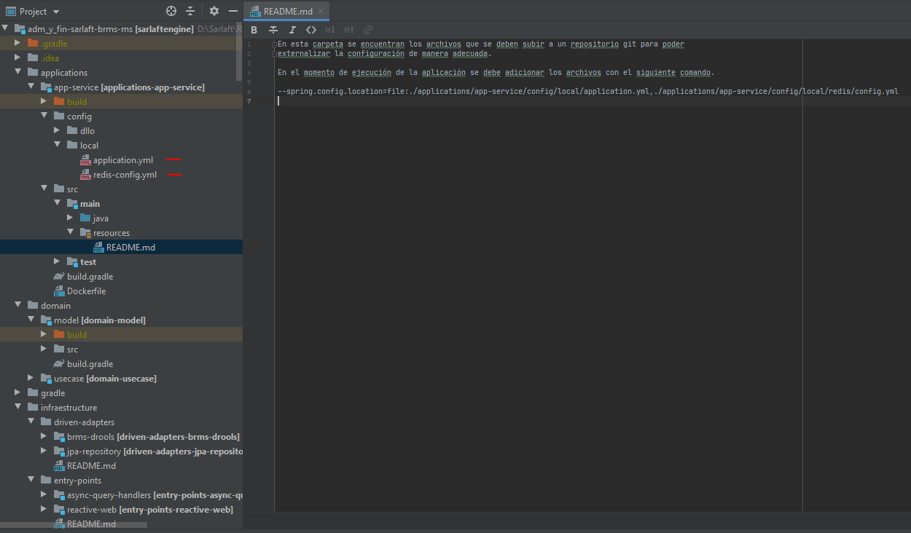
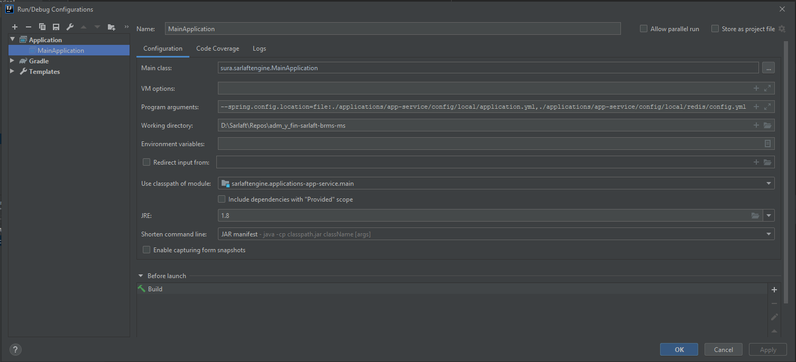

# Configuración Ambiente - Motor Evaluación

> **Fuente Confluence:** [Configuración Ambiente - Motor Evaluación](https://segurosti.atlassian.net/wiki/spaces/EPA/pages/1809941012/Configuraci+n+Ambiente+-+Motor+Evaluaci+n)
> **Última modificación:** 2024-05-30 — Santiago Valencia Ochoa (Unlicensed) · versión 14
> **Sección:** [Configuración Ambiente - Motor Evaluación](../index.md)

## Archivos adjuntos

| Archivo | Enlace |
| --------- | -------- |
| `image-20210629-025050.png` | [image-20210629-025050.png](./attachments/image-20210629-025050.png) |
| `image-20210629-025021.png` | [image-20210629-025021.png](./attachments/image-20210629-025021.png) |

**Elementos requeridos para la configuración del ambiente:**

- Java SE 8 (LTS)

- Gradle 6.8+

- Certificados de seguridad para la JVM

**IDEs o editores de código recomendados para el proyecto:**

- [Intellij IDEA](https://www.jetbrains.com/idea/download/?section=windows)

- [Visual Studio Code](https://code.visualstudio.com/)

**Plugins recomendados:**

- SonarLint

- Lombook

---

**Repositorios:**

- [https://dev.azure.com/SuraColombia/Gerencia_Tecnologia/_git/892-sarlaft-brms-ms](https://dev.azure.com/SuraColombia/Gerencia_Tecnologia/_git/892-sarlaft-brms-ms) (Principal)

- [https://dev.azure.com/SuraColombia/Gerencia_Tecnologia/_git/892-sarlaft-brms-conf](https://dev.azure.com/SuraColombia/Gerencia_Tecnologia/_git/892-sarlaft-brms-conf) (Configuración)

- [https://dev.azure.com/SuraColombia/Gerencia_Tecnologia/_git/892-sarlaft-brms-pa](https://dev.azure.com/SuraColombia/Gerencia_Tecnologia/_git/892-sarlaft-brms-pa)

**Pipelines:**

- [https://dev.azure.com/SuraColombia/Gerencia_Tecnologia/_build?definitionId=3350](https://dev.azure.com/SuraColombia/Gerencia_Tecnologia/_build?definitionId=3350)

**SonarQube:**

- [https://sonarqube.suramericana.com.co/solucionescorporativas/dashboard?id=892-sarlaft-brms-ms](https://sonarqube.suramericana.com.co/solucionescorporativas/dashboard?id=892-sarlaft-brms-ms)

---

**Argumentos Necesarios:**

**Configuración Mínima:**

