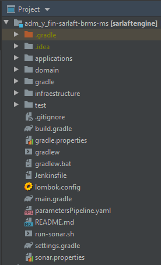
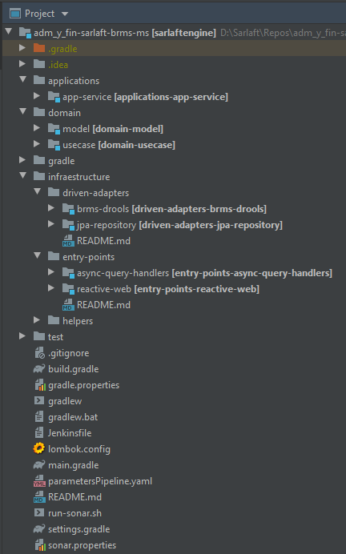

# Estructura Proyecto - Motor Evaluación

> **Fuente Confluence:** [Estructura Proyecto - Motor Evaluación](https://segurosti.atlassian.net/wiki/spaces/EPA/pages/1809941019/Estructura+Proyecto+-+Motor+Evaluaci+n)
> **Última modificación:** 2021-06-29 — Edwin Didier Méndez Rojas - Ceiba Software · versión 2
> **Sección:** [Estructura Proyecto - Motor Evaluación](./index.md)

## Archivos adjuntos

| Archivo | Enlace |
|---------|--------|
| `image-20210629-013238.png` | [image-20210629-013238.png](./attachments/image-20210629-013238.png) |
| `image-20210629-005159.png` | [image-20210629-005159.png](./attachments/image-20210629-005159.png) |

**Generalidades:**

El proyecto Motor Evaluación hace parte del conjunto del proceso de Sarlaft4.0, con el propósito de la clasificación de riesgo, validaciones y formularios que requiere cada figura involucrada en la compra de Pólizas.

Esta construido a partir del generador de legos de Sura (Versión 0.0.19), Se basa en arquitectura Hexagonal y aplicación de programación reactiva.

El proyecto esta compuesto de los siguientes subproyectos:

- **applications-app-service**: contiene configuraciones generales del aplicativo.

- **domain-model**: representa los objetos de dominio (negocio) del aplicativo, sus características y comportamientos. dichos objetos están acoplados al domino de SarlaftApi.

- **driven-adapters-jpa-repository**: aquí se encuentran las implementaciones para el control de persistencia de los objetos de domino, adicional de implementaciones concretas para consulta de información de base de datos.

- **driven-adapters-brms-drools**: Este modulo implementara la lógica y construcción de la base de conocimiento con las cuales trabajara el proyecto.

- **entry-points-reactive-web**: define los diferentes endpoints que se habilitarán en la aplicación. Aquí también se encuentran las implementaciones de invocación a servicios SOAP requeridos para consutlar y registrar información de personas.

- **entry-points-async-query-handler**: tendra la capacidad de responder a consultas enviadas al microservicio de forma asíncrona a través de RabbitMQ usando Reactive Commons.

- **helpers-jpa-repository-commons**: representa objetos utilitarios para el manejo de persistencia. Este es usado directamente por driven-adapters-jpa-repository

