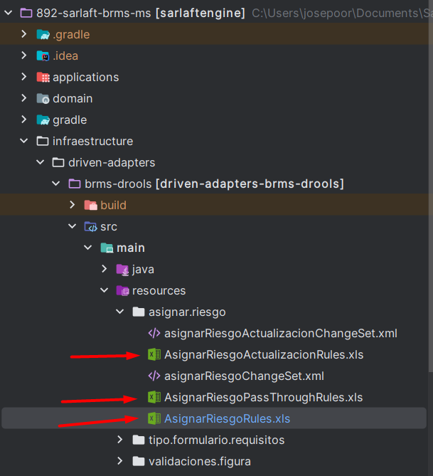

# Riesgo

> **Fuente Confluence:** [Riesgo](https://segurosti.atlassian.net/wiki/spaces/EPA/pages/2365718886/Riesgo)
> **Última modificación:** 2025-10-14 — Antiguo usuario (Deleted) · versión 4
> **Sección:** [Riesgo](./index.md)

## Archivos adjuntos

| Archivo | Enlace |
|---------|--------|
| `image-20251014-130444.png` | [image-20251014-130444.png](./attachments/image-20251014-130444.png) |

- **Clasificación del Riesgo**

La clasificación del riesgo que se entrega como resultado es:

**RIESGO BAJO:**Procedimiento**SIMPLIFICADO**

- **RIESGO MEDIO:**Procedimiento**ORDINARIO**

- **RIESGO ALTO:**Procedimiento**INTENSIFICADO**

Esta clasificación se define según lo establecido en [“Todo lo que debes saber sobre SARLAFT 4.0”](https://www.segurossura.com.co/Lanzamientos/Sarlaft4.0/index.html).

> **Nota:**Según la asignación del tipo de riesgo, dependerán los requisitos en los formularios y las validaciones de las figuras.

- **Reglas de Negocio en el Motor**

El motor ya cuenta con reglas de negocio establecidas para asignar el riesgo, y estas se encuentran en:

- **Validaciones en el Motor**

Las validaciones se realizan mediante un motor basado en **Drools**, con reglas definidas en archivos Excel que se pueden ver el la**Figura 1: archivos de la asignación de riesgos.**
Para mayor contextualización apoyarse en los videos de la carpeta [**4- Motor**](https://suramericana.sharepoint.com/sites/MESA7-CALIDADDEINFORMACIN/Shared%20Documents/Forms/AllItems.aspx?id=%2Fsites%2FMESA7%2DCALIDADDEINFORMACIN%2FShared%20Documents%2FGeneral%2FProyecto%20SARLAFT%204%2E0%2FDocumentacionDesarrollo%2FContextoNegocio%2F4%2D%20Motor&viewid=95cc38c2%2D5a58%2D4e15%2Da124%2Dbcdac91ae443&csf=1&web=1&e=Zp6moh&CID=757b6b95%2D8b8f%2D489a%2D974e%2D5b8ce96328e4&FolderCTID=0x012000CD5B148735D16E46A8957895F03860C0)(es necesario que solicite permisos para poder visualizar los videos)

Para ver cómo se documenta y se desarrolla una historia de usuario(HU) ver  la página de [**Cómo desarrollar una HU para inclusión de reglas.**](/wiki/spaces/EPA/pages/5084020779/C+mo+desarrollar+una+HU+para+inclusi+n+de+reglas.)

### Sub-páginas

| Página | Nivel |
|--------|-------|
| [Cómo desarrollar una HU para inclusión de reglas.](./CómoDesarrollarUnaHUParaInclusiónDeReglas.md) | 0 |
